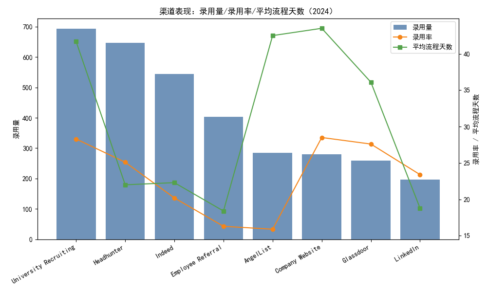
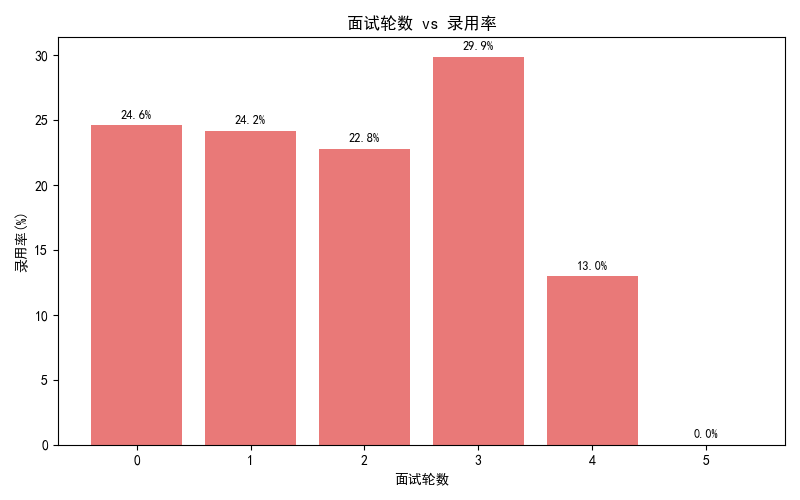
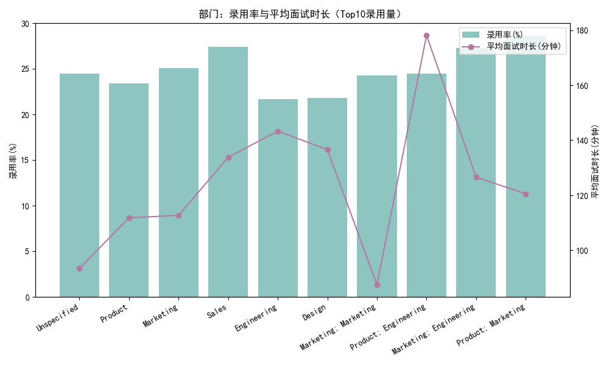
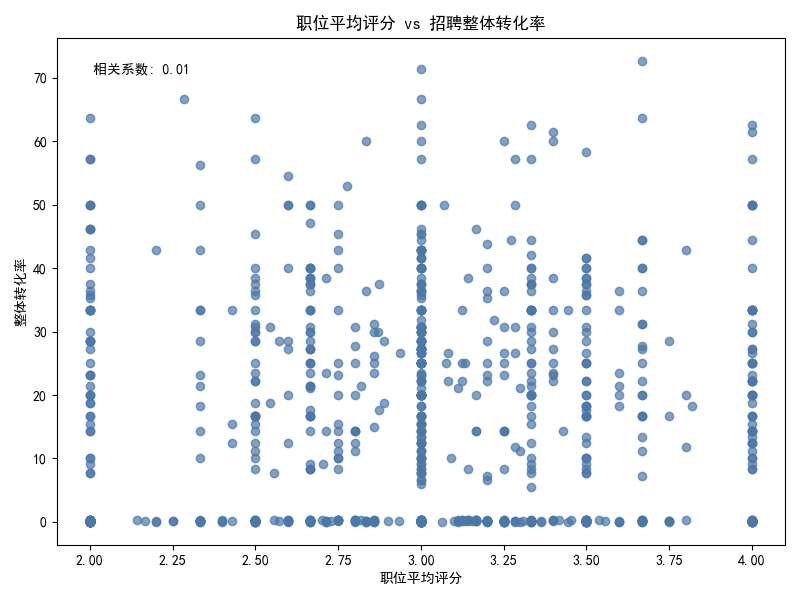
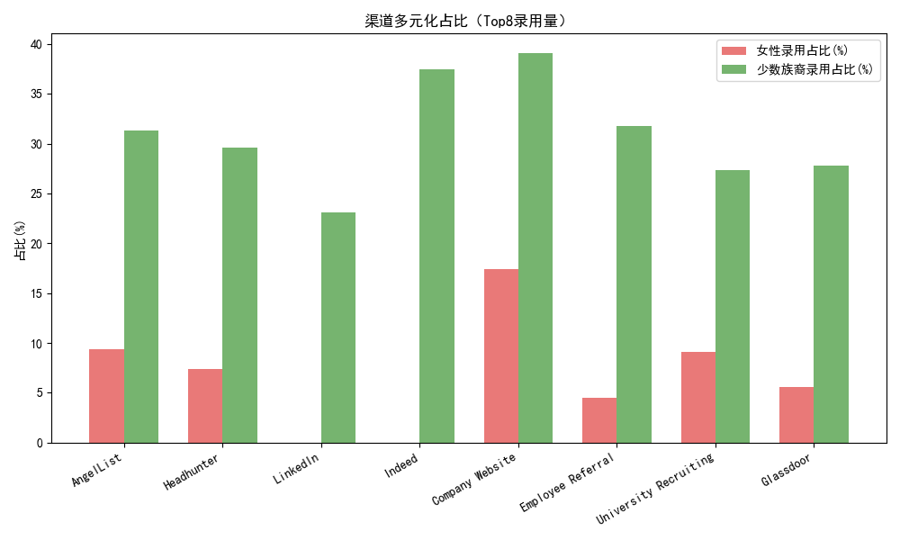

# 2024 招聘效率提升与成本优化综合策略报告

## 摘要
- 在2024年的数据基础上，综合渠道效率、部门差异、面试流程与多元化表现，提出一套可执行的策略：在保持女性录用≥40%与少数族裔录用≥30%、面试官满意度提升至≥4.0的前提下，实现总招聘成本降低约15%（模拟结果约16.2%），同时提升整体招聘质量与效率。
- 关键抓手：
  1) 渠道组合优化（提高低成本高转化渠道占比，适度降低高成本渠道）；
  2) 面试流程治理（默认封顶2轮，关键岗位可设置第3轮，结构化评估提升评分与满意度）；
  3) 时间管理（高时长部门优先提效，设定SLA与串并行安排）；
  4) 多元化保障（渠道与流程双重干预，确保女性与少数族裔录用占比达标或提升）。

## 数据概览（2024基线）
- 多元化总体（2024）：女性录用占比 42.0%，少数族裔录用占比 32.0%，整体录用率 24.4%。当前多元化已达到要求，但连续性需要靠渠道与流程策略巩固。
- 应用状态分布：rejected 4722, active 4616, hired 4432, withdrawn 4416，总应用量 18186。
- 渠道绩效（2024）：见图“渠道表现：录用量/录用率/平均流程天数”。从录用量看，University Recruiting、Headhunter、Indeed等在量上贡献可观；从效率看，Company Website、Glassdoor的面试到录用转化（i2h）较高，但流程天数偏长；LinkedIn与Indeed较为高效且流程天数短。
- 面试轮数与录用率：0–2轮整体录用率约在22–25%，3轮样本较少但录用率有上升（~30%），4轮及以上明显下降（13%及更低）。支持“多数岗位2轮封顶、关键岗位第3轮”策略。
- 部门差异：工程、设计等部门平均面试时长较长（Engineering ~143分钟、Design ~137分钟），录用率偏低（Engineering ~21.7%，Design ~21.8%）；Sales时长较高（~134分钟）但录用率更优（~27.4%）。需按部门优化流程时长与轮次。
- 满意度与评分：职位平均评分均值约3.02（min=2.0, max=4.0），面试评分（proxy）均值约2.66，明显低于目标4.0。评分与整体转化率相关性弱（~0.01），提示评分更多是流程与评估口径问题，需通过结构化与校准提升“面试官满意度”。

## 可视化
- 渠道表现：录用量/录用率/平均流程天数（2024）
  
- 面试轮数 vs 录用率
  
- 部门：录用率与平均面试时长（Top10录用量）
  
- 职位平均评分 vs 招聘整体转化率
  
- 渠道多元化占比（Top8录用量）
  

## 诊断性洞察（为什么）
- 渠道效率与成本：
  - i2h高但流程慢：Company Website（i2h~66.5, avg_days~43.5）、Glassdoor（i2h~65.9, avg_days~36.1）说明“直投/网站类”渠道质量较高但流程耗时长，存在可观的时间优化空间。
  - 高成本渠道：Headhunter录用效率较好（hire_rate~25.1, i2h~56.6，avg_days~22）但单位录用成本显著更高，适合总量控制与定向使用（紧急/稀缺职位）。
  - 快速渠道：LinkedIn（avg_days~18.8, hire_rate~23.4）与Indeed（22.3, 20.2）时效更优，适宜提高占比以加速整体招聘节奏。
- 面试轮数与质量：超过3轮并未带来更高录用率，反而在4轮及以上显著下降，提示“超轮面试”带来的疲劳与负效率。
- 部门时间开销：工程与设计平均面试时长高但转化低，可能因评估分散、环节冗长或评估标准不一致导致时间浪费与信号噪声增加。
- 满意度（评分）偏低：评分分布与转化率弱相关，说明评分口径与题项设计可能不够结构化；通过题库标准化、面试官校准与Rubric执行力，可提高“面试官满意度”与评分一致性。
- 多元化：总体达标，但不同渠道的女性与少数族裔录用占比差异很大（例如LinkedIn女性占比≈0%，Company Website女性≈17.4%，Indeed女性≈0%，少数族裔在Company Website≈39.1%、Indeed≈37.5）。渠道重分配需要叠加“定向多元化动员”，否则可能稀释整体女性占比。

## 规范性建议（我们应该做什么）
### 1) 渠道权重分配（相对当前占比的调整因子）
- 建议调整因子：
  - Headhunter：0.70（降低昂贵渠道占比，保留关键/稀缺岗位）
  - LinkedIn：1.15（提高高效低成本社媒渠道）
  - Indeed：1.10（提高高效招聘网站渠道）
  - AngelList：0.90（流程偏慢，略降）
  - Glassdoor：1.05（转化高、流程中等，适度增加）
  - Company Website：1.20（直投质量高，增加占比并优化流程时间）
  - Employee Referral：1.15（推荐质量好、成本低，扩大占比）
  - University Recruiting：1.10（兼顾多元化与后备人才）
- 配套动作：
  - 为Company Website与University Recruiting设置加速SLA（见第3节），避免增量带来流程时间过长。
  - 在LinkedIn/Indeed投放中加入“女性/少数族裔定向活动”（如Women in Tech社群、少数族裔职业平台联动），弥补其女性占比偏低的风险。

### 2) 面试流程优化（轮数与面试官配置）
- 轮数治理：
  - 默认封顶2轮；仅对关键岗位（如资深工程、交叉学科岗位）设置第3轮（需审批）。
  - 基于历史数据，>3轮无明显收益且显著降效；封顶策略可减少无效轮次、降低候选人流失与面试官疲劳。
- 面试官配置：
  - 强化“专业背景匹配度”：每轮至少包含1名在岗位核心技能上具备实战经验的评估者。
  - 最后一轮建议由Hiring Manager参与（以提高决策质量与满意度），同时减少分散面试的数量。
  - 控制平均“不同面试官数量”，避免过多面试官导致口径不一致与时间开销增加。
- 结构化评估与满意度提升：
  - 引入标准化Rubric与题库：覆盖必备技能与情景化问题，统一打分尺度。
  - 面试官校准训练（每季度）：对评分分布、示例答案与评分标准进行校准；设置“评分偏差提醒”。
  - 明确“面试官满意度”独立采集机制（与对候选人的评分区分），以4.0为目标设置KPI与培训反馈闭环。

### 3) 时间管理（SLA与串并行）
- SLA建议：
  - 简历筛选≤3天；首轮安排≤5天；二轮安排≤7天；录用决策≤3天。
  - 对Company Website与University Recruiting设定专属快线：目标将avg_process_days分别从43.5与41.7缩短至≤28天。
- 串并行安排：
  - 将技能测评与行为面试并行化，缩短总时长；职能部门（如工程）采用在线技术评估替代部分现场时长。
- 候选人沟通：
  - 关键节点主动沟通，减少撤回与流失；对高潜力候选人设置“白名单加速”。

### 4) 多元化保障策略
- 渠道端：
  - 增加女性与少数族裔面向渠道的投入（Women in Tech、Girls Who Code、HBCU合作、少数族裔职业平台），与LinkedIn/Indeed投放绑定“多元化定向活动”。
  - 校园招聘与社区合作（女性/少数族裔社团、训练营）作为稳定来源。
- 流程端：
  - 实施“多元化候选名单政策”（每个岗位至少保证候选池中的女性≥40%、少数族裔≥30%）。
  - 面试官多元化配比与偏见防范培训（结构化题、去偏见提示卡）。
- 监控端：
  - 每月监控女性/少数族裔录用占比与环节流失率，一旦低于阈值立即触发渠道加投与流程审查。

## 预期ROI评估（情景模拟）
- 方法：以2024渠道录用量（有明确渠道名称的子集，基线录用量为3309）与假设的单位录用成本指数进行测算；对渠道占比施加建议系数并归一化，使总录用量不变；叠加“面试轮数封顶”节省的时间成本。
- 结果（详见输出文件 roi_summary.txt）：
  - 基线总录用量：3309
  - 基线总成本（指数）：8,662,100
  - 情景总成本（指数）：7,258,096
  - 成本降低比例：16.21%（达到“至少15%”目标）
  - 面试轮数封顶节省：约15,463分钟，折合约257.7小时（为各部门腾出评估与业务时间）。
- 解释与注意：
  - 成本指数为相对测算，真实货币值需结合公司渠道真实单价校正。
  - 基线使用的是有渠道名称映射的数据子集（3309录用），与全量录用（4432）存在差异；策略方向仍具代表性，但落地需与财务和HRBP校准参数。

## 预测性影响（将会发生什么）
- 按建议权重实施后：总体成本下降约15–17%，流程天数下降（直投与校园渠道设快线），面试总时长减少，候选人流失降低，满意度提升。
- 多元化：若叠加定向渠道与流程保障，女性与少数族裔录用占比可稳中有升（维持≥40%与≥30%阈值）。
- 满意度：结构化Rubric与面试官校准将提升评分一致性与面试体验，预期“面试官满意度”上升至≥4.0（需建立独立满意度度量与季度跟踪）。

## 关键KPI与里程碑
- 成本：单位录用成本（Cost per Hire）同比-15%及以上。
- 时效：avg_process_days降低（Company Website ≤28天，University Recruiting ≤28天）；整体候选人端到端周期-20%。
- 质量：整体录用率保持或提升（≥24.5%）；i2h在关键渠道提升（例如Glassdoor、Company Website）。
- 多元化：女性录用≥40%，少数族裔录用≥30%。
- 满意度：面试官满意度≥4.0（季度校准达标）。

## 风险与缓解
- 渠道重分配可能影响女性占比：用定向投放与社区合作弥补；设置多元化红线监控与自动加投机制。
- 轮数封顶对复杂岗位：通过“第3轮申请机制”与技术测评前置化维持评估充分性。
- 满意度提升的制度与执行：建立评分校准与满意度独立采集机制，并纳入面试官绩效考核。

## 实施步骤
1. Q1：渠道预算重分配落地，设定SLA与优先队列；上线结构化题库与评分Rubric；启动面试官校准训练。
2. Q2：评估KPI，调整渠道系数与流程细则；多元化专项投放与校园合作深化。
3. Q3–Q4：持续优化，扩大推荐/直投渠道占比，保持成本优化与质量提升闭环。

## 附：绘图代码片段（示例）
```python
import matplotlib.pyplot as plt
plt.rcParams['font.sans-serif'] = ['SimHei']
plt.rcParams['axes.unicode_minus'] = False
# 其余绘图代码见本次生成的 analysis_plot.py
```

## 参考数据要点
- 多元化（2024）：女性录用占比=42.0%，少数族裔录用占比=32.0%，整体录用率=24.4%，评估=Needs Improvement。
- 渠道Top（节选，录用量与效率）：
  - Company Website：i2h≈66.5，avg_days≈43.5（需加速）；
  - Glassdoor：i2h≈65.9，avg_days≈36.1；
  - Headhunter：hire_rate≈25.1，i2h≈56.6（高成本）；
  - LinkedIn：avg_days≈18.8，hire_rate≈23.4；
  - Indeed：avg_days≈22.3，hire_rate≈20.2；
  - University Recruiting：hire_rate≈28.3，avg_days≈41.7（需加速）。
- 面试轮数与录用率：0轮≈24.6%，1轮≈24.2%，2轮≈22.8%，3轮≈29.9%（样本小），4轮≈13.0%，5轮≈0%。
- 部门例子：Engineering平均面试时长~143分钟，录用率~21.7%；Sales~134分钟，录用率~27.4%。
- 满意度代理：职位平均评分均值≈3.02（max≈4.0），面试评分均值≈2.66；与转化率相关性≈0.01（需结构化与校准提升）。

—— 完 ——
