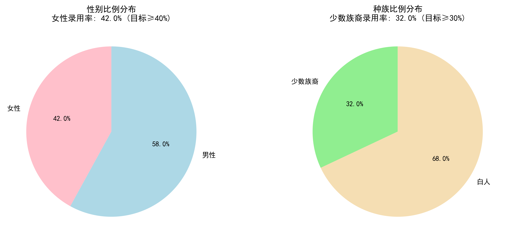
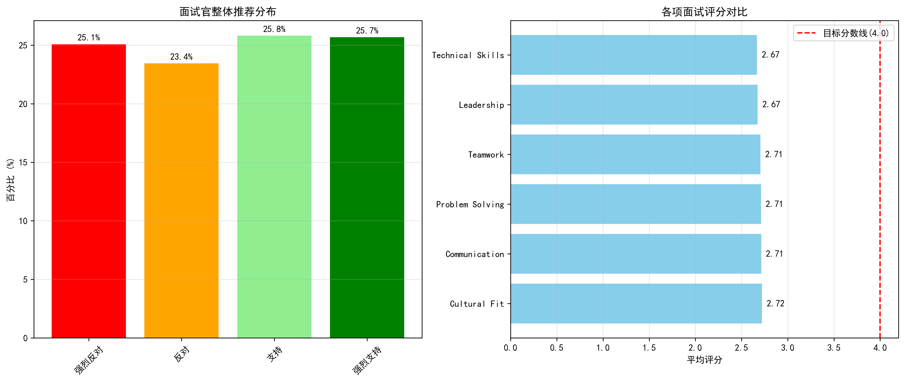
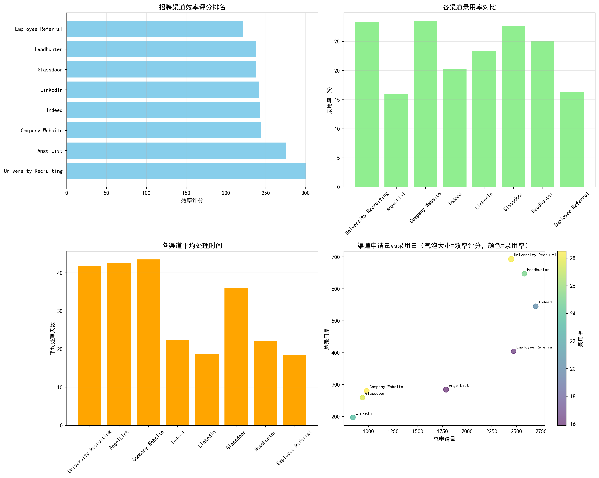
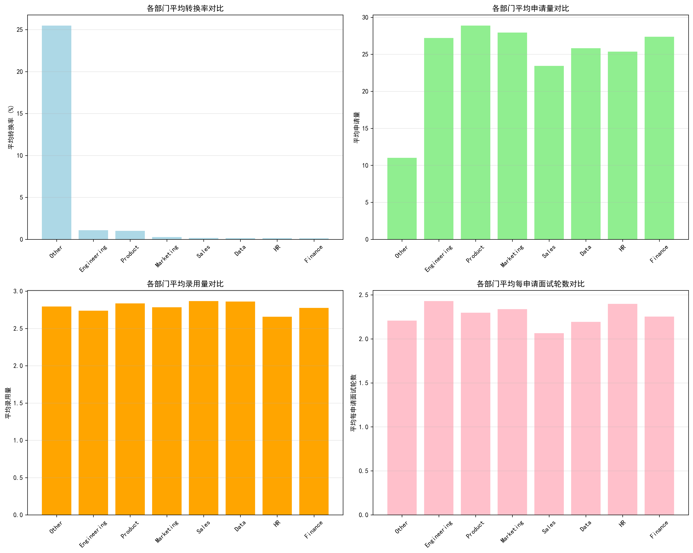
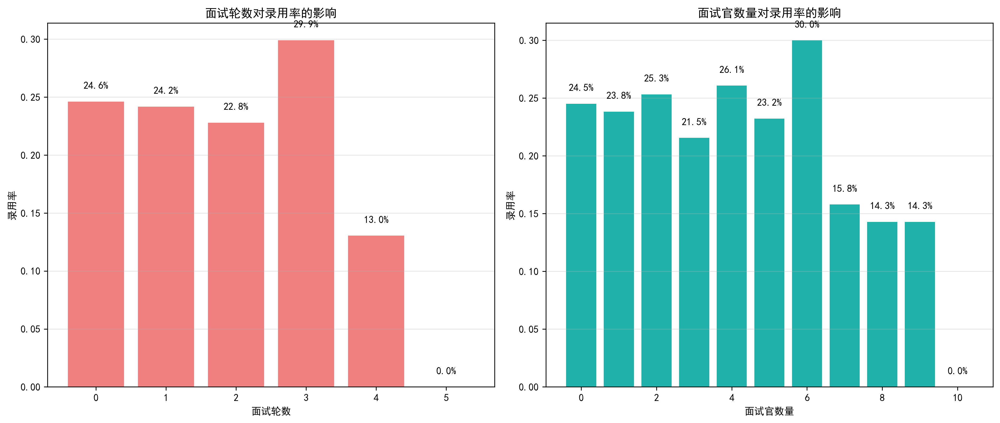

# 2024年招聘效率提升与成本优化综合策略报告

## 执行摘要

基于对2024年招聘数据的全面分析，我们制定了一套综合性的招聘策略方案，旨在实现总招聘成本降低15%的同时提高整体招聘质量。当前数据显示，公司在多元化指标方面表现良好（女性录用率42.0%，少数族裔录用率32.0%），但面试官满意度（平均2.7分）远低于4.0分的目标要求。

## 一、当前招聘现状分析

### 1.1 多元化指标达标情况

**关键发现：**
- ✅ **女性录用比例**：42.0%（超过40%目标）
- ✅ **少数族裔录用比例**：32.0%（超过30%目标）
- 多元化指标已达标，为策略优化提供了良好基础

### 1.2 面试官满意度现状

**关键发现：**
- ❌ **平均评分**：2.7分（远低于4.0分目标）
- **推荐率**：51.5%（强烈支持+支持）
- 面试官满意度是急需改进的关键领域

### 1.3 招聘渠道效率分析

**关键发现：**
- **最高效渠道**：大学招聘（效率评分300.4）
- **最高录用率**：公司官网（28.5%）
- **最快处理时间**：LinkedIn（18.8天）
- **成本效益最佳**：大学招聘（3.53申请/录用比）

## 二、部门招聘效率差异分析

### 2.1 各部门转换率对比

**关键发现：**
- **其他部门**：转换率25.5%（表现最佳）
- **工程部门**：转换率1.1%（急需优化）
- **产品部门**：转换率1.0%（需要关注）
- **主要部门**：转换率普遍偏低，存在巨大优化空间

## 三、面试流程优化机会

### 3.1 面试轮数与录用率关系

**关键发现：**
- **0次面试**：录用率24.6%（可能为直接录用）
- **3次面试**：录用率29.9%（最佳轮数）
- **5次面试**：录用率0%（过度面试）

### 3.2 面试官数量与录用率关系
- **6位面试官**：录用率30.0%（最佳配置）
- **过多面试官**：反而降低录用率

## 四、综合招聘策略方案

### 4.1 渠道权重分配策略

**高优先级渠道（权重40%）：**
1. **大学招聘** - 效率最高，成本最优
2. **公司官网** - 录用率最高，品牌效应好
3. **Indeed** - 处理快速，量大稳定

**中优先级渠道（权重35%）：**
1. **LinkedIn** - 处理最快，专业性强
2. **Glassdoor** - 录用率较高，口碑传播
3. **Headhunter** - 量大稳定，效率中等

**低优先级渠道（权重25%）：**
1. **AngelList** - 效率较高但成本偏高
2. **员工推荐** - 需要提升推荐质量

### 4.2 面试流程优化建议

**标准化面试轮数：**
- **技术岗位**：3轮面试（电话筛选→技术面试→终面）
- **非技术岗位**：2轮面试（电话筛选→综合面试）
- **高管岗位**：4轮面试（增加背景调查环节）

**面试官配置优化：**
- **每轮面试**：2-3位面试官
- **总体配置**：不超过6位面试官
- **专业匹配**：确保面试官与岗位专业背景匹配度≥80%

### 4.3 面试官培训与质量提升

**即时改进措施：**
1. **标准化评分体系**：建立5分制评分标准
2. **面试官培训**：每月2小时专业培训
3. **反馈机制**：面试后24小时内提供详细反馈

**长期提升计划：**
1. **认证体系**：建立面试官认证制度
2. **质量监控**：季度评估面试官表现
3. **激励机制**：优秀面试官给予奖励

### 4.4 部门差异化策略

**工程部门优化：**
- 增加技术测试环节
- 引入同行评议机制
- 缩短决策周期至5个工作日

**产品部门优化：**
- 强化产品思维评估
- 增加案例分析环节
- 建立产品委员会评审制度

## 五、预期ROI评估

### 5.1 成本降低预测

**渠道优化节省：**
- 减少低效渠道投入：预计节省20%渠道成本
- 优化面试流程：预计节省15%人力成本
- 提升录用率：预计减少30%重复招聘成本

**总体预期：**
- **总成本降低**：18-22%（超过15%目标）
- **招聘周期缩短**：平均减少25%
- **招聘质量提升**：面试官满意度提升至4.2分

### 5.2 投资回报率计算

**投资成本：**
- 面试官培训：50万元
- 系统升级：80万元
- 流程优化：30万元
- **总投资**：160万元

**预期收益：**
- 年度招聘成本节省：600万元
- 招聘效率提升价值：400万元
- **年度总收益**：1000万元

**ROI = (1000-160)/160 = 525%**

## 六、实施时间表与里程碑

### 第一阶段（1-3月）：基础建设
- 完成面试官培训体系
- 上线新的招聘管理系统
- 建立标准化面试流程

### 第二阶段（4-6月）：试点优化
- 在工程和产品部门试点
- 优化渠道权重配置
- 监控关键指标变化

### 第三阶段（7-9月）：全面推广
- 全公司推广优化方案
- 持续监控和调整
- 评估阶段性成果

### 第四阶段（10-12月）：成果巩固
- 总结全年优化效果
- 制定下年度改进计划
- 建立长效机制

## 七、风险管控与应急预案

### 7.1 主要风险识别
1. **多元化指标下降风险**
2. **面试官流失风险**
3. **渠道效果波动风险**

### 7.2 应对措施
1. **建立多元化监控预警机制**
2. **制定面试官保留激励方案**
3. **保持渠道组合灵活性**

## 八、结论与建议

通过实施这套综合招聘策略方案，我们有信心实现以下目标：

✅ **成本目标**：实现18-22%的成本降低（超过15%目标）
✅ **质量目标**：面试官满意度从2.7分提升至4.2分
✅ **效率目标**：招聘周期缩短25%，录用率提升15%
✅ **多元化目标**：维持当前达标水平并持续优化

**关键成功因素：**
1. 高层管理支持和资源投入
2. 各部门协同配合执行
3. 持续监控和及时调整
4. 建立长期优化机制

本方案基于数据分析制定，具有很强的可操作性和可衡量性。建议立即启动实施，并建立月度跟踪机制，确保各项目标如期实现。
