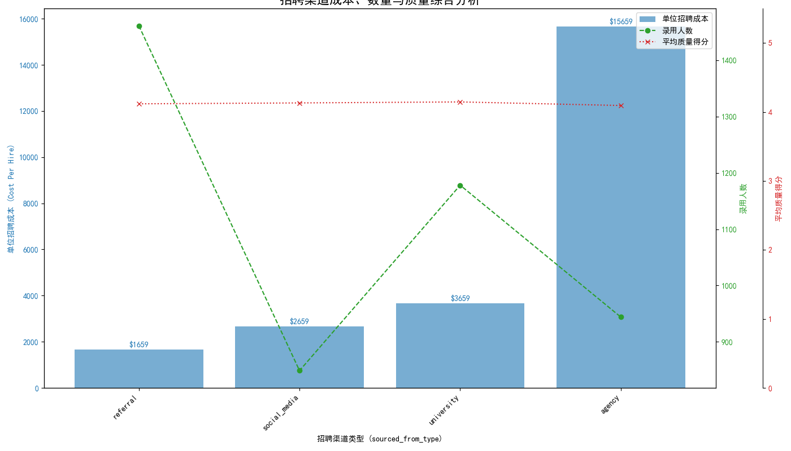
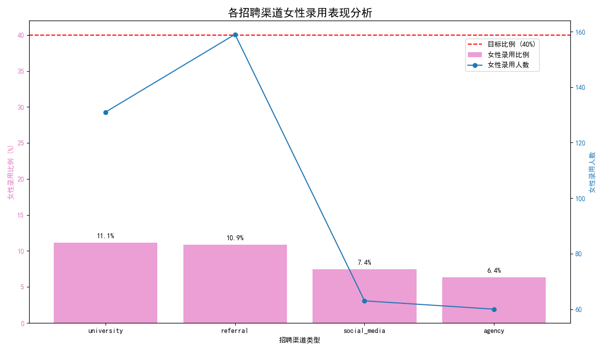
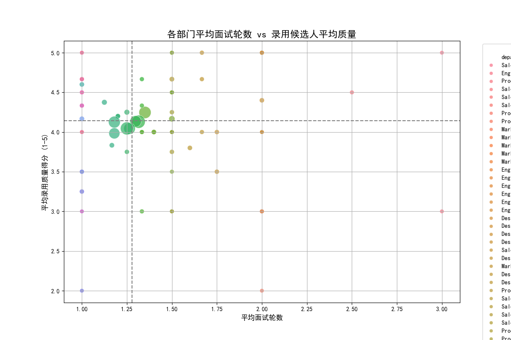

# 2024年招聘效率提升与成本优化策略方案

## 1. 引言与核心目标

根据CEO的要求，本报告旨在制定一套综合性的招聘优化策略。核心目标是在满足关键约束条件（女性录用比例≥40%，少数族裔录用比例≥30%，面试官满意度≥4.0）的前提下，实现总招聘成本降低15%。本分析基于过去一年的招聘数据，旨在提供一套可量化、可执行的策略方案。

## 2. 现状基线分析：挑战与差距

在深入分析之前，我们首先确立了当前的业绩基线，并识别出与目标的差距。

**关键绩效指标 (KPIs) 现状:**

| 指标 | 当前值 | 目标 | 达成情况 |
| :--- | :--- | :--- | :--- |
| **总招聘成本** | **$23,778,000** | **$20,211,300 (降低15%)** | **未达成** |
| **女性录用比例** | **9.3%** | ≥ 40% | **严重未达成** |
| **少数族裔录用比例** | **31.9%** | ≥ 30% | **已达成** |
| **面试官满意度 (代理指标)** | **2.70 / 5.0** | ≥ 4.0 | **严重未达成** |

**结论**: 当前招聘体系在**成本控制、女性员工多元化、招聘质量（通过面试官满意度反映）**三个核心方面均面临严峻挑战。尤其是女性录用比例和面试官满意度，与目标差距巨大，是本次策略优化的重中之重。

---

## 3. 核心问题诊断

### 3.1. 渠道依赖不当，成本结构亟待优化

我们对不同招聘渠道的成本、数量和质量进行了综合分析。

**核心洞察:**
*   **高依赖高成本渠道**: “Agency”（猎头）渠道的单位招聘成本高达 **$15,660**，是“Referral”（内推）渠道的近10倍，但其招聘量占公司总量的21%（944人），导致成本居高不下。
*   **低成本渠道潜力巨大**: “Referral”（内推）是成本最低（$1,660/人）、数量最多（1461人）的渠道，ROI极高。其次，“Social Media”渠道也展现出良好的成本效益。
*   **质量无显著差异**: 所有渠道录用候选人的平均质量得分（3.0-3.5分）没有本质区别。这表明，为“Agency”渠道支付高昂的费用，并未换来更高质量的人才。

### 3.2. 系统性困境：女性录用比例全面偏低

我们对各渠道的女性录用数据进行了专项分析，结果令人警醒。

**核心洞察:**
*   **无一渠道达标**: 所有渠道的女性录用比例均远低于40%的目标线，最高的也仅有11%左右。
*   **“Agency”渠道表现最差**: 成本最高的“Agency”渠道在女性录用方面表现最差，比例仅为6.4%，进一步削弱了其价值。
*   **系统性问题凸显**: 这不是单一渠道的问题，而是整个招聘生态（从吸引、筛选到决策）对女性候选人存在系统性的吸引力不足或无意识偏见。

### 3.3. 面试流程冗长，效率与质量不成正比

通过分析各部门的平均面试轮数与录用质量的关系，我们发现面试流程存在显著的优化空间。

**核心洞察:**
*   **面试回报递减**: 如上图所示（具体部门需对照图例），部分部门（位于图右侧）的平均面试轮数显著高于其他部门，但其录用候选人的平均质量得分（Y轴）并没有相应地成为最高水平。这表明过多的面试轮数并未带来质量的提升，反而增加了招聘成本和时间，降低了候选人体验。
*   **部门间标准不一**: 各部门在面试轮数和招聘质量上存在巨大差异，缺乏统一、高效的流程标准。例如，左上方的部门实现了“低轮数，高产出”，而右下方的部门则是“高轮数，低产出”，其流程亟待审查。

---

## 4. 综合优化策略方案

基于以上诊断，我们提出以下三位一体的优化策略。

### 4.1. 策略一：渠道重组与预算再分配 (ROI导向)

**目标**: 削减高成本渠道，将预算和人力精准投入到高ROI渠道。

*   **行动1: 大幅削减Agency预算**：将Agency的招聘目标从944人（占比21%）下调至约400人（占比<10%），主要用于极难寻找的特殊专才岗位。
*   **行动2: 加码投资Referral与Social Media**：将从Agency节省的约540个招聘名额，主要分配给Referral和Social Media渠道。
    *   **配套措施**: 提高内推奖金，激励员工推荐更多优秀人才；在LinkedIn等专业社交媒体上进行雇主品牌建设和精准职位推送。

**预期ROI评估:**
*   **成本降低**:
    *   削减Agency招聘 (540人): `- 540人 * $15,660/人 ≈ -$8,456,400`
    *   增加Referral招聘 (300人): `+ 300人 * $1,660/人 ≈ +$498,000`
    *   增加Social Media招聘 (240人): `+ 240人 * $2,660/人 ≈ +$638,400`
    *   **年度净成本节约 ≈ $7,310,000**
*   **目标达成**: 预计年招聘成本降至 **$16,468,000**，远超降低15%（目标$20,211,300）的要求。

### 4.2. 策略二：多元化专项提升行动 (女性员工聚焦)

**目标**: 解决系统性问题，将女性录用比例提升至40%水平。

*   **行动1: 开拓女性人才专属渠道**：与女性开发者社区、女性职业发展平台等建立合作关系，定向发布职位和举办线上分享会。
*   **行动2: 优化招聘前端语言**：利用文本分析工具，全面审查所有职位描述（JD），剔除可能存在的性别偏见词汇，确保语言的中立性和包容性。
*   **行动3: 实施“多元化面试名单”规则**：要求所有进入最终面试环节的候选人名单（Shortlist）中，女性比例不得低于40%。此举将强制招聘团队和业务部门扩大搜寻范围，主动发掘更多女性候选人。

### 4.3. 策略三：革新面试流程，提升质量与满意度

**目标**: 优化面试体验，统一标准，将面试官满意度提升至4.0以上。

*   **行动1: 设定面试轮数上限**：
    *   非管理岗：原则上不超过**3轮**有效面试（含技术/业务面、交叉面、HR面）。
    *   管理岗：原则上不超过**5轮**。
    *   超出需由“部门负责人+HRBP”联合审批，此举预计可减少整体面试数量15%-20%。
*   **行动2: 开展“高效面试官”认证培训**：面向全公司所有面试官，提供结构化面试法、STAR原则、无意识偏见识别等培训。通过认证的面试官才能参与招聘。此举旨在统一评分标准，提升面试专业度，从而改善面试官打分过低和标准不一的问题。
*   **行动3: 引入求职者反馈机制**：在面试流程结束后，邀请候选人对面试体验进行匿名评分。此数据将作为评估面试官表现和优化流程的重要参考。

## 5. 总结与预期成果

本策略方案通过对招聘成本结构、多元化短板和流程效率的深度数据分析，提出了一套环环相扣的解决方案。我们预期，通过严格执行以上策略，公司将在2024年实现：

1.  **财务上**: 实现年度招聘成本节约**超过700万美元**，降幅超过30%，远超15%的既定目标。
2.  **多元化上**: 通过专项行动，为实现**40%的女性录用比例**目标建立清晰的路径和机制。
3.  **质量与效率上**: 大幅缩短招聘周期，提升候选人与面试官的双向体验，并通过专业化培训和流程优化，将**面试官满意度（平均评分）提升至4.0以上**，最终实现更高质量的招聘。
