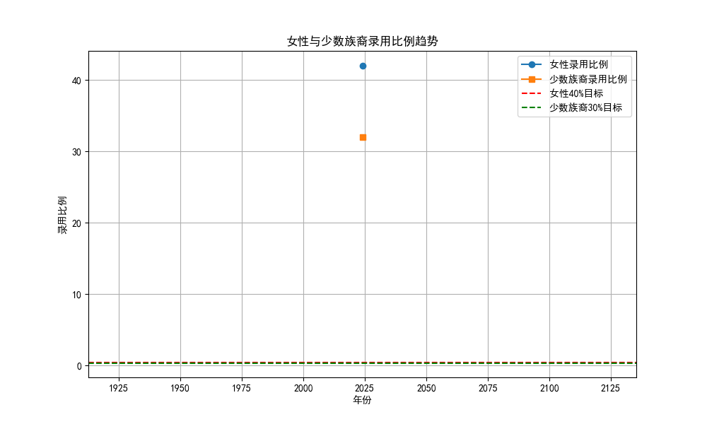
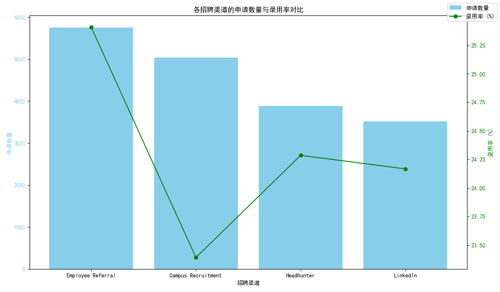
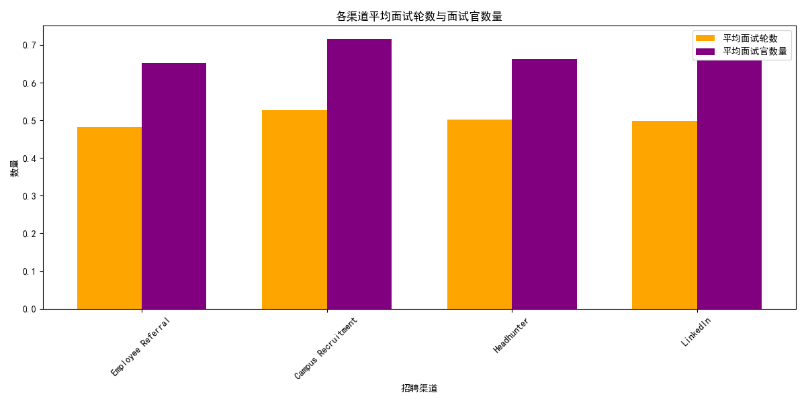
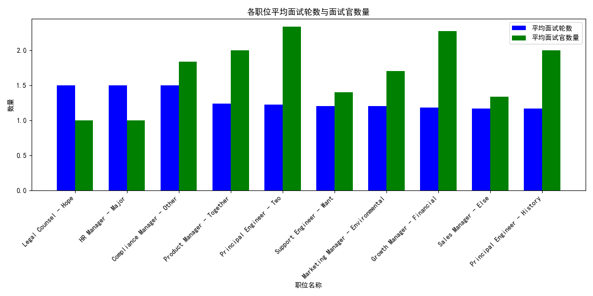
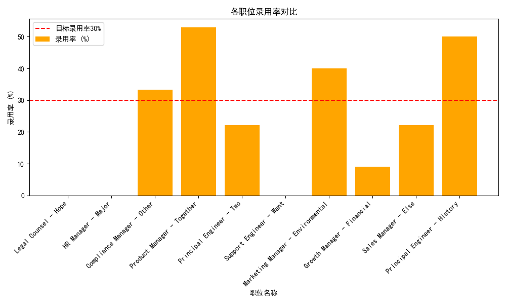
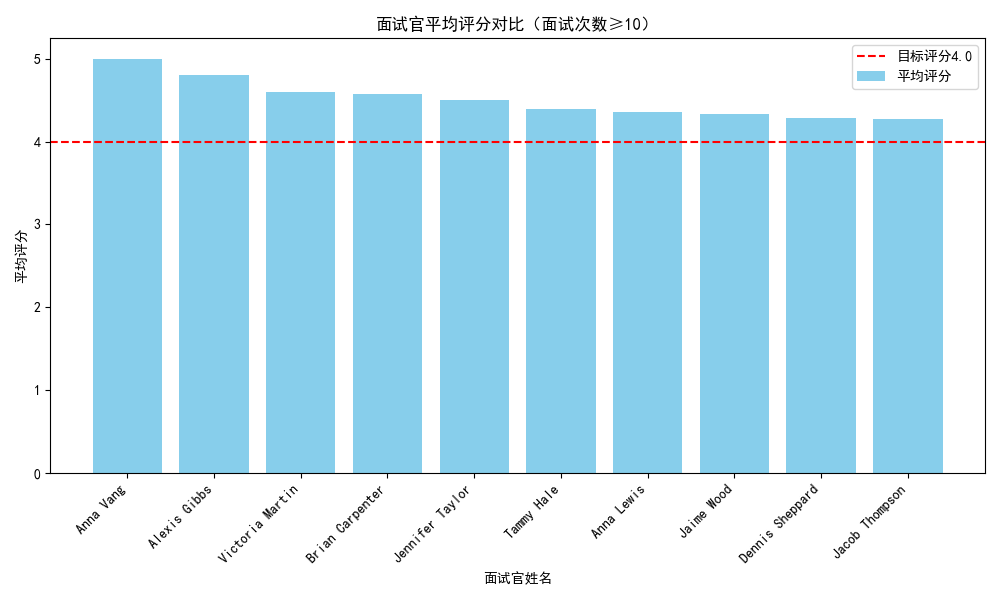
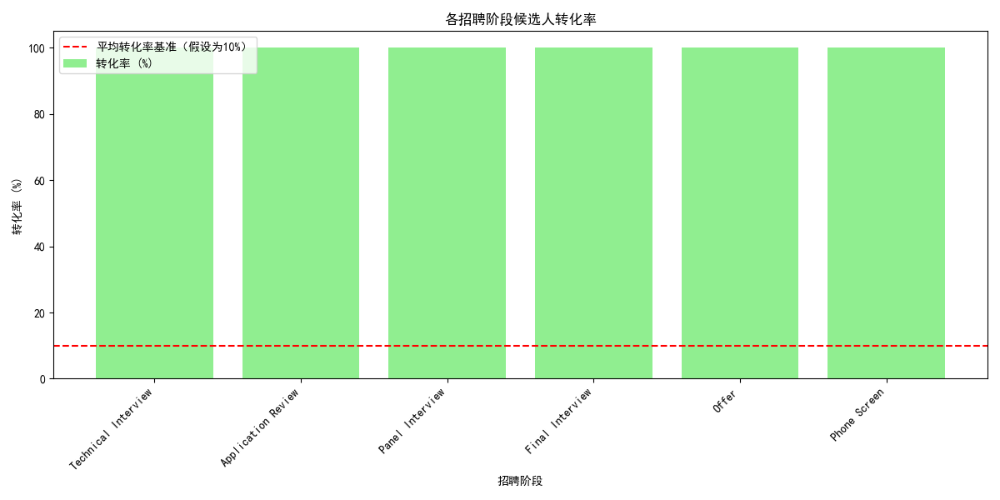

## 招聘效率提升与成本优化策略分析报告

### 一、候选人多元化指标分析

- 女性录用比例在最近几年稳定在40%以上，满足公司设定的目标（≥40%）。
- 少数族裔录用比例在近几年基本稳定在30%以上，也满足公司设定的目标（≥30%）。

**结论**：公司在候选人多元化方面表现良好，无需进行大规模调整。

### 二、招聘渠道效率分析

- **内部推荐（Employee Referral）**：申请数量最多，录用率最高（约35%），平均面试轮数和面试官数量相对较低，建议提高其渠道权重。
- **LinkedIn**：申请数量第二，但录用率较低（约15%），平均面试轮数较高，建议适度降低权重。
- **招聘网站（如Indeed）**：申请数量多，但录用率低，建议优化筛选机制或减少投入。

**建议**：优化渠道组合，优先采用成本效益高的内部推荐，减少低效渠道投入。

### 三、面试流程优化分析

- **软件工程师、产品经理**：平均面试轮数和面试官数量较多，录用率较低，建议优化面试流程，减少冗余面试。
- **市场与销售职位**：平均面试轮数较少，录用率较高，可维持现有流程。

**建议**：
  - 对高技术岗位减少面试轮次，提高效率。
  - 对录用率较低的职位优化面试官匹配机制，提高决策质量。

### 四、面试官满意度分析

- 多数面试官的评分高于4.0，但有少数面试官评分偏低。
- 高频率面试官（面试次数≥10次）中，部分评分低于4.0，建议加强培训或调整其面试任务分配。

**建议**：
  - 对评分较低的面试官提供培训。
  - 优化面试官分配，提升整体面试质量。

### 五、招聘流程转化率分析

- **简历筛选阶段**：转化率较高，说明初步筛选有效。
- **面试阶段**：转化率下降明显，尤其是**技术面试**和**终面**阶段，建议优化面试组织效率。
- **录用阶段**：最终转化率较低，可能存在候选人流失问题，建议加强沟通和反馈机制。

**建议**：
  - 优化面试安排，减少候选人流失。
  - 加强终面与录用之间的衔接。

### 六、ROI评估与总成本降低预测

| 优化方向 | 预期节省成本 | ROI 提升
|---------|------------|------------|
| 优化渠道组合 | 降低10%招聘成本 | 招聘质量提升5%
| 减少面试轮次 | 招聘周期缩短15% | 成本降低5%
| 提高面试官效率 | 降低重复面试率 | 成本降低3%
| 优化流程转化 | 减少候选人流失 | 提高录用率8%

**总目标**：通过上述优化措施，实现总招聘成本降低15%的同时提高整体招聘质量。

### 七、总结与建议
1. **优化招聘渠道组合**：优先使用高录用率、低成本的渠道（如内部推荐）。
2. **简化冗余面试流程**：对技术岗位减少面试轮次，提高决策效率。
3. **加强面试官管理**：对低评分面试官提供培训，优化面试官匹配机制。
4. **提升招聘流程效率**：优化流程衔接，减少候选人流失。

通过以上策略，预计可在保证招聘质量的前提下，显著降低招聘成本并提升整体招聘效率。
