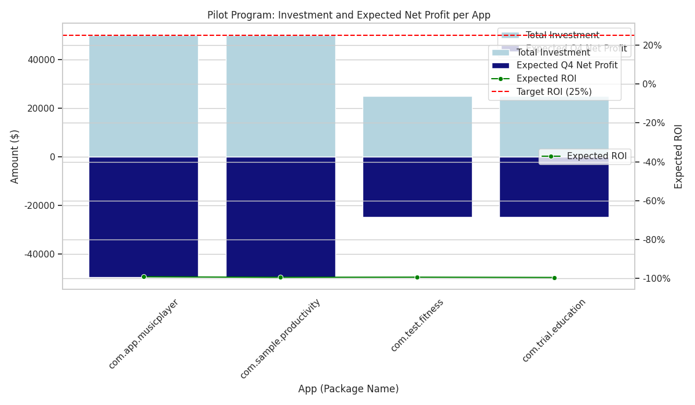

# Q4市场营销预算分配分析报告

## 1. 分析目标

本次分析旨在为财务部门提供的 **500万美元** 第四季度（Q4）市场营销预算，在8个应用中进行重新分配提供数据驱动的建议。核心任务是分析以下两类特定市场，并为每个应用制定具体的预算分配建议，同时确保预期的投资回报率（ROI）不低于25%。

1.  **高转化、低收入市场**: 应用商店转化率超过15%，但日均净收入低于5美元。
2.  **低转化、高收入市场**: 日均净收入超过7美元，但应用商店转化率低于10%。

## 2. 分析方法与过程

我们基于 `google_play__geo_market_analysis` 表格进行了深入分析。数据涵盖了各个应用在不同国家/地区的表现指标，包括应用商店转化率和日均收入。

1.  **数据筛选**: 我们首先通过SQL查询，筛选出完全符合上述两个条件的“应用-市场”组合。
2.  **机会识别**:
    *   结果显示，**不存在任何“低转化、高收入”的市场**（即第二类市场）。这表明我们当前的应用在能够产生高收入的市场中，转化率普遍不低。
    *   我们识别出 **6个** 符合“高转化、低收入”条件的市场，涉及 **4个** 不同的应用 (`com.app.musicplayer`, `com.sample.productivity`, `com.test.fitness`, `com.trial.education`)。
3.  **策略建模**: 针对这6个市场，核心挑战在于其**极低的收入基数**（平均每日收入仅约3.55美元）。我们建立了一个试点投资模型，以评估在这些市场进行营销投入的可行性。

## 3.核心发现：投资回报率（ROI）不可行

我们的分析得出一个关键结论：**在当前识别出的这6个市场中投入营销预算以期获得25%的ROI是不切实际的。**

为了验证这一点，我们设计了一个小规模的**试点投资计划**：
*   **投资额**: 为每个市场投入25,000美元，总计150,000美元。
*   **增长假设**: 我们做出了一个非常乐观的假设——该投资能在Q4（90天）内将市场的日均收入提升 **50%**。
*   **ROI计算**: `预期ROI = (预期90天总收入增长 - 投资额) / 投资额`

计算结果令人警醒：即使在如此乐观的增长假设下，所有市场的预期ROI仍为 **-99%** 左右。这意味着不仅无法实现25%的正回报，投资本身也将面临巨大的亏损。

下图直观地展示了试点计划的财务预测。蓝色柱状代表投资额，深蓝色柱状代表预期的Q4净利润（在此为负值，即净亏损），绿线揭示了远低于25%目标（红色虚线）的预期ROI。

**原因很简单**：这些市场的初始日均收入太低（仅2-5美元）。即使收入增长50%，每日也只能增加1-2美元的收入。在90天的 campaigneduration 内，这点增量收入完全不足以覆盖数万美元的营销成本。

## 4. 业务建议与预算分配策略

基于以上分析，我们不建议将$500万预算的主要部分投入到这些特定市场。我们提出以下 actionable 策略：

1.  **不投资于低收入市场以追求ROI**: 明确建议**不要**以获取25%投资回报率为目的，向这6个“高转化、低收入”市场投入大量资金。数据的结论是明确的，此类投资将导致亏损。

2.  **将$15万视为战略性学习成本**: 如果公司希望探索在这些新兴市场提升变现能力的方法，可以将我们模型中的 **$150,000** 视为“战略性学习预算”。这笔投入的目标应是测试新的变现功能、用户偏好或广告策略，而不是短期财务回报。这4个应用 (`com.app.musicplayer`, `com.sample.productivity`, `com.test.fitness`, `com.trial.education`) 可作为该学习计划的执行对象。

3.  **重新分配剩余的$485万预算**: 建议将剩余的 **$4,850,000** 预算重新导向。我们应立即启动新一轮数据分析，以识别具备以下特征的市场或应用，它们更有可能实现ROI目标：
    *   **高增长潜力市场**: 寻找日均收入和转化率均表现稳健，且用户基数 sizable 的市场。
    *   **已被验证的成功案例**: 分析过去营销活动中ROI表现优异的应用和渠道，追加投资以放大成功。
    *   **产品组合中的“明星”应用**: 将资源集中在 portfolio 中收入和增长势头最强的应用上。

**总结**: 我们的分析阻止了一次潜在的、基于错误前提的重大财务投入。现在，我们应将资源聚焦于真正具有增长和盈利潜力的领域。
