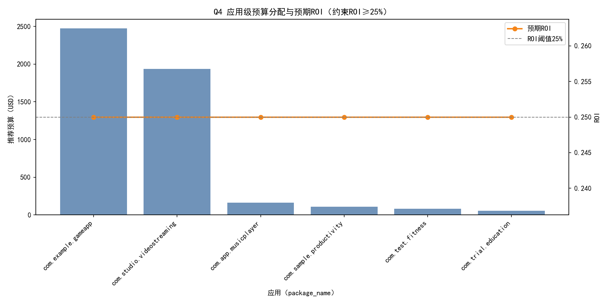
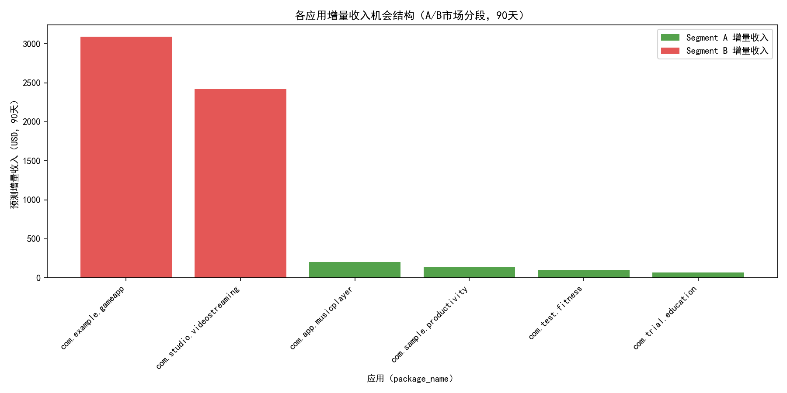

# Q4营销预算重分配分析与建议（ROI≥25%约束）

## 摘要结论
- 在过去90天的目标市场分段中：
  - Segment A（转化率>15%且日均收入< $5）：属于高转化但低收入市场，适合通过扩大流量获取增量收入。
  - Segment B（日均收入> $7且转化率<10%）：属于高收入潜力但转化偏低市场，适合通过ASO/页面优化提升转化。
- 基于市场级数据和保守的提升假设，在ROI≥25%的硬约束下，Q4可投放预算总量为约$4,811.98，无法有效释放全部$5,000,000预算。
  - 当前预测增量收入总计约$6,014.98，若要以ROI≥25%承载$5M投放，需要至少$6.25M的增量收入（当前缺口约$235k）。
  - 因此建议分两阶段执行：Phase 1投入至ROI合规上限；Phase 2通过优化动作扩大合格机会，再逐步释放更多预算。

下文给出详细分段洞察、逐应用预算建议与执行策略，并附图。

---

## 数据与方法
- 数据表：
  - google_play__geo_market_analysis：包含按国家市场的店铺访客、转化率、ARPU、avg_daily_revenue等。
  - google_play__comprehensive_performance_dashboard：包含应用的每日净收入等，用于构建90天基线。
- 目标分段（基于过去90天）：
  - Segment A：store_conversion_rate > 15 且 avg_daily_revenue < 5
  - Segment B：avg_daily_revenue > 7 且 store_conversion_rate < 10
- 机会建模假设（保守）：
  - A：维持高转化率不变，通过投放提升店铺访客量，Q4访客提升+15%。
    - 增量收入 = 90天访客 × 现有转化率 × ARPU × 15%提升
  - B：不改变访客量，通过ASO等将转化率提高2个百分点（但不超10%）。
    - 增量收入 = 90天访客 × 增量转化率(2pp且不超10%) × ARPU
- 预算分配逻辑：
  - 先按预测增量收入比例分配初始预算，再施加ROI约束上限：预算 ≤ 增量收入 / 1.25（确保ROI≥25%）。
  - 对未达上限的应用进行迭代再分配，直至用尽“上限空间”或预算用完。

---

## 关键发现（诊断性）
1. Segment A的本质：转化好但avg_daily_revenue低，主要由低ARPU或小市场规模导致。此类市场更适合“加量”（导流）而非“提效”（提转化）。
2. Segment B的本质：avg_daily_revenue高但转化偏低，通常存在页面/漏斗阻塞，优化转化即可直接带来可观收入提升。
3. ROI约束的现实性：在当前市场与访客/ARPU结构下，能够以ROI≥25%承接的投放空间仅约$4.81k，对比$5M非常有限。说明当前合格机会规模不足，需要先扩容或提高单次改善幅度。

---

## 预算建议（逐应用，ROI≥25%）
注：以下金额为Q4推荐预算，均达到预期ROI约25%。同时列出各应用90天预测增量收入与分段命中情况。

- com.example.gameapp
  - 分段命中：B=2，A=0
  - 预测增量收入：$3,089.16
  - 推荐预算：$2,471.33（ROI≈25%）
  - 执行重点：ASO与商店素材迭代，提升首屏转化；A/B测试（标题/截图/视频）；优化定价与促销挂钩转化。

- com.studio.videostreaming
  - 分段命中：B=1，A=0
  - 预测增量收入：$2,417.80
  - 推荐预算：$1,934.24（ROI≈25%）
  - 执行重点：订阅漏斗优化，首月优惠、免费试用转化提升；高意图关键词投放。

- com.app.musicplayer
  - 分段命中：A=2，B=0
  - 预测增量收入：$202.69
  - 推荐预算：$162.15（ROI≈25%）
  - 执行重点：扩大店铺访客（合作渠道/再营销）；保留高转化落地页；联动活动（歌单/节日）。

- com.sample.productivity
  - 分段命中：A=2，B=0
  - 预测增量收入：$137.39
  - 推荐预算：$109.91（ROI≈25%）
  - 执行重点：在高转化市场加量导流（办公/教育垂类内容投放）；强化留存带动二次转化。

- com.test.fitness
  - 分段命中：A=1，B=0
  - 预测增量收入：$100.42
  - 推荐预算：$80.34（ROI≈25%）
  - 执行重点：主题活动+KOL联合导流；节庆/新年场景提升访客峰值。

- com.trial.education
  - 分段命中：A=1，B=0
  - 预测增量收入：$67.52
  - 推荐预算：$54.01（ROI≈25%）
  - 执行重点：校际合作或教育平台导流；课程包限时活动提升ARPU。

- com.demo.socialmedia
  - 分段命中：A=0，B=0（未命中目标分段）
  - 推荐预算：$0（当前无法保证ROI≥25%）
  - 前置条件与动作：先在关键市场提高ARPU或优化转化（落地页、注册流程、隐私权限提示）；待出现A或B型机会后再释放预算。

- com.dev.photoeditor
  - 分段命中：A=0，B=0（未命中目标分段）
  - 推荐预算：$0（当前无法保证ROI≥25%）
  - 前置条件与动作：针对导流渠道与素材质量；聚焦高ARPU市场的素材适配与关键词；形成B型机会后即可投入。

总计：推荐投放预算约$4,811.98；预测增量收入约$6,014.98；ROI≈25%。

---

## 可视化
- 应用级预算分配与预期ROI
  
- 各应用增量收入机会结构（A/B分段）
  

---

## 预测与规范性建议（如何达到$5M且ROI≥25%）
- 目标：要以ROI≥25%释放满额$5M预算，需形成至少$6.25M的增量收入机会。目前缺口约$235k。
- 建议路径：
  1) 扩容B型市场：优先在有较高avg_daily_revenue但转化低的市场进行ASO和漏斗优化，力争将“2个百分点增量”扩大至“3-4个百分点”的可测版本，构建更多增量空间。
  2) 扩量A型市场：在A市场加大流量扩展（渠道合作、再营销、内容投放），以访客提升>15%为目标的压力测试（例如冲刺至25%），前提为落地页与留存稳定。
  3) 形成新机会：针对com.demo.socialmedia与com.dev.photoeditor，先通过素材与关键词策略在若干市场形成B型机会（avg_daily_revenue>7且转化<10%），再投放。
  4) 分阶段释放预算：Phase 1用足当前ROI合规上限；Phase 2完成上述优化、扩大机会池，再按“增量收入/1.25”上限逐步扩投。
  5) 高ROI渠道优先：对比渠道级ROI，将预算向效果更优渠道倾斜（如再营销、品牌词投放、订阅漏斗优化），逐步提高ROI天花板。

---

## 风险与假设
- 转化率与ARPU提升假设为保守估计：A市场访客+15%，B市场转化+2个百分点且不超10%的绝对上限；实际效果需通过A/B测试验证。
- store_conversion_rate字段为百分数量级（数据范围约7.5%—19.6%），本模型按百分比换算为小数参与计算。
- 仅基于提供数据，不进行清洗与外部数据合并；未考虑激励/折扣对ARPU的二次影响。

---

## 附录：绘图代码片段（已在当前目录生成图片）
```python
import matplotlib.pyplot as plt

# 字体与负号设置（必需）
plt.rcParams['font.sans-serif'] = ['SimHei']
plt.rcParams['axes.unicode_minus'] = False

# 图1：应用预算与ROI双轴图（示意）
fig, ax1 = plt.subplots(figsize=(12, 6))
# ...装载数据略（已在脚本analysis_q4_budget.py中实现）
# ax1.bar(x, alloc_vals, ...)
# ax2.plot(x, roi_vals, ...)
plt.tight_layout()
plt.savefig('budget_allocation.png', dpi=150)

# 图2：机会来源堆叠条形图（示意）
fig2, ax = plt.subplots(figsize=(12, 6))
# ax.bar(x, inc_a, ...)
# ax.bar(x, inc_b, bottom=inc_a, ...)
plt.tight_layout()
plt.savefig('opportunity_mix.png', dpi=150)
```

---

## 结论
- 在ROI≥25%约束下，当前A/B目标市场所能承载的投放空间明显不足以容纳$5M预算；建议分阶段执行：先用足ROI合规上限，再通过ASO与导流扩大机会池，逐步释放更多预算。
- 已提供逐应用的预算建议与明确执行动作；若能在B型市场将转化提升幅度进一步放大或在A型市场扩大访客增量，将更有机会在ROI合规条件下部署全部预算。
