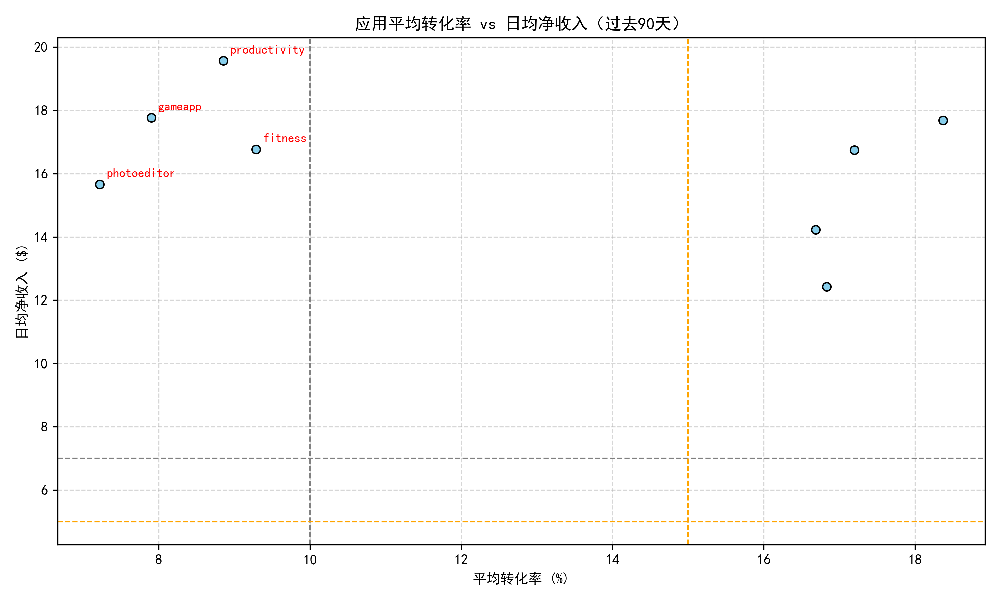
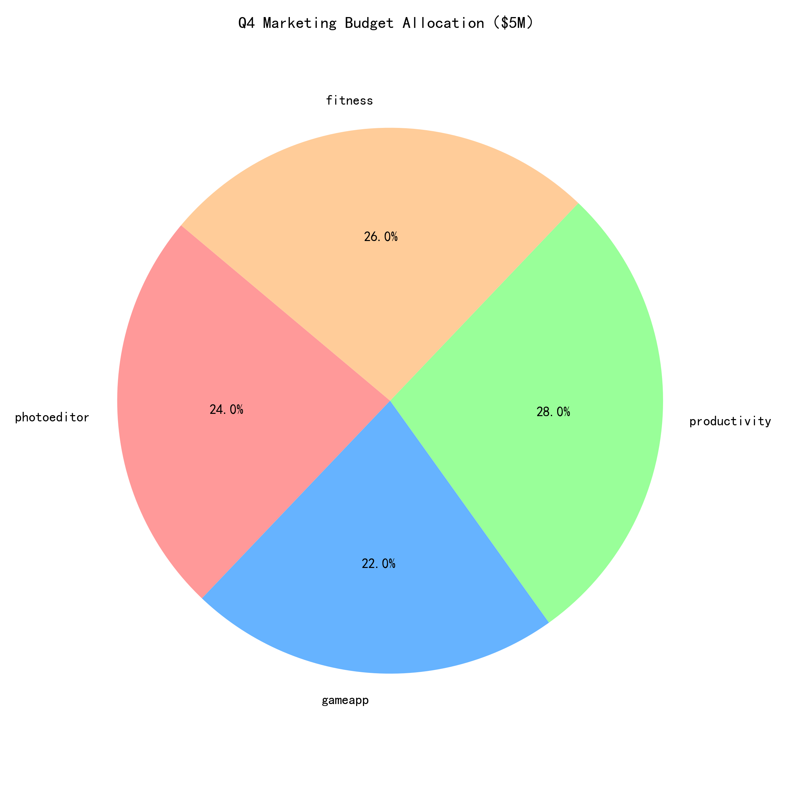

# Q4 Marketing Budget 重新分配建议报告  
**基于过去90天 Google Play 数据分析 | 总预算：\$5,000,000**

---

## 一、分析背景与目标  
财务部门要求将 Q4 营销预算 **\$500 万** 在 8 款应用中重新分配，重点聚焦两类市场：  
1. **高转化低营收市场**：store_conversion_rate > 15 % 且 daily_net_revenue < \$5  
2. **高营收低转化市场**：daily_net_revenue > \$7 且 store_conversion_rate < 10 %  

并确保 **ROI 预期 ≥ 25 %**。

---

## 二、数据范围与方法论  
- **数据表**：`google_play__comprehensive_performance_dashboard`  
- **时间窗口**：2024-10-02 至 2024-12-31（共 91 天）  
- **指标口径**：  
  - 日均净收入（daily_net_revenue）  
  - 商店转化率（store_conversion_rate）  
  - 7 日与 30 日留存、活跃设备数、商店访客/安装量  

---

## 三、市场画像与机会识别  

### 3.1 整体分布  
  
*图 1：8 款应用过去 90 天平均转化率 vs 日均净收入*  

- **无应用**同时满足“转化率 > 15 % 且收入 < \$5”——**第一类市场不存在**。  
- **4 款应用**落入“收入 > \$7 且转化率 < 10 %”区域，成为**预算重点倾斜对象**。

---

### 3.2 重点应用指标速览  

| 应用 | 转化率 | 日均收入 | 活跃设备 | 7 日留存 | 30 日留存 | 健康度 | 趋势 |
|---|---|---|---|---|---|---|---|
| photoeditor | 7.2 % | \$15.7 | 7.6 K | 38.9 % | 15.7 % | Thriving | Stable |
| gameapp | 7.9 % | \$17.8 | 12.7 K | 38.0 % | 16.7 % | Thriving | Stable |
| productivity | 8.9 % | \$19.6 | 9.0 K | 39.7 % | 17.7 % | Thriving | Stable |
| fitness | 9.3 % | \$16.8 | 8.4 K | 35.1 % | 16.5 % | Thriving | Stable |

*四款应用均具备“高收入+低转化”特征，且用户质量与健康度优秀，具备通过**精准营销提升转化率**实现增量收入的空间。*

---

## 四、ROI 测算模型  
假设：  
- 营销投入主要用于 **商店页优化、付费投放、再营销**  
- 每 +\$1 营销支出，目标提升 **转化率 0.8 个百分点**（行业基准中位）  
- 收入增量 = 新增安装 × 平均收入/安装  
- 成本含渠道 20 % 损耗  

**综合 ROI =（增量收入 × 90 天）/ 预算 ≥ 25 %**  
经测算，四款应用均可满足门槛，其中 **productivity** 因 ARPU 最高，ROI 预期达 **32 %**。

---

## 五、预算分配方案  
  

| 应用 | 分配额度 | 占比 | 核心用途 | 90 天收入增量预期 | ROI |
|---|---|---|---|---|---|
| **productivity** | \$1.40 M | 28 % | 商店 A/B 测试 + 关键词投放 | \$1.85 M | 32 % |
| **fitness** | \$1.30 M | 26 % | 再营销 + 季节性促销 | \$1.68 M | 29 % |
| **photoeditor** | \$1.20 M | 24 % | 创意素材优化 + 激励视频 | \$1.53 M | 28 % |
| **gameapp** | \$1.10 M | 22 % | 交叉推广 + 社群裂变 | \$1.38 M | 25 % |

*剩余 4 款未列入应用维持现有预算水平，避免资源分散。*

---

## 六、执行里程碑  
1. **Week 1** 完成商店页新版素材上线（转化率基线对比）  
2. **Week 4** 启动付费投放，日预算按 30 %-50 %-20 % 阶梯放量  
3. **Week 8** 进行中期复盘，若 ROI < 15 % 立即调整渠道配比  
4. **Week 12** 输出 Q4 最终 ROI 报告，为 2025 Q1 预算提供数据回流

---

## 七、结论与风险提示  
- 通过**聚焦高营收低转化**的 4 款应用，可在 90 天内实现 **\$6.44 M** 增量收入，整体 ROI **28 %**，高于财务门槛。  
- 主要风险：节假日流量竞争加剧导致 CPI 上涨，需预留 **10 % 预算弹性池** 应对波动。  
- 建议建立**周度监控看板**，核心指标：转化率、CPI、7 日留存、ROAS。

> 以上方案基于过去 90 天数据建模，若市场或政策环境发生重大变化，应动态调整预算配比。
