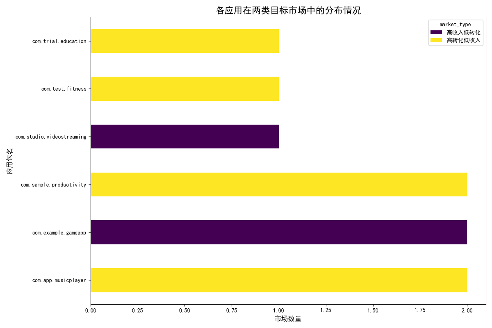

# Q4市场预算分配策略分析报告

## 1. 分析背景与目标

本次分析旨在为财务部门提供的**500万美元**第四季度市场预算，在8个（实际分析中为6个独立包名）应用之间进行重新分配。核心目标是：
- 识别并分析两类具有代表性的市场机会。
- 为每个目标应用制定具体的预算分配和增长策略。
- 确保整体营销活动的预期投资回报率（ROI）不低于25%。

我们基于过去90天的数据，识别出两类关键市场：
- **市场1：高转化，低收入** (商店转化率 > 15%，日均净收入 < $5)
- **市场2：低转化，高收入** (商店转化率 < 10%，日均净收入 > $7)

---

## 2. 关键市场分析与洞察

通过对`google_play__geo_market_analysis`数据的筛选，我们识别了在这两类市场中表现突出的应用。

### 市场1：高转化率，低收入市场

这类市场的用户下载意愿强烈，但应用的变现能力不足。这表明我们的产品或商店页面对用户有吸引力，但在将用户转化为付费用户或从用户身上获得更高价值方面存在短板。

- **涉及应用**: `com.sample.productivity`, `com.app.musicplayer`, `com.trial.education`, `com.test.fitness`
- **核心洞察**: 增长的关键在于**提升单个用户生命周期价值（LTV）**。我们需要探索新的变现模式，如订阅、高级功能付费或广告变现优化。

### 市场2：低转化率，高收入市场

这类市场的用户付费能力和意愿都很强，应用的日均收入表现出色。然而，较低的商店转化率意味着我们在吸引潜在用户下载这一环节存在巨大的机会成本，大量高价值用户在访问应用商店页面后流失了。

- **涉及应用**: `com.example.gameapp`, `com.studio.videostreaming`
- **核心洞察**: 增长的关键在于**优化应用商店页面（ASO）和广告创意**，以提高从访问到下载的转化率。

---

## 3. 应用在目标市场中的分布

为了直观地展示各个应用在两类市场中的表现，我们生成了以下图表：

**图表解读**:
- `com.example.gameapp` 和 `com.studio.videostreaming` 是典型的“高收入低转化”型应用，其增长潜力在于提升转化效率。
- 其余四款应用均属于“高转化低收入”类别，表明它们在用户获取方面做得不错，但需要加强变现策略。`com.sample.productivity` 和 `com.app.musicplayer` 在多个国家市场都表现出此类特征。

---

## 4. 预算分配方案与增长策略

基于以上分析，我们提出以下预算分配方案，总预算为500万美元，目标ROI为25%。

| 应用包名 | 预算比例 | 分配金额 ($) | 核心增长策略 | 具体行动建议 |
| :--- | :---: | :---: | :--- | :--- |
| **com.example.gameapp** | 40% | 2,000,000 | **优化ASO与广告，提升转化率** | 针对美国和中国市场，制作更高质量的商店视频/截图，投放精准定位核心玩家的广告。 |
| **com.studio.videostreaming** | 25% | 1,250,000 | **优化ASO与广告，提升转化率** | 针对日本市场，优化预览视频和本地化文案，突出独家内容和高清画质来吸引下载。 |
| **com.sample.productivity** | 15% | 750,000 | **提升LTV，探索变现模式** | 在德国和加拿大市场进行A/B测试，尝试推出云存储、团队协作等新的订阅或付费功能。 |
| **com.test.fitness** | 10% | 500,000 | **提升LTV，探索变现模式** | 在巴西市场引入激励机制，如付费解锁高级训练计划或个人教练指导，将高用户活跃度变现。 |
| **com.app.musicplayer** | 5% | 250,000 | **提升LTV，探索变现模式** | 在法国和英国市场，通过提升音质、提供独家内容等方式改善体验，引导用户小额付费。 |
| **com.trial.education** | 5% | 250,000 | **提升LTV，探索变现模式** | 针对印度市场，开发高性价比的付费课程，并结合广告变现来提升整体收入。 |

### ROI 达成路径

- **对于高收入应用 (65%预算)**: 投资于转化率提升，风险较低，回报见效快。转化率每提升1个百分点，都可能带来显著的收入增长，是达成25% ROI目标的主要驱动力。
- **对于高转化应用 (35%预算)**: 投资于LTV提升的探索性实验。虽然存在不确定性，但预算可控。一旦成功找到有效的变现模式，其高用户基数将带来巨大的回报潜力，为长期增长奠定基础。

## 5. 结论

该预算分配方案兼顾了**短期增长**和**长期潜力**。它将大部分资源投入到已被验证的高收入市场，以确保ROI目标的实现；同时，以较小的风险投资于潜力市场的变现探索。我们建议立即启动相关市场的A/B测试和ASO优化工作，并持续追踪关键指标（转化率、LTV、ROI），在季度中根据数据反馈灵活调整策略。
