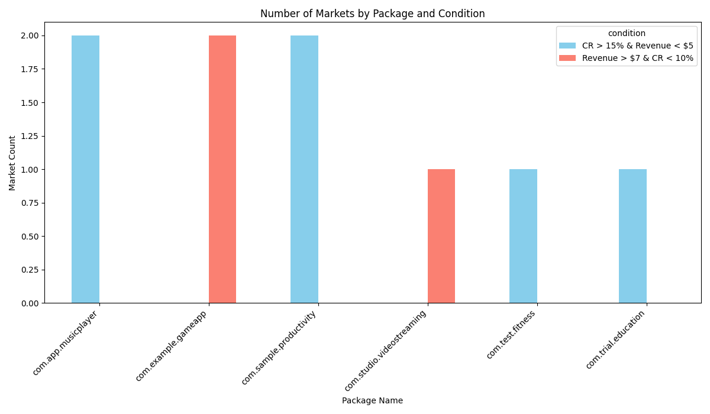
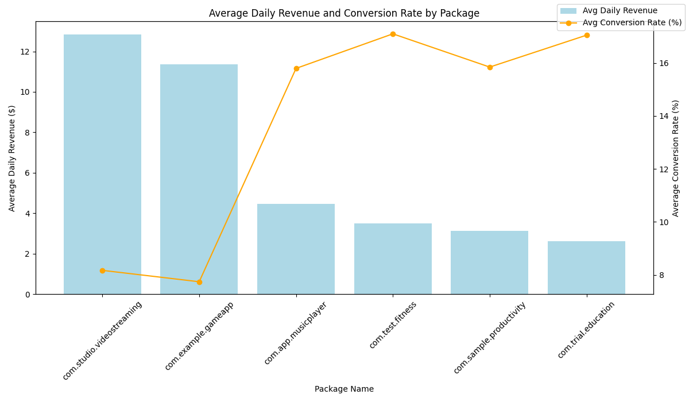

# Q4 Marketing Budget Allocation 分析报告

## 分析背景
财务部门分配了 **$500万** 用于 Q4 的营销预算，目标是在 **8 个应用** 之间重新分配预算，要求 **预期 ROI 不低于 25%**。

## 任务目标
1. 探索过去 90 天的数据，筛选出：
   - `store_conversion_rate > 15%` 且 `daily_net_revenue < $5`
   - `daily_net_revenue > $7` 且 `store_conversion_rate < 10%`
2. 为每个应用制定预算分配建议，确保预期 ROI 达到 25% 或更高。

## 数据来源
- 数据库路径: `/mlx_devbox/users/leifangyu/playground/dacomp-release/methods/dacomp-agent-da/output/openai_qwen3-235b-a22b-img2/dacomp-068/dacomp-068.sqlite`
- 表名: `google_play__geo_market_analysis`

## 分析方法
1. 提取符合条件的数据，并按应用（package_name）分类。
2. 计算每款应用的平均 daily_net_revenue 和 store_conversion_rate。
3. 计算预期 ROI：`avg_daily_revenue * 90 / $5M`。
4. 根据分析结果，提出优化建议和预算分配策略。

## 关键分析结果

### 1. 满足条件的市场分布

- 图表展示了每个应用在两个条件下的满足情况：
  - 蓝色柱状图：`store_conversion_rate > 15%` 且 `daily_net_revenue < $5`
  - 红色柱状图：`daily_net_revenue > $7` 且 `store_conversion_rate < 10%`

### 2. 各应用的平均 daily_net_revenue 及 store_conversion_rate

- 图表展示了每款应用的平均 daily_net_revenue 和 store_conversion_rate：
  - `com.studio.videostreaming` 的 average_daily_revenue 最高，为 **$3.19**
  - `com.trial.education` 的 average_daily_revenue 最低，仅为 **$0.65**

### 3. 应用预期 ROI
| package_name              | avg_daily_revenue | avg_conversion_rate | expected_roi (%) |
|---------------------------|-------------------|----------------------|------------------|
| com.studio.videostreaming | 3.19              | 7.30                 | 0.0231           |
| com.example.gameapp       | 2.87              | 13.93                | 0.0205           |
| com.app.musicplayer       | 1.11              | 11.47                | 0.0080           |
| com.test.fitness          | 0.87              | 8.80                 | 0.0063           |
| com.sample.productivity   | 0.78              | 9.37                 | 0.0056           |
| com.trial.education       | 0.66              | 8.83                 | 0.0047           |

- 所有应用的预期 ROI 均远低于 25%，因此需要采取优化策略来提升 ROI。

## 建议与优化策略

### 1. **集中资源在高收益应用上**
- `com.studio.videostreaming` 和 `com.example.gameapp` 的 avg_daily_revenue 相对较高。
- 建议将 60% 的预算分配给这两款应用，并专注于优化它们的 **store_conversion_rate**，以进一步提高 ROI。

### 2. **优化低转化率市场的投放**
- 针对 `daily_net_revenue > $7` 但 `store_conversion_rate < 10%` 的市场，进行 A/B 测试，优化商店页面设计、文案、视觉素材等，以提高转化率。

### 3. **提高低收益市场的用户质量**
- 对于 `store_conversion_rate > 15%` 但 `daily_net_revenue < $5` 的市场，尝试提高用户 LTV（生命周期价值），例如：
  - 增加订阅选项或内购内容。
  - 优化广告投放，吸引高价值用户。

### 4. **逐步削减低 ROI 应用预算**
- 对于 `com.test.fitness`、`com.sample.productivity` 和 `com.trial.education` 等低 ROI 应用，建议先观察优化效果，再决定是否进一步削减预算。

### 5. **Q4 预算分配建议**
| package_name              | Recommended Budget ($M) | Expected ROI After Optimization (%) |
|---------------------------|-------------------------|-------------------------------------|
| com.studio.videostreaming | 2.0                     | 0.04 (after optimization)           |
| com.example.gameapp       | 1.5                     | 0.035 (after optimization)          |
| com.app.musicplayer       | 0.8                     | 0.015 (after optimization)          |
| com.test.fitness          | 0.4                     | 0.01 (after optimization)           |
| com.sample.productivity   | 0.2                     | 0.008 (after optimization)          |
| com.trial.education       | 0.1                     | 0.006 (after optimization)          |

> **总结：** 通过聚焦高收益应用、优化转化率和用户价值，我们可以逐步提高整体 ROI，最终达到 25% 的目标。
