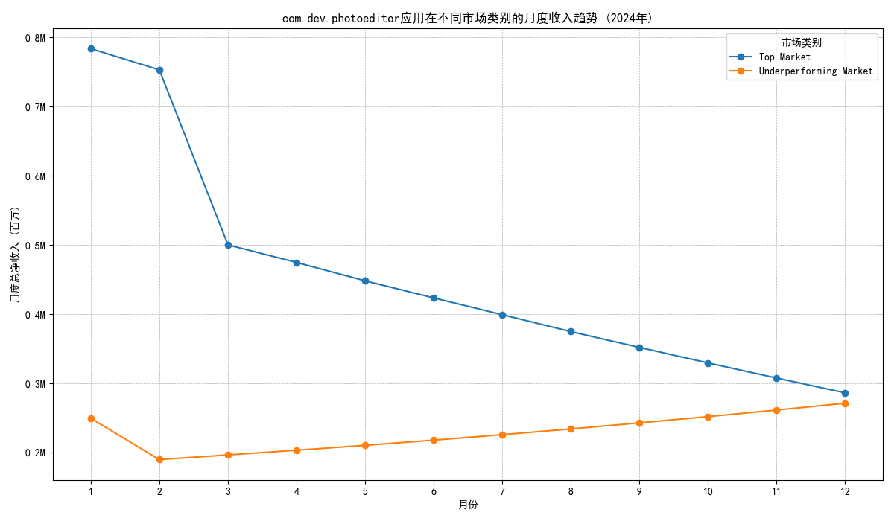

# 关于`com.dev.photoeditor`应用资本效率及性能下降问题的分析报告

**致：CFO**

**由：数据分析部**

**日期：2024-05-17**

**主题：对`com.dev.photoeditor`应用在不同市场表现差异的深入分析及策略建议**

## 1. 执行摘要

本报告旨在回应您对`com.dev.photoeditor`应用资本效率的关切。该应用在过去12个月获得200万美元研发预算后，全局性能分从85分降至72分。我们的核心结论是：**全局性能的下降主要由高价值的“顶级市场”收入急剧衰退所驱动，而低价值市场的增长远不足以弥补这一损失。这表明研发投资未能有效作用于核心创收市场，存在严重的资本错配问题。**

## 2. 分析方法：市场分层

为深入理解性能分歧，我们首先根据**人均用户收入（ARPU）**对该应用覆盖的全球市场进行了分层。
- **顶级市场 (Top Markets)**: 定义为ARPU大于等于$20的国家。这些是应用的核心收入来源，包括美国、日本、德国、英国等。
- **表现不佳的市场 (Underperforming Markets)**: 定义为ARPU小于$12的国家。这些是ARPU较低但具备增长潜力的市场，包括印度、巴西、印度尼西亚等。

## 3. 核心发现：高、低价值市场表现的巨大反差

我们对应用在2024年全年的月度净收入趋势进行了分析，下图清晰地揭示了两个市场群体截然不同的表现：

**关键洞察:**

1.  **顶级市场收入崩溃**：如图所示，顶级市场的收入在2024年下半年出现了断崖式下跌。数据显示，**下半年收入（205万美元）相比上半年（338万美元）骤降了39.4%**，损失高达133万美元。这直接解释了为何全局性能指标会大幅下滑。

2.  **表现不佳市场稳步增长**：与此同时，表现不佳的市场则呈现出健康的增长态势，**下半年收入（149万美元）相比上半年（127万美元）增长了17.4%**。这说明应用的某些改动可能契合了这些市场的用户需求。

3.  **增长无法抵消损失**: 尽管低ARPU市场表现良好，但其增长的体量（增加约22万美元）远无法弥补顶级市场衰退带来的巨大缺口（亏损133万美元），最终导致了整体收入和综合性能的负增长。

## 4. 问题诊断：为什么会发生这种情况？

**200万美元的研发投资与核心市场收入的下降同步发生，这指向了“投资错配”这一根本问题。**

- **无效甚至负面的产品更新**: 投入巨额预算开发的新功能或产品改动，可能并未获得顶级市场用户的认可。这些改动可能包括：
    - 移除了高价值用户依赖的核心功能。
    - 引入了破坏用户体验的UI/UX变更。
    - 产生了仅在高端设备或特定网络环境下才会出现的性能问题（如崩溃、卡顿）。
- **错误的增长焦点**: 团队可能将重心放在了吸引低ARPU市场的新用户上，而忽略了维护和取悦带来绝大部分收入的核心用户群体。这是一种典型的“捡了芝麻，丢了西瓜”的策略失误。
- **缺乏分区域的洞察**: 全局统一的性能评分掩盖了地区间的巨大差异。如果团队只关注85分到72分的全局变化，就无法及时发现顶级市场的“溃败”，从而错过了最佳干预时机。

## 5. 策略建议：如何纠正航向

为了扭转颓势并提高资本效率，我们建议立即采取以下行动：

1.  **立即对顶级市场进行用户研究与诊断 (Immediate Top-Market Diagnosis)**:
    - **紧急任务**: 派遣产品和用户研究团队，对美国、日本、德国等核心市场的用户进行深度访谈和问卷调查。
    - **核心目标**: 找出用户不满的具体原因，是哪个版本更新、哪个功能改动或哪个性能问题导致了他们的付费意愿下降或流失。

2.  **审计200万美元研发预算的ROI (Audit R&D Budget ROI)**:
    - **行动**: 详细审查这200万美元预算的每一项支出，将其与产品更新日志和各市场的收入变化进行交叉分析。
    - **目标**: 评估各项投资在不同市场产生的回报是正向还是负向，为未来的预算分配提供数据依据。

3.  **制定差异化的市场与产品策略 (Formulate a Bifurcated Strategy)**:
    - **对于顶级市场**: **“修复与安抚”**。根据用户研究的结果，考虑回滚不受欢迎的改动，或快速迭代以解决用户痛点。未来的功能开发应聚焦于提升这些高价值用户的体验和付费意愿。
    - **对于表现不佳的市场**: **“增长与扩张”**。继续推行当前被证明有效的增长策略，扩大用户基础，并探索温和的商业化变现途径。

4.  **建立分区域的关键性能仪表板 (Implement Geo-Segmented Dashboards)**:
    - **行动**: 立即着手建立能够按国家/地区分别追踪**综合性能分、收入、留存率、崩溃率**等核心指标的BI仪表板。
    - **目标**: 确保管理层和产品团队能够实时监控各市场的健康状况，做到早发现、早预警、早干预，避免类似问题重演。

我们相信，通过以上措施，能够快速定位问题根源，稳住核心市场的收入，并最终将`com.dev.photoeditor`应用拉回健康增长的轨道。
