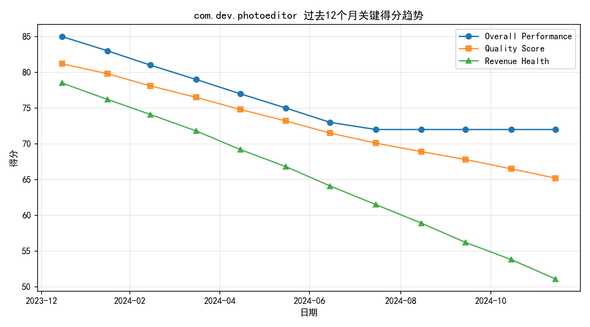
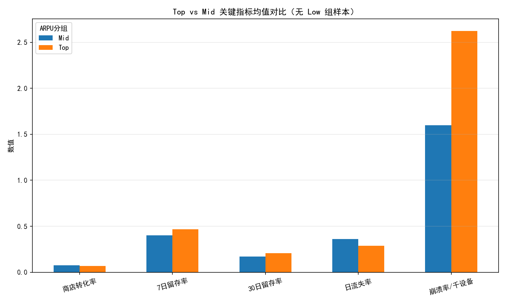
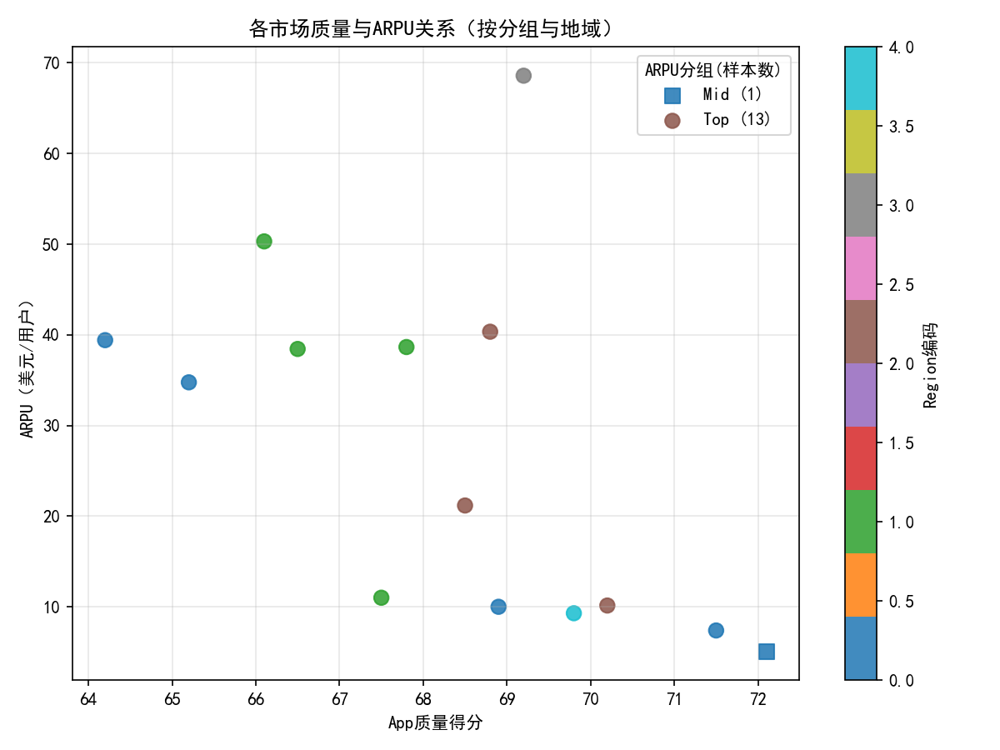

# com.dev.photoeditor 地区绩效分化与资本效率诊断（过去12个月）

## 结论摘要（TL;DR）
- 总体：在投入约$2M研究预算的过去12个月内，该应用的总体绩效下行（overall_performance_score从85降至72），质量与收入健康分值同步走弱。
- 地区绩效分化明显：
  - Top市场（按ARPU>7美元定义）整体留存更优、流失更低，但质量分与商店转化率偏弱、周增长率为负，显示“高价值但增长受限且质量负担加重”。
  - 数据集中无“ARPU<3美元”的Low市场样本；仅有1个Mid市场（印尼，ARPU≈5.08），作为低ARPU对照：其转化率、质量、增长更高，但留存弱、流失率高、ARPU低。
- 关键成因线索：ARPU与留存正相关，与流失显著负相关，但与质量分、转化率、周增长率呈负相关、与崩溃率呈正相关，指向“高ARPU地区可能有更重的稳定性/体验债务与增长乏力问题”。
- 策略：优先在Top市场投入“质量稳定性+转化率优化”，扭转负增长并改善绩效评分；在Mid/潜在低ARPU市场投入“留存提升与订阅LTV设计”，承接高转化的增量流入，形成第二增长曲线。

---

## 数据与方法
- 数据源（SQLite: dacomp-069.sqlite）
  - google_play__comprehensive_performance_dashboard：月度综合指标（样本期 2024-01-15 至 2024-12-15，共12条）。
  - google_play__geo_market_analysis：按国家/地区的市场画像（14个市场，5个region）。
  - google_play__finance_report：按国家的交易/净额（但国家级“日均净收入”远大于阈值$7/$3，不适合直接用作市场分层阈值）。
- 分组口径：将“revenue超过$7 / 低于$3”的阈值落地为ARPU（average_revenue_per_user）。本数据集中：
  - Top组（ARPU>7）：13个市场
  - Mid组（3≤ARPU≤7）：1个市场（印尼，ARPU≈5.08）
  - Low组（ARPU<3）：0个市场（数据缺失）
- 绘图：使用Python+Matplotlib生成3张图，保存在当前目录。

---

## 背景与总体趋势
- 绩效分值首末对比（SQL）：
  - 2024-01-15：overall=85，quality=81.2，revenue_health=78.5
  - 2024-12-15：overall=72，quality=65.2，revenue_health=51.1
- 可视化：

- 观察：质量与收入健康的持续走弱与总体绩效同步，暗示质量稳定性、转化/变现健康在下行周期中扮演了核心角色。

---

## Top（ARPU>7） vs 低ARPU市场（以Mid为对照）的差异
- 分组均值（SQL）：
  - Top组（n=13）：
    - AVG(ARPU)=29.19；商店转化率=0.0677；7日留存=0.4662；30日留存=0.2077；日流失=0.2877；质量分=68.02；崩溃率/千=2.623；周增长率=-0.02。
  - Mid组（n=1，印尼）：
    - ARPU=5.08；转化率=0.077；7日留存=0.40；30日留存=0.17；日流失=0.36；质量分=72.1；崩溃率/千=1.6；周增长率=0.12。
- 对比结论：
  - Top vs Mid：Top留存更好（更高的D7/D30，流失更低），但转化率更低、质量/稳定性指标更差（质量分更低、崩溃更高），且整体周增长率为负；Mid转化和增长更优，但留存与LTV偏弱。
- 可视化（关键指标对比）：


说明：数据中没有ARPU<3的市场，无法直接与Low组对比。若CFO需要严格对比，可在后续数据工程侧补充更多市场或下探到用户分位段（基于用户级ARPU分箱）进行“Low组”分析。

---

## 地区（Region）层面的Top市场分化
- Top组分地区均值（SQL要点）：
  - Europe（n=4）：ARPU=34.60；转化=0.0628；D7=0.460；D30=0.2025；流失=0.300；质量=66.98；崩溃/千=2.85；周增长=-0.05。
  - North America（n=3）：ARPU=23.89；转化=0.0723；D7=0.4867；D30=0.2200；流失=0.2667；质量=69.17；崩溃/千=2.467；周增长=-0.0233。
  - Asia（n=4）：ARPU=22.90；转化=0.0700；D7=0.4550；D30=0.2025；流失=0.2975；质量=67.45；崩溃/千=2.675；周增长=-0.01。
  - South America（n=1）：ARPU=9.30；转化=0.0720；D7=0.3800；D30=0.1600；流失=0.3500；质量=69.80；崩溃/千=2.10；周增长=+0.08。
  - Oceania（n=1）：ARPU=68.57；转化=0.0600；D7=0.5600；D30=0.2600；流失=0.2000；质量=69.20；崩溃/千=2.50；周增长=-0.03。
- 关键洞察：
  - 欧洲Top：ARPU高但增长最弱（-5%/周），转化与质量较弱，是“高价值但增长受阻”的典型代表。
  - 北美Top：留存最佳（D7、D30最高），流失最低，但增长仍为负，需在漏斗端解法上发力。
  - 亚洲Top：中性偏弱，增长近0，改善空间在产品质量与转化两端。
  - 南美Top（单市场）：ARPU低但增长为正，留存偏低，适合以低价包/本地化订阅培育LTV。
  - 大洋洲Top（单市场）：超高ARPU、留存强，但转化低、增长为负，应守住高价值用户的体验/价格弹性。
- 质量-ARPU散点（按分组与地域）：


---

## 诊断：ARPU与关键指标的相关性（n=14个市场）
- 计算结果（Python）：
  - corr(ARPU, D7)=+0.766；corr(ARPU, D30)=+0.736 → 高ARPU市场通常留存更佳。
  - corr(ARPU, churn)=-0.745 → 高ARPU伴随更低流失。
  - corr(ARPU, quality)=-0.539、corr(ARPU, conv)=-0.523、corr(ARPU, growth)=-0.673 → 高ARPU市场的质量分、商店转化与周增长反而偏弱。
  - corr(ARPU, crash)=+0.687 → 令人警觉：ARPU越高的市场，崩溃率越高。
- 解释与推断：
  - 高ARPU区域可能聚集“高价值用户/订阅者”与成熟付费群体，但由于历史功能复杂度或设备多样性，稳定性压力更大，导致质量分与增长承压；新增用户转化低，难以扩大规模。
  - Mid/（潜在Low）市场更具拉新效率（转化高、增长正），但因产品适配/本地化与价值证明不足，早期留存与LTV偏弱。
- 对CFO的含义（资本效率）：当前R&D投入可能偏向新增功能/商业化而牺牲稳定性，未在漏斗前端与质量护城河上形成改善，导致整体绩效下降。若不调整，将继续侵蚀收入健康与增长动能。

---

## 预测与规范性建议（What next）
- Top市场（ARPU>7）优先事项（3个月内）：
  1) 稳定性专项：将研发预算的30–40%用于崩溃/ANR治理与关键机型适配，目标3个月内将崩溃率/千降低20–30%，质量分提升3–5分。
  2) 转化率提升：
     - A/B测试商店素材（主KV、截图、本地化文案），以North America/Europe为先；
     - 首次启动与试用转订路径优化，KPI：商店转化率+1–1.5个百分点、试用转订率+2–3个百分点。
  3) 价格与包装：在留存强的大洋洲/北美做价格弹性测试（年度订阅-分期/捆绑滤镜包），对欧洲做价税本地化优化，目标提升ARPU但不损伤转化。
  4) 预测：若稳定性与转化同步改进，结合现有留存优势，Top市场的周增长率有望由负转正（+1–3%/周），overall_performance_score回升至75–78区间。
- Mid/潜在Low市场（以印尼为代表）增长策略：
  1) 入门体验与价值证明：优化首周引导、功能任务制“价值解锁”，目标D7+5个百分点、D30+3个百分点。
  2) 本地化定价与轻订阅：提供低门槛月度/周度订阅或功能包微付费，承接较高的商店转化，提升LTV。
  3) 渠道扩张：投放以装机量大、低设备性能分布的渠道，确保稳定性不下降；持续追踪周增长与留存曲线。
- 治理与度量：
  - 设立双北极星KPI：质量稳定性（崩溃率/千、质量分）与增长（周增长率、转化率）。
  - 建立地区看板：Top地区每周监控留存/转化/崩溃；Mid/Low候选地区每周监控拉新与D7/D30提升速度。
  - 数据完善：在后续版本中补充更多低ARPU市场样本，或以用户分位（人群ARPU<3）分析“Low组”，完成本分析框架的闭环。

---

## 附录：关键SQL与指标
- 绩效首末（overall、quality、revenue_health）对比：
  - 2024-01-15：85 / 81.2 / 78.5；2024-12-15：72 / 65.2 / 51.1。
- 分组汇总（Top vs Mid）：Top留存更强、但转化/质量/增长更弱；Mid相反。
- Top组按Region：欧洲负增长最重；北美留存最佳；亚洲中性偏弱；南美低ARPU但增长为正；大洋洲超高ARPU但增长为负。
- 相关性（n=14）：ARPU与留存强正相关、与流失强负相关；与质量/转化/增长负相关、与崩溃正相关。

---

## 附：绘图代码（节选，可复现）
```python
import sqlite3
import pandas as pd
import numpy as np
import matplotlib.pyplot as plt

plt.rcParams['font.sans-serif'] = ['SimHei']
plt.rcParams['axes.unicode_minus'] = False

conn = sqlite3.connect('dacomp-069.sqlite')

# 1) 月度趋势
sql_dash = \"\"\"
SELECT date_day, overall_performance_score, revenue_health_score, quality_score
FROM google_play__comprehensive_performance_dashboard
WHERE package_name='com.dev.photoeditor'
ORDER BY date_day
\"\"\"
df_dash = pd.read_sql_query(sql_dash, conn)
df_dash['date_day'] = pd.to_datetime(df_dash['date_day'])
plt.figure(figsize=(9,5))
plt.plot(df_dash['date_day'], df_dash['overall_performance_score'], marker='o', label='Overall Performance')
plt.plot(df_dash['date_day'], df_dash['quality_score'], marker='s', label='Quality Score', alpha=0.8)
plt.plot(df_dash['date_day'], df_dash['revenue_health_score'], marker='^', label='Revenue Health', alpha=0.8)
plt.title('com.dev.photoeditor 过去12个月关键得分趋势')
plt.xlabel('日期'); plt.ylabel('得分'); plt.grid(True, alpha=0.3)
plt.legend(); plt.tight_layout(); plt.savefig('performance_trend.png', dpi=150); plt.close()

# 2) 地理市场分组与散点
sql_geo = \"\"\"
SELECT country_name, region, sub_region,
       average_revenue_per_user AS arpu,
       avg_daily_revenue,
       store_conversion_rate, day_7_retention_rate, day_30_retention_rate,
       daily_churn_rate, app_quality_score, app_crash_rate_per_1k, weekly_growth_rate
FROM google_play__geo_market_analysis
WHERE package_name='com.dev.photoeditor'
\"\"\"
df_geo = pd.read_sql_query(sql_geo, conn)
df_geo['group'] = np.select([df_geo['arpu']>7, df_geo['arpu']<3], ['Top','Low'], default='Mid')
# 散点图保存为 geo_quality_vs_arpu.png（见报告正文）

# 3) Top vs Mid 关键指标柱状图
# 保存为 top_vs_mid_key_metrics.png（见报告正文）

conn.close()
```

---

## 图片清单
- 绩效趋势：performance_trend.png
- 质量-ARPU散点：geo_quality_vs_arpu.png
- Top vs Mid关键指标对比：top_vs_mid_key_metrics.png

以上分析与图表均基于当前数据库，未进行数据清洗。若需要更细的“Low（<3美元）市场”对比，请在数据源侧补充相应市场或提供用户级ARPU分箱数据。
