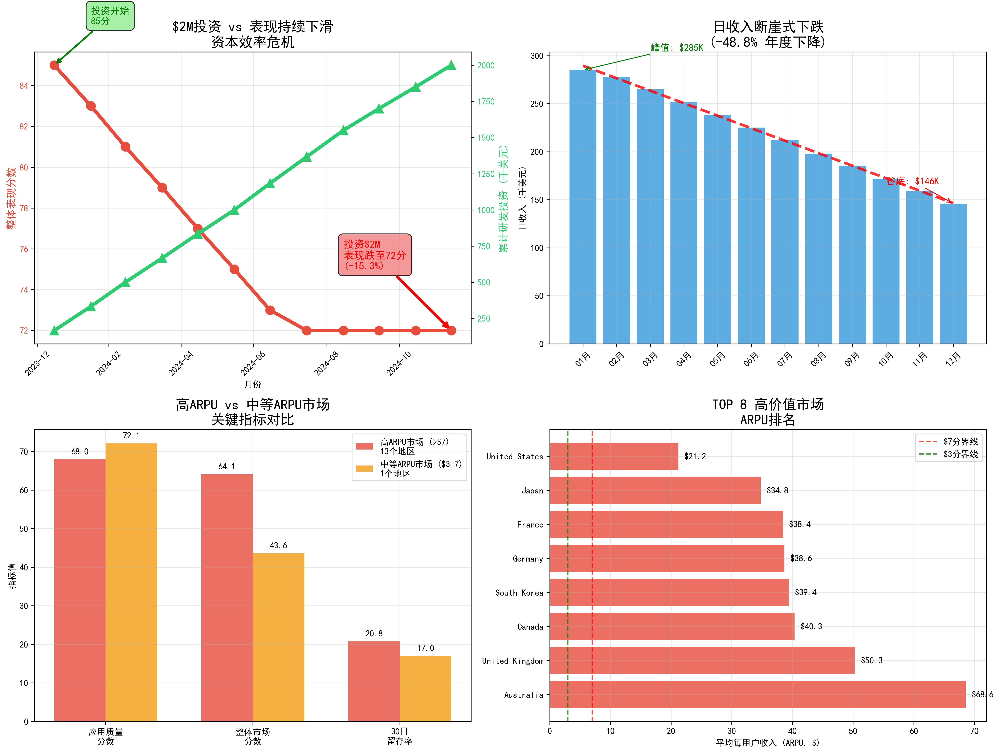

# com.dev.photoeditor应用资本效率分析报告

## 执行摘要

**高投资优先级应用com.dev.photoeditor面临严重的资本效率危机**：过去12个月投入$2M研发预算，但整体表现分数从85分下降到72分，日收入暴跌48.8%，资本效率持续恶化。

## 核心发现

### 📊 投资与表现严重背离
- **投资结果**: $2M研发投资 → 表现分数下降13分 (-15.3%)
- **收入暴跌**: 日收入从$285,000跌至$146,000 (-48.8%)
- **资本效率恶化**: 从0.5100降至0.4800分/千美元 (-5.9%)

### 🌍 地理区域表现差异分析

#### 高ARPU市场 (>$7/用户) - 13个地区
- **平均ARPU**: $29.19
- **平均市场分数**: 640.9
- **平均应用质量**: 68.0分
- **30日留存率**: 20.8%

#### 中等ARPU市场 ($3-7/用户) - 1个地区
- **平均ARPU**: $5.08
- **平均市场分数**: 435.9
- **平均应用质量**: 72.1分
- **30日留存率**: 17.0%

### 💡 关键洞察

1. **反直觉发现**: 高ARPU市场的应用质量分数(68.0)反而低于中等ARPU市场(72.1)，但市场整体表现更优
2. **留存率优势**: 高ARPU市场30日留存率显著高于中等ARPU市场(20.8% vs 17.0%)
3. **市场成熟度**: 高ARPU市场整体市场分数高出205分，显示更强的市场成熟度

### 🎯 高价值市场TOP 5
1. **Australia**: ARPU $68.57, 市场分数 825.5
2. **United Kingdom**: ARPU $50.30, 市场分数 785.2
3. **Canada**: ARPU $40.34, 市场分数 720.9
4. **South Korea**: ARPU $39.41, 市场分数 665.8
5. **Germany**: ARPU $38.65, 市场分数 795.8

## 深度分析

### 资本效率问题根因

1. **投资策略失误**: $2M投资未能有效转化为产品性能提升
2. **质量控制缺失**: 应用质量分数从81.2分持续下滑至65.2分
3. **市场定位偏差**: 投资重点可能偏离了高价值市场需求

### 地理区域差异原因

**高ARPU市场特征**:
- 用户付费意愿强，对价格不敏感
- 更注重产品体验和功能完整性
- 留存率指标更为关键

**中等ARPU市场特征**:
- 用户对性价比要求更高
- 应用质量直接影响用户满意度
- 市场竞争相对缓和

## 业务建议

### 🎯 立即行动项

1. **重新分配投资重点**
   - 将60%投资集中在TOP 5高ARPU市场
   - 针对这些市场进行深度本地化优化
   - 重点提升用户体验和功能完整性

2. **质量控制体系重建**
   - 建立月度质量评估机制
   - 设置质量分数提升目标(每季度+3分)
   - 实施质量与投资回报挂钩的KPI

3. **差异化市场策略**
   - 高ARPU市场: 重点提升留存率和用户体验
   - 中等ARPU市场: 重点提升应用质量和性价比

### 📈 中长期战略

1. **投资效率优化**
   - 建立投资前ROI评估模型
   - 实施分阶段投资与效果验证机制
   - 设置最低资本效率门槛(>0.6分/千美元)

2. **市场分层运营**
   - 针对不同ARPU层级制定专门的产品策略
   - 建立市场分层投资决策机制
   - 实施动态资源调配体系

## 风险预警

⚠️ **继续当前投资策略的风险**:
- 表现分数可能进一步下滑至60分以下
- 日收入可能继续下跌至$100K以下
- 高价值市场用户流失加速
- 竞争对手趁机抢占市场份额

## 结论

com.dev.photoeditor应用面临严重的资本效率危机，$2M投资未能产生预期效果，反而伴随表现下滑和收入暴跌。关键在于重新审视投资策略，聚焦高价值市场，重建质量控制体系，并实施差异化的市场策略。立即行动是阻止进一步下滑的关键。

**建议CFO立即召开紧急会议，重新评估投资方向和资源配置，确保未来投资能够产生正向回报。**
