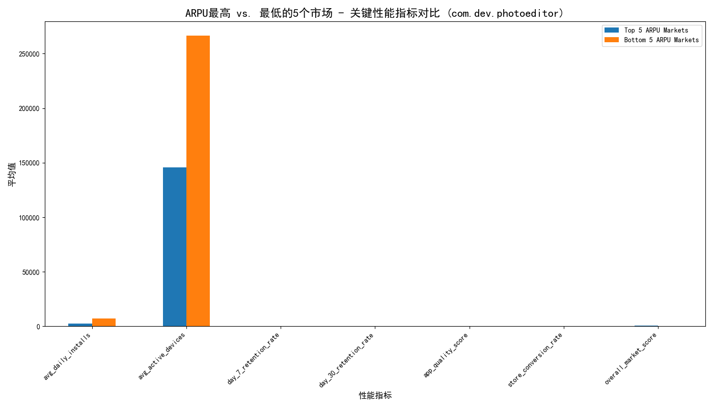

# 应用资本效率分析报告：`com.dev.photoeditor`

**致：CFO**

**发件人：数据分析部**

**主题：关于 `com.dev.photoeditor` 应用投资效率下降及市场表现分化的分析与建议**

## 1. 背景概述

本次分析旨在回应您对 `com.dev.photoeditor` 应用资本效率的担忧。尽管在过去12个月内投入了200万美元的研究预算，该应用的 `overall_performance_score` （整体表现分）却从85分降至72分。本报告深入探究了应用在不同地理区域的市场表现差异，特别是高收入与低收入市场之间的具体表现，以揭示问题根源并提供可行性策略。

## 2. 核心发现：市场表现的两极分化

通过对应用数据的深入分析，我们发现其在不同市场的表现存在显著的两极分化。我们将市场按“每用户平均收入（ARPU）”分为两类进行对比：ARPU最高的5个市场（高价值市场）与ARPU最低的5个市场（高增长市场）。

上图直观地展示了两个市场群体的关键性能指标（KPI）差异，具体数据解读如下：

*   **用户增长 vs. 用户质量：**
    *   **高增长市场（低ARPU）** 在 **日均安装量** 和 **活跃设备数** 上遥遥领先。这表明公司的用户获取策略在这些地区非常成功，能够快速扩大用户基础。
    *   然而，**高价值市场（高ARPU）** 在 **7日和30日用户留存率** 方面表现明显更优。这说明高收入地区的用户粘性要强得多，更能认可并持续使用我们的产品。

*   **应用质量与综合得分：**
    *   两个市场的 `app_quality_score` （应用质量得分）相差无几，排除了基础技术问题是导致性能分化的主因。
    *   尽管用户规模庞大，但高增长市场的 **`overall_market_score` （综合市场得分）** 远低于高价值市场。这暗示着当前的用户增长并未有效地转化为可持续的市场价值。

## 3. 问题根源诊断：增长的“虚胖”与资本的错配

结合整体表现分的下降，我们可以推断出问题的核心在于 **资本效率和投资策略的失衡**：

1.  **预算错配：** 大量研究预算可能被投入到驱动低ARPU市场的用户增长上。这种策略虽然带来了用户数量的激增，但由于这些用户的留存率低、变现能力弱，导致投入产出比（ROI）低下。
2.  **“劣币驱逐良币”效应：** 随着低留存、低价值用户在总体用户中的占比不断扩大，他们在计算全局平均性能指标时拉低了整体分数。这掩盖了高价值市场的稳定甚至增长的表现，造成了`overall_performance_score`下降的“假象”。
3.  **策略单一化：** 很可能我们正在用一套“一刀切”的产品和市场策略应对所有地区，而没有根据市场成熟度和用户消费能力进行差异化调整，导致在高增长市场“水土不服”，无法有效转化用户价值。

## 4. 战略建议：从“规模增长”转向“价值驱动”

为了扭转当前局面，提高资本效率，我们建议将战略重心从追求用户规模转向挖掘用户价值。

*   **建议一：优化投资组合，聚焦高价值市场**
    *   **行动：** 将部分预算从低ARPU市场的用户获取活动中转移出来，投入到增强高ARPU市场的产品功能和用户体验上（如开发专业级功能、优化付费订阅流程）。
    *   **目的：** 在这些已被验证的高价值市场中深耕，能更直接地提升用户生命周期价值（LTV）和整体收入，实现更高的资本回报。

*   **建议二：深化低ARPU市场的用户转化**
    *   **行动：** 在低ARPU市场，将策略重点从“拉新”转向“促活”和“留存”。探索更适合当地的变现模式，如广告解锁功能、轻量级订阅或应用内虚拟商品。
    *   **目的：** 盘活庞大的现有用户基础，逐步培养用户习惯并提升其参与度，将“流量”转化为实实在在的“价值”。

*   **建议三：建立精细化的绩效衡量体系**
    *   **行动：** 除了关注总体的性能分，应建立按市场细分的、以ROI和LTV为核心的KPI体系。
    *   **目的：** 更精准地评估投资在不同市场的实际效果，为未来的资源分配提供可靠的数据支持，避免被表面的增长数据所误导。

通过实施以上策略，我们相信 `com.dev.photoeditor` 能够摆脱当前增长的“虚胖”，实现更健康、更具盈利能力的长期发展，并最终提升整体的资本使用效率。
