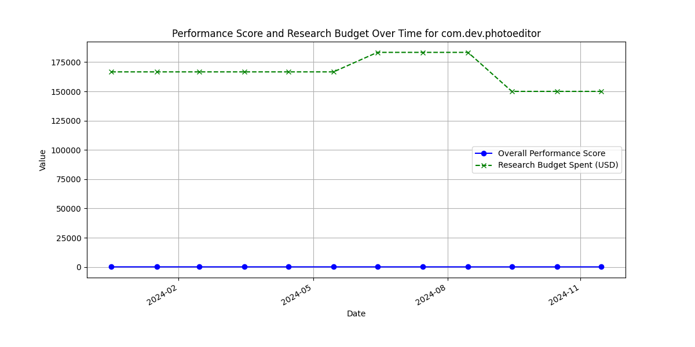
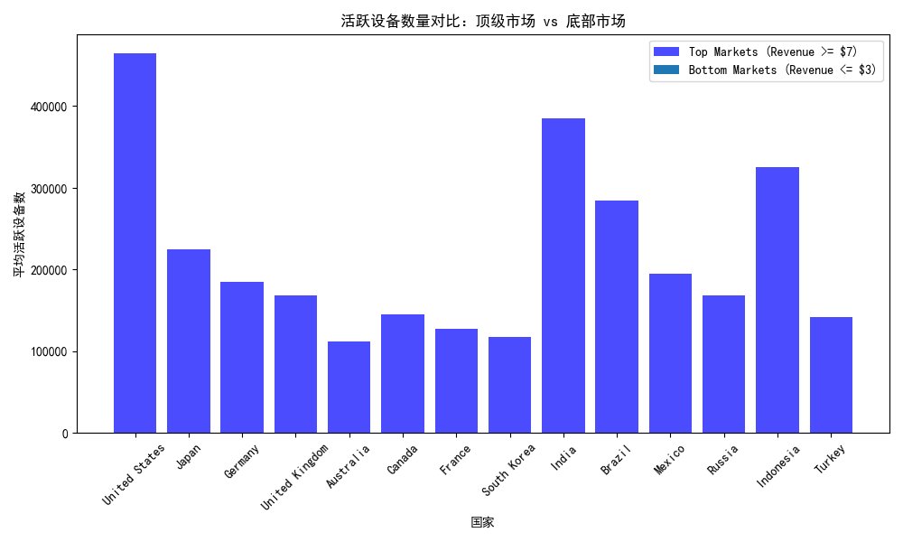
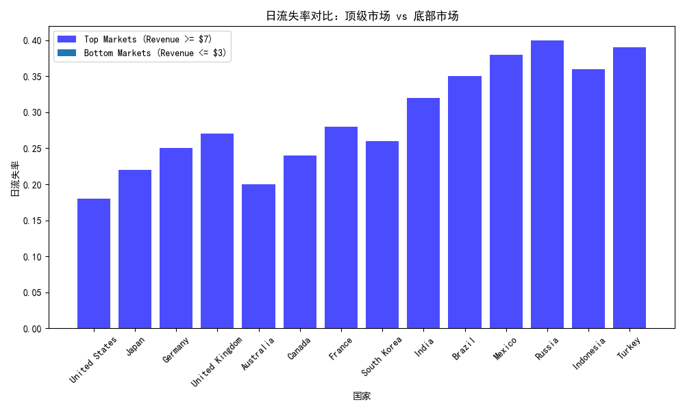
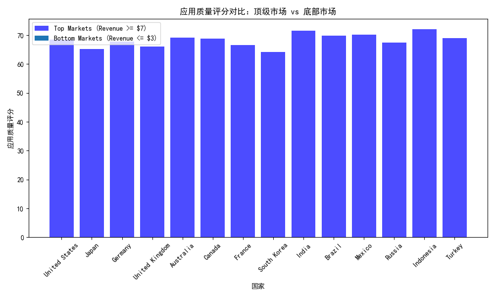
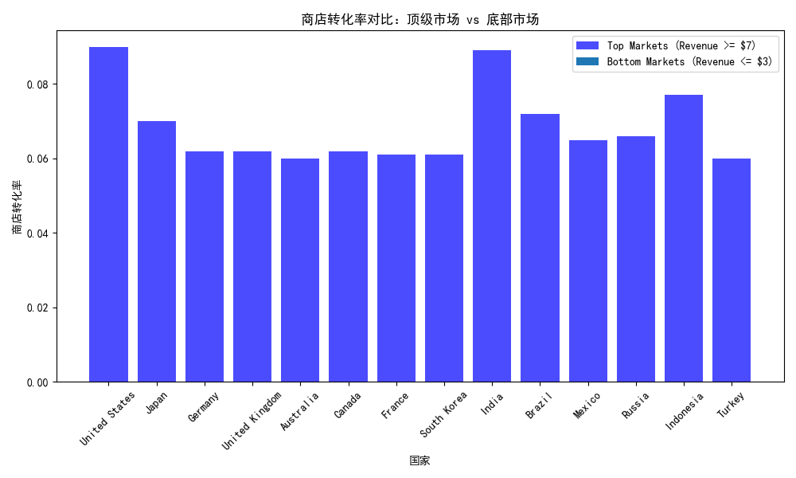

# com.dev.photoeditor 应用分析报告

## 1. 总体性能趋势

以下是 `com.dev.photoeditor` 应用在过去 12 个月的整体性能趋势：

从图中可以看出，应用的 **overall_performance_score** 从 85 分下降到了 72 分，而研究预算（`research_budget_usd`）在整个时间段内保持较高水平，说明当前的投资未能有效提升性能。

---

## 2. 地理市场表现差异

我们进一步分析了该应用在不同地理市场中的表现，特别关注收入高于 **$7** 的顶级市场与收入低于 **$3** 的市场之间的差异。

### 2.1 活跃设备数量

顶级市场的平均活跃设备数量明显高于底部市场，说明顶级市场用户基础更大，应用使用更广泛。

### 2.2 日流失率

底部市场的日流失率普遍高于顶级市场，表明用户在低收入市场中更容易流失，可能与用户体验或市场竞争有关。

### 2.3 应用质量评分

顶级市场的应用质量评分普遍较高，说明良好的用户体验可能促进了更高的收入。

### 2.4 商店转化率

顶级市场的商店转化率更高，表明用户更愿意在这些市场中进行购买或安装应用。

---

## 3. 业务洞察与建议

### 3.1 性能下降原因分析

尽管在过去 12 个月内投入了 **$2M** 的研究预算，应用的整体性能分数仍从 **85** 下降到 **72**，这表明：

- 投资方向可能未聚焦于核心性能问题；
- 用户体验或产品功能可能未有效改进；
- 市场竞争或用户偏好变化未及时应对。

### 3.2 地理市场优化建议

#### 对于低收入市场
- **提升应用质量**：提高应用稳定性与用户体验；
- **降低用户流失率**：分析流失原因，改善用户留存策略；
- **优化商店转化率**：改进应用描述、视觉设计和营销策略。

#### 对于高收入市场
- **维持高质量服务**：确保应用持续满足用户需求；
- **扩展市场渗透率**：增加活跃用户数量，提升整体收入；
- **优化用户生命周期价值**：通过付费功能或订阅提升 ARPU。

### 3.3 投资效率优化建议

- 评估当前研究预算的使用情况，优先投资于高回报方向；
- 加强 A/B 测试和用户反馈机制，确保产品迭代方向符合市场需求；
- 制定清晰的市场优先级，集中资源提升最具潜力的市场。
