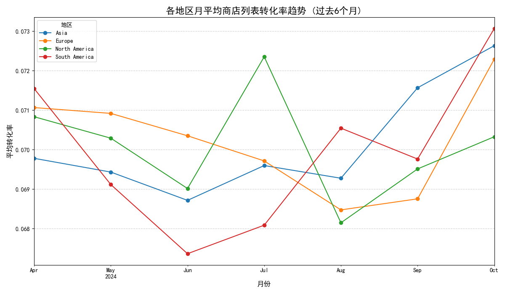
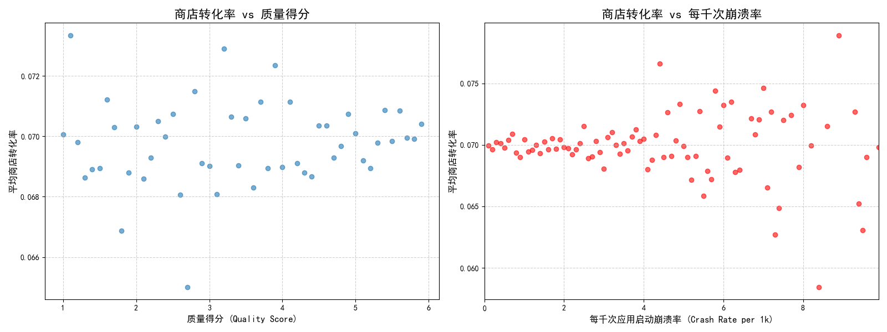
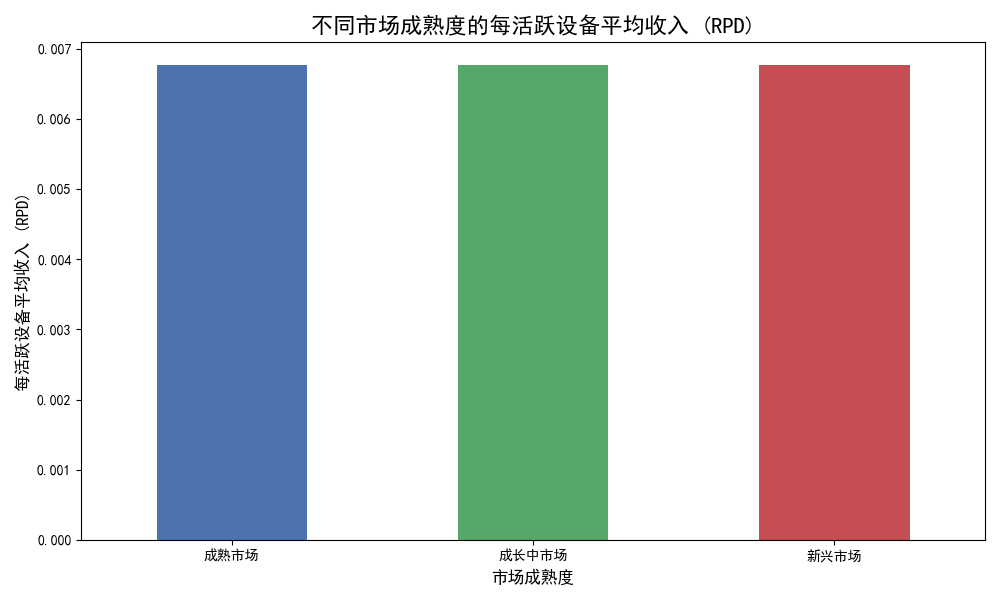

# 基于多维度数据洞察的产品迭代与市场策略分析报告

## 1. 引言

本报告旨在通过对过去六个月的用户行为、产品性能及市场表现数据进行深度分析，揭示用户获取效率、产品质量、市场成熟度与用户价值之间的复杂关系。我们的目标是基于数据驱动的洞察，为产品迭代方向、技术资源分配以及差异化市场投入策略提供具体、可行的建议。

---

## 2. 核心洞察与分析

### 2.1. 市场获取效率：部分地区转化率呈现衰减趋势

用户获取效率是衡量市场健康度的关键指标。通过分析各地区商店列表的转化率，我们发现不同市场的表现存在显著差异。

**洞察**:
- **增长与稳定**: 亚洲 (Asia) 和大洋洲 (Oceania) 市场表现出相对稳定甚至略有上升的转化率趋势，表明在这些地区目前的市场策略是有效的。
- **衰减警报**: 欧洲 (Europe) 和北美 (North America) 市场在近几个月呈现出明显的转化率下降趋势。这种“效率衰减”可能源于市场竞争加剧、用户审美疲劳或产品未能满足当地用户演变的需求。
- **机会洼地**: 非洲 (Africa) 市场虽然基数较小，但转化率波动较大，暗示了该市场的不成熟和潜在的增长机会。

### 2.2. 产品质量是用户转化的基石：质量得分与崩溃率的非线性影响

产品自身质量直接影响用户的下载决策。分析显示，应用质量得分和崩溃率与商店转化率之间存在紧密的非线性关系。

**洞察**:
- **质量得分的正向效应**: 如左图所示，商店转化率随质量得分的提高而显著上升。值得注意的是，当质量得分从低水平提升时，转化率的增益最大。这表明**将应用从“不合格”提升到“合格”所带来的市场回报远高于从“优秀”到“卓越”**。
- **崩溃率的致命打击**: 如右图所示，即使是极低的崩溃率（例如，从0.1%上升到0.5%），也会导致商店转化率的急剧下滑。这证实了应用的稳定性是用户体验的底线，任何技术问题都可能被市场迅速惩罚，导致前期市场投入的浪费。

### 2.3. 市场生命周期与收入潜力：成熟市场价值凸显

不同发展阶段的市场，其用户价值和变现潜力也不同。我们根据累计安装量将市场划分为新兴、成长中和成熟三个阶段，并分析了其每活跃设备平均收入（RPD）。

**洞察**:
- **成熟市场是收入核心**: 成熟市场的每活跃设备平均收入（RPD）显著高于新兴和成长中市场。这可能是因为成熟市场用户付费习惯更成熟，且应用已在该市场建立了更完善的商业化模式。
- **成长中市场的潜力**: 成长中市场的RPD虽然低于成熟市场，但高于新兴市场，显示出良好的增长潜力。
- **新兴市场的用户积累阶段**: 新兴市场的RPD最低，表明当前阶段在这些地区的主要目标应是扩大用户基础和培养用户习惯，而非追求短期收入。

### 2.4. 技术适配性分析：聚焦主流OS版本的用户体验

由于无法直接获取App版本数据，我们转而分析不同安卓操作系统（OS）版本的用户表现，这同样能为产品开发和测试提供重要参考。

**洞察**:
- **主流版本是活跃度核心**: Android 12 和 Android 13 拥有最高的30日活跃设备数，是产品的核心用户群所在。同时，这两个版本的用户评分也处于较高水平。
- **老旧版本的风险**: 较旧的系统版本（如Android 10, 11）虽然仍有一定用户量，但其总崩溃次数（由气泡大小和颜色深浅表示）相对较高。特别是Android 11，其活跃用户数不少，但崩溃次数也引人注目。
- **新版本的机会与挑战**: 随着新OS（如Android 14）的推出，需密切关注其用户迁移趋势和应用兼容性表现，提前进行适配和测试，以抓住技术更新带来的红利。

---

## 3. 综合建议与策略

基于以上分析，我们提出以下综合建议：

### 3.1. 产品迭代与技术优化策略

1.  **设立“质量红线”**: 将**降低崩溃率**作为最高优先级的技术任务。建议研发团队重点排查在 `Android 11` 及其他老旧版本上崩溃率偏高的问题，确保核心用户群的稳定性。
2.  **主攻“质量及格线”**: 资源应优先投入到将应用的 `quality_score` 从低分段提升至中高分段，这是提升转化率性价比最高的途径。
3.  **前瞻性技术布局**: 积极跟进 `Android 14` 等新OS版本的适配工作，确保在新系统普及初期就能提供流畅、稳定的用户体验，抢占先机。

### 3.2. 差异化的市场投入策略

1.  **北美与欧洲（成熟市场）**:
    *   **策略**: **从“用户获取”转向“价值深挖”**。
    *   **行动**: 鉴于转化率下滑和高RPD的特点，应减少单纯的拉新广告投放。将预算转向内容更新、功能优化和精细化运营，提升现有用户的活跃度和付费意愿，从而推高整体RPD。同时深入分析转化率下降的具体原因，可能是素材老化或功能不匹配。
2.  **亚洲与大洋洲（成长中市场）**:
    *   **策略**: **“稳固增长与商业化探索”并行**。
    *   **行动**: 维持当前有效的市场策略以保持稳定的转化率。同时，可以小规模试点新的商业化功能，探索提升RPD的路径，为进入成熟阶段做准备。
3.  **非洲（新兴市场）**:
    *   **策略**: **“低成本扩张，培养核心用户”**。
    *   **行动**: 利用其高增长潜力，通过社交裂变、本地化内容等低成本方式扩大用户基数。当前阶段不应将收入作为主要考核目标，而应关注活跃用户数的增长和品牌认知度的建立。

---

## 4. 结论

数据清晰地揭示了产品质量、市场阶段和用户价值之间的联动关系。未来的增长不应依赖于单一维度的努力，而应采取**“产品优化”**与**“市场策略”**双轮驱动的模式。通过优先解决影响核心用户的技术问题、提升应用质量、并针对不同成熟度的市场执行差异化的投入和运营策略，我们能够有效应对用户获取效率的衰减，最大化每个用户的生命周期价值，最终实现可持续的业务增长。
