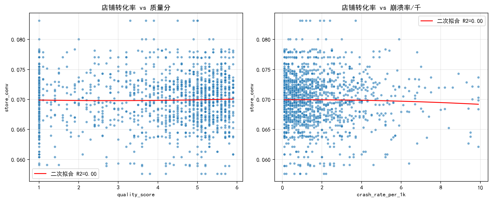
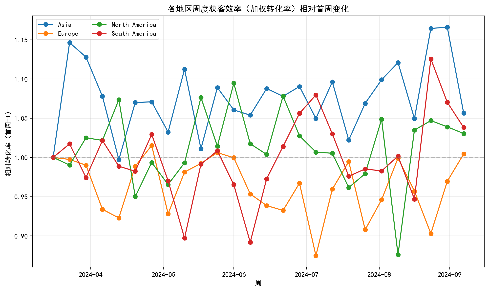
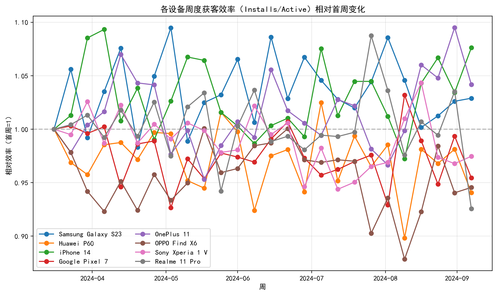
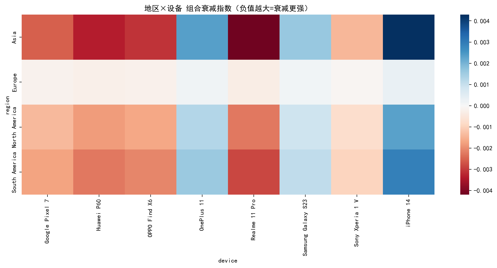
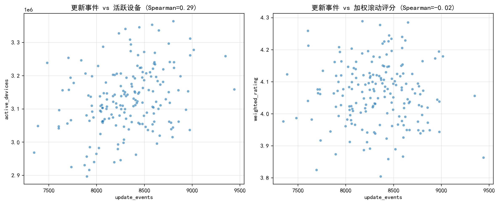
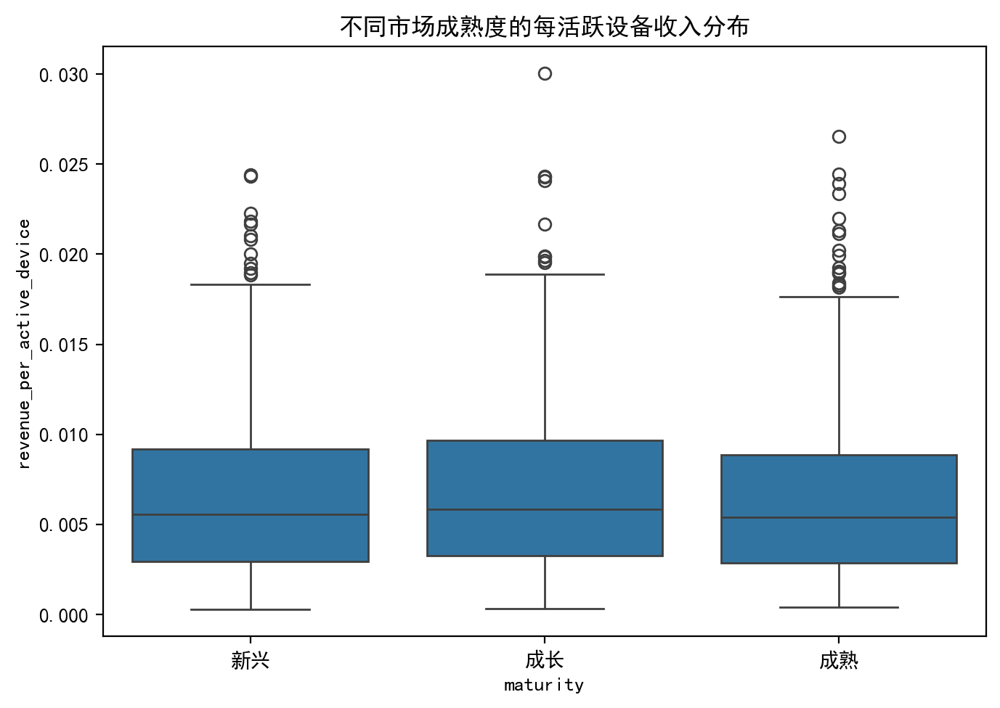

# 应用市场获取效率与用户价值衰减分析（近6个月）

> 数据来源：/workspace/dacomp-070.sqlite（通过SQL导出CSV后使用Python绘图分析）
> 时间范围：根据数据库最大日期回溯180天（近6个月）

## 绘图代码片段（示例）
```python
import matplotlib.pyplot as plt
plt.rcParams['font.sans-serif'] = ['SimHei']
plt.rcParams['axes.unicode_minus'] = False
# 其余绘图与分析代码见运行脚本
```

## 总览与核心结论
- 店铺转化率与质量分、崩溃率的非线性关系：
  - Spearman(质量分, 转化率)=0.012，二次拟合R2≈0.000，未见显著非线性。
  - Spearman(崩溃率/千, 转化率)=-0.008，二次拟合R2≈0.000，同样未见显著非线性。
  - 解释：近半年全局层面，质量分与崩溃率的波动并未在日级别显著改变店铺转化率，暗示当前漏斗瓶颈更可能在素材/价格/流量质量而非稳定性或评分端（至少在全局平均意义上）。

- 地区与设备的获客效率衰减模式：
  - 地区（加权店铺转化率周度相对变化，首周为1）：
    - Europe: +0.44%，North America: +3.04%，South America: +3.81%，Asia: +5.64%。
    - 观察：主要地区整体略有改善而非衰减，推测近半年投放或上架优化有效（如文案/素材/本地化）。
  - 设备（Installs/Active的周度相对变化）：
    - 明显衰减：Realme 11 Pro -7.43%，Huawei P60 -5.93%，OPPO Find X6 -5.44%，Google Pixel 7 -4.55%，Sony Xperia 1 V -2.53%。
    - 明显改善：iPhone 14 +7.62%，OnePlus 11 +4.18%，Samsung Galaxy S23 +2.89%。
    - 观察：设备层面差异显著，存在结构性衰减设备（安卓中端为主）与结构性改善设备（高端与部分品牌）。

- 地区×设备组合的衰减指数（地区衰减率×设备衰减率，越负越差）：
  - TOP5最差组合：
    - Asia × Realme 11 Pro: -0.0042
    - Asia × Huawei P60: -0.0033
    - Asia × OPPO Find X6: -0.0031
    - South America × Realme 11 Pro: -0.0028
    - Asia × Google Pixel 7: -0.0026
  - 解释：亚洲与南美在部分安卓机型上获客效率呈现结构性衰减，需针对组合维度做差异化优化。

- 更新频率的交互影响（按国家加权）：
  - Spearman(更新事件, 活跃设备)=0.291（正相关，偏弱-中等）。
  - Spearman(更新事件, 加权滚动评分)=-0.024（近零，略负）。
  - 高频更新相对低频更新的提升：活跃设备+2.40%，评分-0.16%。
  - 解释：更高更新频率可带来一定活跃提升，但对评分可能有轻微负向影响（可能因频繁更新出现短期体验波动或期望管理不足）。

- 市场成熟度分层（以 active_countries 分为新兴/成长/成熟）与每活跃设备收入：
  - 整体分层均值（近半年）：成熟=0.0065，成长=0.0069，新兴=0.0067（差异不大）。
  - 最近30天均值与波动：
    - 成熟: 均值=0.0061, 标准差=0.0045
    - 成长: 均值=0.0062, 标准差=0.0043
    - 新兴: 均值=0.0056, 标准差=0.0041
  - 解释：成长市场在近30天的每活跃设备收入略优于成熟与新兴；新兴市场略低，但波动相对较小。

## 可视化图表
- 非线性关系检测（散点+二次拟合）：
  - 
- 地区周度效率相对变化：
  - 
- 设备周度效率相对变化：
  - 
- 地区×设备组合衰减热力图：
  - 
- 更新频率交互影响散点：
  - 
- 不同成熟度下的每活跃设备收入分布：
  - 

## 诊断性洞察（为什么）
1. 非线性关系未显著：店铺转化率在全局平均视角下对质量分/崩溃率不敏感，说明转化改善主要受前链路（素材、定价、地域流量结构）影响，而非后链路稳定性或评分的边际变化。
2. 地区层面整体改善：说明近半年在主力市场的Listing与投放策略有效（本地化文案、素材迭代、渠道结构优化），但这可能掩盖设备结构上的衰减风险。
3. 设备层面分化：部分安卓机型（中端与特定品牌）出现持续衰减，可能与机型兼容性、性能适配、渲染/网络表现、不同渠道的流量质量变化有关。
4. 更新频率提升活跃但对评分略负：可能由频繁更新带来短期bug/体验变动、用户预期管理不足或提示打断导致评分波动。
5. 市场成熟度差异不大但成长市场近期更优：成长市场仍有提升空间（ARPPU/转化微调），成熟市场趋于稳定而需要价值深挖（留存与高价位产品包）。

## 预测性与规范性建议（我们应该做什么）
- 针对“用户价值衰减模型”的多维优化策略（不进行模型训练，基于观测规律）：
  1) 地区×设备差异化投放与产品适配：
     - 对 Asia/South America × Realme/Huawei/OPPO/Pixel 等组合，优先：
       - 降低付费流量在这些组合上的占比或提高素材门槛，避免低质量流量持续进入。
       - 开展机型专项适配（启动耗时、首屏渲染、离线/弱网策略），提升首日体验与留存，从而提高获客效率。
       - 列表页与首登引导的机型化文案/图片（屏幕尺寸/色域适配），提升转化。
  2) 设备结构再平衡：
     - 对“改善设备”（iPhone 14、OnePlus 11、Samsung S23）提高优质渠道配比与预算上限，将其作为效率托底的结构性砝码。
  3) 更新频率的门控策略：
     - 采用分阶段发布（staged rollout）与灰度策略，确保“高频更新带来的活跃提升”同时控制评分风险。
     - 每次更新前后设定质量阈值（崩溃率/千阈值、核心路径通过率），达标后再扩大人群，避免评分下滑。
     - 增强更新文案的价值感与稳定性说明（Changelog中明确性能修复/新功能价值），缓解评分负向。
  4) 成熟度细分的收入优化：
     - 成熟市场：
       - 主攻“留存驱动的价值提升”，如订阅权益打包、分层价格试验（A/B的相对安全带），围绕高频使用场景提升愿付价。
       - 结合用户分群（例如活跃设备的行为强度）做分级优惠与动态定价，提升 revenue_per_active_device 的上限。
     - 成长市场：
       - 继续优化店铺转化与定价微调（如首购优惠与上架文案），在不牺牲评分与稳定性的情况下扩大人群。
     - 新兴市场：
       - 优先提升转化率（低价包、轻量版功能、低端机型性能优化），并控制付费获取成本，避免效率稀释。

- 操作性量化目标（近一季度）：
  - 设备专项适配：让“结构性衰减设备”的Installs/Active相对首周提升≥+3%。
  - 更新节奏：在保持Spearman(更新, 评分)≥-0.02的约束下，将Spearman(更新, 活跃)提升至≥0.35；并实现高频更新相对低频的活跃提升≥+3%。
  - 成熟度策略：成长市场的 revenue_per_active_device 较当前均值提升≥+5%，新兴市场提升≥+3%，成熟市场以留存驱动的价值提升≥+4%。

## 风险与监控
- 设备适配改动可能引入新问题，需建立机型分组的崩溃率/ANR的周度监控与快速回滚。
- 更新频率提升需配合“质量闸门”，否则评分下滑会侵蚀长期价值。
- 市场成熟度定义使用 active_countries 的分位法，若业务扩张结构发生显著变化，需滚动更新分层阈值。

## 附：可视化与数据文件
- 图片文件：
  - nonlinear_relationships.png
  - region_decay.png
  - device_decay.png
  - composite_heatmap.png
  - updates_interaction.png
  - rpad_by_maturity.png
- CSV中间数据：
  - daily_conv_quality_crash.csv
  - region_daily.csv
  - device_daily.csv
  - updates_interaction.csv

以上分析为近6个月的多维诊断，结合地区与设备维度的效率差异、更新频率的交互效应以及市场成熟度分层，提出了差异化的产品迭代与市场投入策略。建议按季度复盘这些指标，并在关键组合维度上持续A/B以滚动优化。
