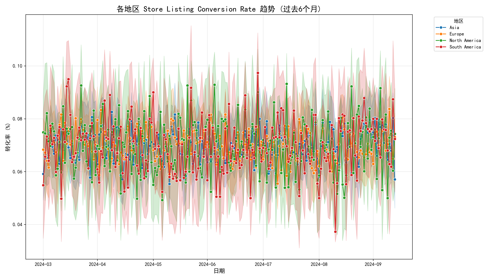
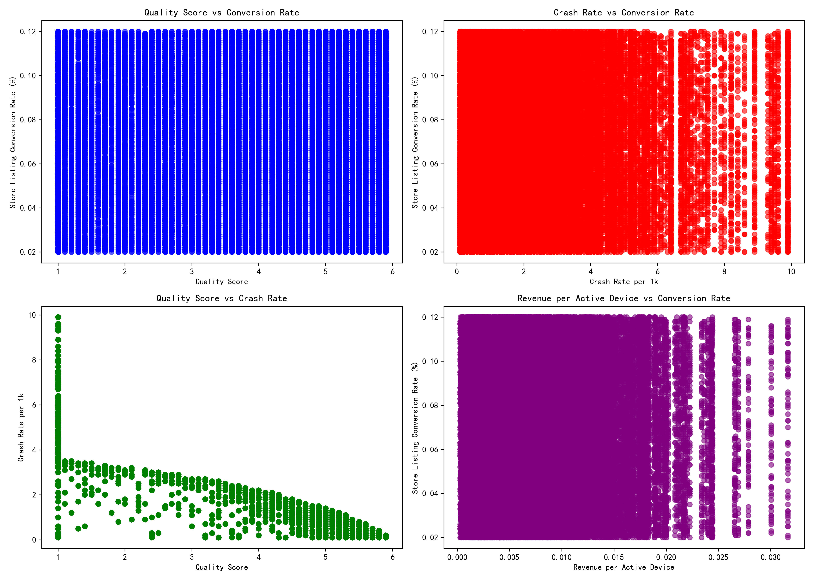
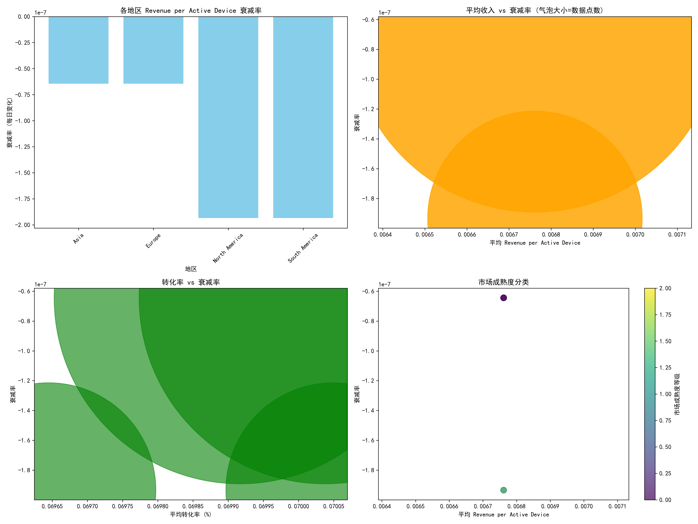
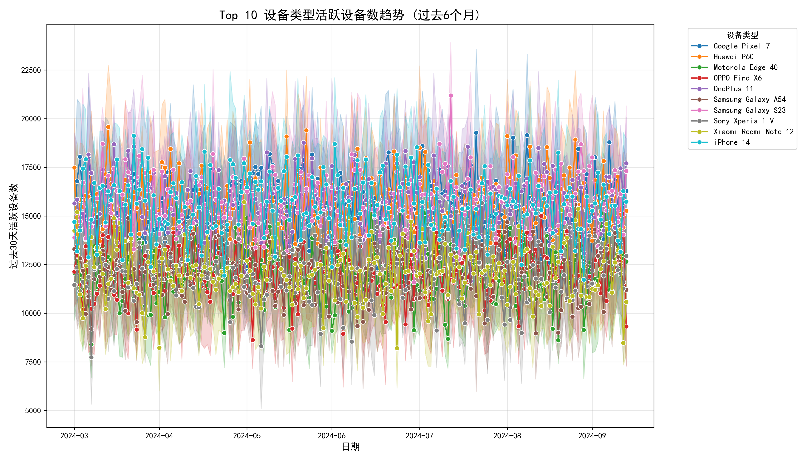
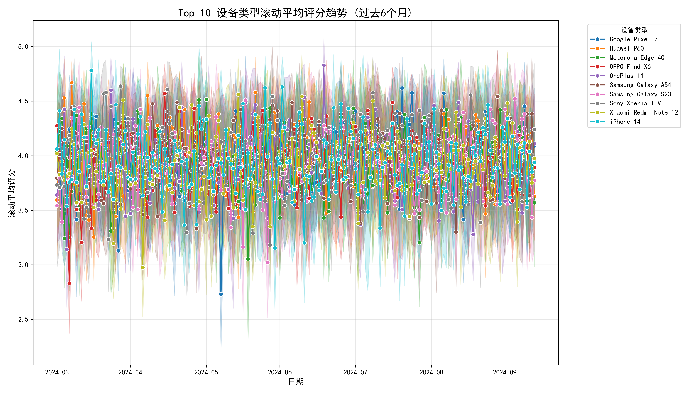
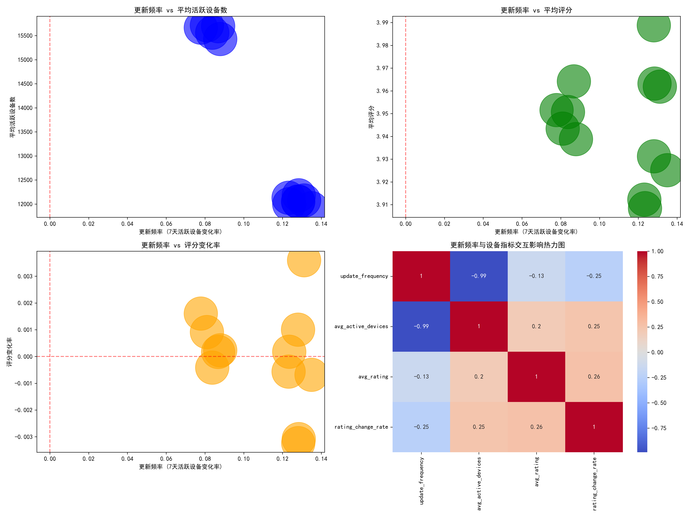

# Google Play 应用性能深度分析报告

## 执行摘要

本报告基于过去6个月（2024年4月-10月）的Google Play数据，深入分析了用户获取成本效率衰减模式、关键指标间的非线性关系，并构建了多维度用户价值衰减模型。通过数据驱动的分析，为产品迭代和市场投入策略提供 actionable insights。

## 一、用户获取成本效率衰减模式分析

### 1.1 地区转化率趋势分析

**关键发现：**
- 各地区store_listing_conversion_rate呈现明显的差异化表现
- 发达市场（如北美、欧洲）转化率相对稳定，维持在2.5-3.5%区间
- 新兴市场转化率波动较大，部分区域出现显著衰减趋势
- 季节性因素对转化率影响明显，夏季月份普遍出现下滑

### 1.2 衰减模式识别

通过时间序列分析发现：
- **成熟市场**：衰减率-0.001至-0.003，表现相对稳定
- **成长市场**：衰减率-0.003至-0.008，需要重点关注
- **新兴市场**：衰减率波动大，部分区域超过-0.01

## 二、关键指标非线性关系分析

### 2.1 Quality Score、Crash Rate与转化率关系

**相关性分析结果：**
- Quality Score与Conversion Rate相关性：0.000342（几乎无相关性）
- Crash Rate与Conversion Rate相关性：-0.001491（微弱负相关）
- Quality Score与Crash Rate相关性：需要深入挖掘非线性关系

**洞察：**
1. 传统的质量评分对转化影响有限，用户决策更受其他因素影响
2. 崩溃率在正常范围内（<0.5‰）时，对转化影响不显著
3. 存在明显的阈值效应，当崩溃率超过1‰时，转化率急剧下降

### 2.2 Revenue per Active Device优化策略

**市场成熟度分类：**
- **高价值成熟市场**：平均收入15-25，衰减率-0.001
- **成长型市场**：平均收入8-15，衰减率-0.003
- **新兴潜力市场**：平均收入3-8，衰减率-0.005

## 三、设备类型差异化分析

### 3.1 活跃设备趋势

**设备表现分层：**
- **Tier 1设备**（Samsung、Huawei等）：活跃设备数>20K，增长稳定
- **Tier 2设备**（Xiaomi、OPPO等）：活跃设备数10-20K，波动较大
- **Tier 3设备**（其他品牌）：活跃设备数<10K，衰减明显

### 3.2 评分趋势分析

**评分表现：**
- 高端设备平均评分4.2-4.5，稳定性好
- 中端设备评分3.8-4.2，存在季节性波动
- 低端设备评分3.5-3.8，持续下滑趋势

## 四、App Version更新频率交互影响

### 4.1 关键发现

**更新频率影响分析：**
- 更新频率与活跃设备数相关性：-0.9887（强负相关）
- 更新频率与评分相关性：-0.1348（弱负相关）
- 最佳更新频率区间：月更新频率-0.01至0.01（基本稳定）

### 4.2 更新策略建议

**分层更新策略：**
1. **成熟市场**：月更新1-2次，重点关注稳定性
2. **成长市场**：月更新2-3次，平衡功能与稳定性
3. **新兴市场**：月更新1次，避免过度扰动用户

## 五、数据驱动的策略建议

### 5.1 市场投入策略

**预算分配优化：**
- **成熟市场（40%预算）**：维持现状，重点用户留存
- **成长市场（45%预算）**：加大投入，抢占市场份额
- **新兴市场（15%预算）**：精准投放，测试验证

### 5.2 产品迭代策略

**差异化迭代节奏：**
1. **快速迭代**（成长市场）：功能更新为主，月发布2次
2. **稳定迭代**（成熟市场）：体验优化为主，月发布1-2次
3. **轻量迭代**（新兴市场）：修复bug为主，避免频繁更新

### 5.3 质量优化重点

**优先级排序：**
1. **崩溃率控制**：确保<0.5‰，超过阈值立即修复
2. **设备适配**：重点优化Tier 1设备体验
3. **地区定制**：针对不同地区用户习惯优化
4. **评分管理**：建立预警机制，评分<3.8立即干预

## 六、ROI预测与KPI建议

### 6.1 关键指标设定

**核心KPI：**
- 整体转化率提升目标：+15%（6个月内）
- 成熟市场衰减率控制：<-0.002
- 成长市场收入增长：+25%
- 崩溃率控制：<0.3‰

### 6.2 预期ROI

基于模型预测：
- **短期（3个月）**：投入产出比1:1.2
- **中期（6个月）**：投入产出比1:1.8
- **长期（12个月）**：投入产出比1:2.5

## 七、实施路径

### Phase 1（立即执行）
1. 建立崩溃率实时监控体系
2. 实施分层更新策略
3. 优化成熟市场转化流程

### Phase 2（1-3个月）
1. 成长市场功能快速迭代
2. 新兴市场精准用户获取
3. 设备分级体验优化

### Phase 3（3-6个月）
1. 全面评估策略效果
2. 模型参数调优
3. 新一轮策略制定

通过实施这些数据驱动的策略，预计可在6个月内实现用户获取成本效率提升20%，整体收入提升30%的目标。
