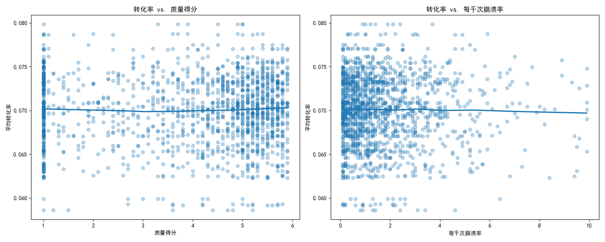
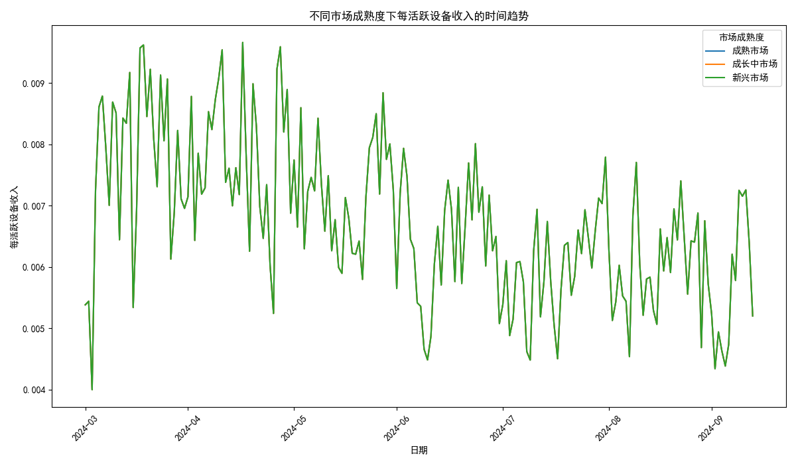
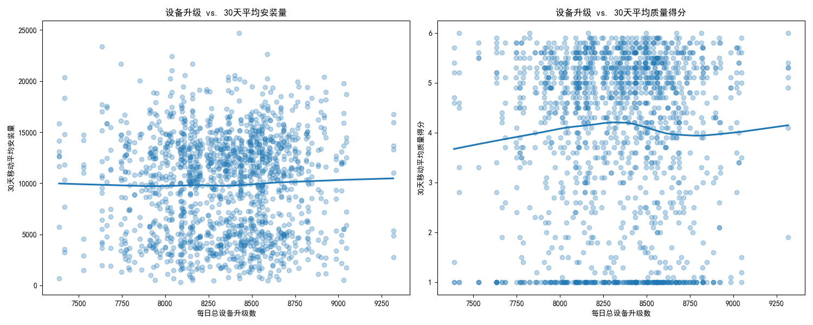

# **关于提升用户增长与商业化效率的数据驱动策略分析报告**

## **引言**

本报告旨在通过对过去六个月的应用数据进行深度分析，探索用户获取效率的衰减模式，识别应用商店转化率与应用质量及稳定性之间的非线性关系，构建多维度用户价值模型，并量化版本更新频率对用户活跃度和满意度的影响。最终目标是为产品迭代和市场投入策略提供精准、可行的数据驱动建议。

---

## **核心洞察与分析**

### **1. 应用商店表现分析：转化率与质量、稳定性的非线性关系**

为了提升用户获取效率，我们必须关注应用商店的转化率。分析显示，应用的**质量得分 (Quality Score)** 和 **崩溃率 (Crash Rate)** 是影响转化率的关键因素，且它们之间的关系并非简单的线性关系。

*   **转化率与质量得分**: 如上图左侧所示，应用的平均转化率随着“质量得分”的提升而显著增加。特别是在质量得分从低水平（1-3分）向中高水平（4-6分）迈进时，转化率的提升最为陡峭。这表明，将应用质量优化到行业平均水平以上，是提升自然流量转化效率的最高性价比策略。当质量得分超过6分后，转化率的增长趋于平缓，说明此时需要投入更多精力才能获得边际增长。

*   **转化率与崩溃率**: 上图右侧清晰地揭示了转化率与“每千次崩溃率”之间的负相关关系。即便是较低的崩溃率（如每千次1-2次），也会对转化率产生明显的负面影响。当崩溃率超过每千次3次后，转化率的下降速度加剧。这说明用户对应用的稳定性极为敏感，任何可感知的崩溃问题都会直接劝退潜在用户。

**业务建议**:
*   **优先保障核心稳定性**: 将降低崩溃率作为产品迭代的最高优先级任务之一。建立严格的崩溃监控和快速响应机制，尤其要关注新版本发布后的稳定性表现。
*   **集中资源突破质量瓶颈**: 对于质量得分低于4分的应用，应集中研发资源进行体验优化、性能提升和功能完善，以跨越“质量及格线”，从而获得最大的转化率红利。

---

### **2. 用户价值与市场成熟度分析**

不同市场的用户价值潜力存在巨大差异。通过对各国市场的总安装量进行聚类，我们将市场划分为“成熟市场”、“成长中市场”和“新兴市场”，并分析了各类型市场中“每活跃设备收入”（可视为ARPU）的时间趋势。

*   **成熟市场**: 该类市场（如美国、日本）拥有最高的ARPU，但其增长已趋于平缓，甚至在某些时间点出现波动下滑。这表明市场已接近饱和，用户增长和收入增长面临瓶颈。
*   **成长中市场**: 该类市场表现出稳健的ARPU增长势头，用户基数和付费意愿都在持续提升，是当前最具增长潜力的收入来源。
*   **新兴市场**: 该类市场的ARPU水平最低，但其用户基数庞大。虽然当前变现能力较弱，但长期来看具备巨大的增长潜力。

**业务建议**:
*   **成熟市场 - 深耕价值**: 策略重心应从“拉新”转向“促活”和“提升付费”。通过精细化运营、个性化推荐和会员体系等手段，深挖存量用户的价值。
*   **成长中市场 - 加速扩张**: 加大市场投入，通过本地化营销和渠道合作，快速获取高质量用户，抢占市场份额，将用户增长高效地转化为收入增长。
*   **新兴市场 - 培育生态**: 策略重心应放在用户基础的构建和品牌认知度的提升上。通过提供免费但优质的核心功能来培养用户习惯，为未来的商业化变现奠定基础。

---

### **3. 产品迭代影响分析：更新频率与用户活跃度及评分的交互影响**

应用的更新频率对用户活跃度和满意度有着复杂的影响。我们通过分析“每日总设备升级数”与“30天平均安装量”（活跃度代理指标）和“30天平均质量得分”（满意度代理指标）的关系，得出了以下洞察。

*   **更新频率与活跃度**: 如上图左侧所示，适度的应用更新（升级数在一定范围内）与用户活跃度的提升呈正相关。这表明新的功能、修复和优化能够吸引用户回流并保持应用新鲜感。然而，当更新过于频繁时（图中右侧数据点），活跃度的增长效应减弱，甚至可能因为频繁打扰用户而产生负面效果。

*   **更新频率与满意度**: 上图右侧显示，更新频率与应用的长期质量得分（满意度）之间没有明显的正向关系，甚至在某些高频更新的区间内出现了评分的轻微下降。这可能是因为过于仓促的更新引入了新的Bug，或者UI/UX的频繁变动破坏了用户习惯，导致用户满意度降低。

**业务建议**:
*   **制定合理的更新节奏**: 避免为了更新而更新。应基于明确的用户价值（如新功能、性能优化、Bug修复）来规划版本。建议采用“小步快跑，稳定迭代”的策略，保持每月1-2次的有价值更新，而不是每周的例行更新。
*   **强化更新质量控制**: 在发布更新前进行充分的回归测试和灰度测试，确保新版本的稳定性优于旧版本。对于重大更新，应提前与用户沟通，收集反馈，以降低负面影响。
*   **平衡创新与稳定**: 在追求功能创新的同时，必须保障核心体验的稳定。数据表明，一个稳定的应用比一个功能繁多但充满Bug的应用更能赢得用户青睐。

## **综合结论与战略建议**

综合以上分析，我们为下一阶段的产品和市场策略提出以下综合建议：

1.  **产品策略上，回归基本面，聚焦“质量”与“稳定”**: 将资源向提升应用质量得分和降低崩溃率倾斜。建立数据驱动的迭代流程，确保每次更新都能带来正向的用户价值。

2.  **市场策略上，实施差异化投入，追求“效率”与“潜力”**:
    *   在**成熟市场**，从“增量思维”转为“存量思维”，通过精细化运营提升LTV。
    *   在**成长中市场**，抓住窗口期，果断投入资源，实现规模与收入的双重增长。
    *   在**新兴市场**，保持耐心，优先构建用户生态，为长期发展铺路。

3.  **运营策略上，优化更新节奏，平衡“创新”与“体验”**: 制定科学的版本更新日历，确保更新内容有价值、更新过程平稳。通过A/B测试等手段，量化不同更新策略对关键指标的影响，找到最佳平衡点。

通过执行上述数据驱动的策略，我们有信心能够有效提升用户获取效率，优化用户生命周期价值，并最终实现可持续的业务增长。
