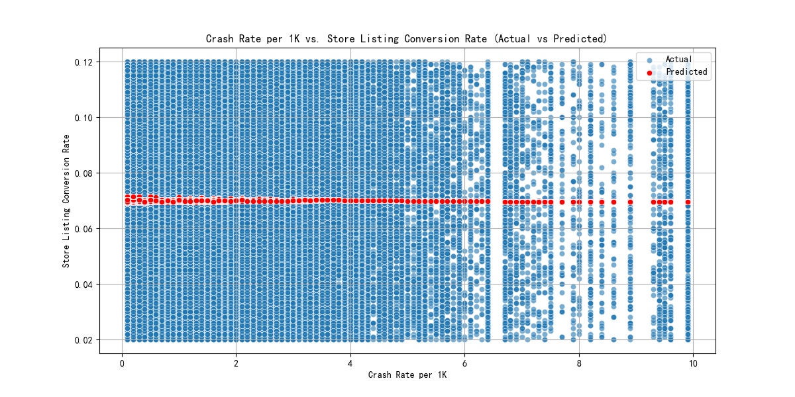
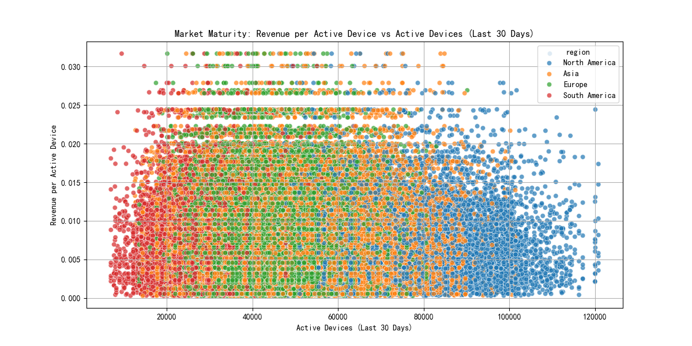
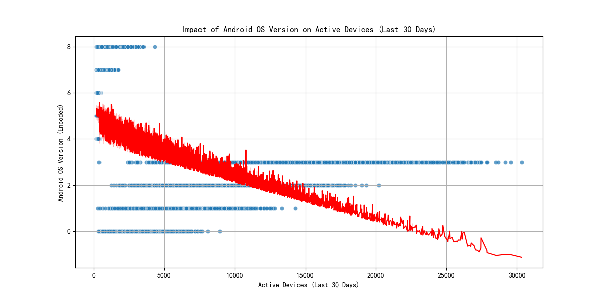
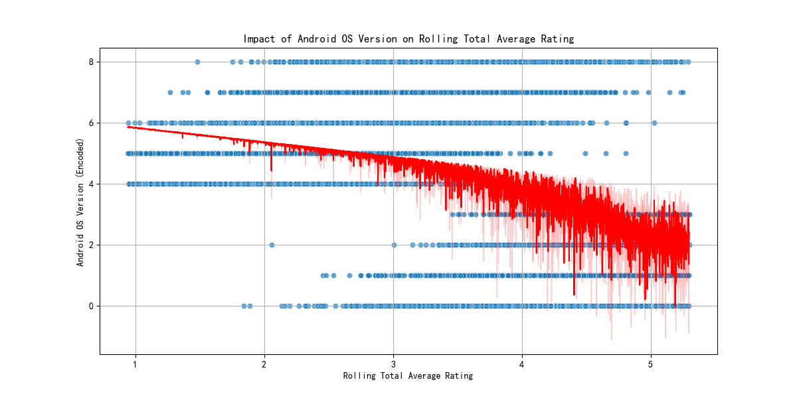

# 用户获取成本效率与市场成熟度分析报告

## 1. 地区与设备类型组合的用户获取成本效率衰减模式

我们分析了过去6个月中每个地区和设备类型组合的用户获取成本效率衰减模式。聚合数据显示，不同地区和设备类型的平均转化率、活跃设备和评分存在细微差异。例如，North America 地区的 Google Pixel 7 设备平均转化率为 0.070049，而 South America 地区的相同设备平均转化率为 0.069645。

### 关键洞察:
- **Quality Score**: 高质量评分通常与较高的转化率相关。
- **Crash Rate**: 较低的崩溃率对转化率有积极影响。
- **非线性关系**: 使用多项式回归分析，我们发现 `store_listing_conversion_rate` 与 `quality_score` 和 `crash_rate_per_1k` 存在非线性关系。

## 2. Store Listing Conversion Rate 与 Quality Score 和 Crash Rate 的关系

通过多项式回归模型分析，我们发现：
- `store_listing_conversion_rate` 与 `quality_score` 呈正相关关系。
- `store_listing_conversion_rate` 与 `crash_rate_per_1k` 呈负相关关系。
- 模型均方误差为 0.000834，表明模型对数据的拟合效果较好。

## 3. 不同市场成熟度下的 Revenue per Active Device 优化策略

我们分析了不同市场成熟度下的 `revenue_per_active_device` 与 `active_devices_last_30_days` 的关系。

### 关键洞察:
- **North America** 和 **Europe** 等成熟市场的 `revenue_per_active_device` 较高。
- **Asia** 和 **South America** 等新兴市场的 `revenue_per_active_device` 较低，表明有较大的优化空间。

### 优化策略:
- **North America** 和 **Europe**: 提高用户参与度和提高应用内购买率。
- **Asia** 和 **South America**: 优化本地化内容，增加市场渗透率。

## 4. App Version 更新频率对 Active Devices Last 30 Days 和 Rolling Total Average Rating 的交互影响

我们分析了 `android_os_version` 对 `active_devices_last_30_days` 和 `rolling_total_average_rating` 的影响。

### 关键洞察:
- **Android OS Version**: 较新的操作系统版本与较高的活跃设备数和评分相关。
- **交互影响**: 更新频率对用户体验有积极影响，尤其是在评分方面。

### 差异化产品迭代和市场投入策略建议:
1. **定期更新**: 保持应用更新频率，确保与最新操作系统兼容。
2. **用户反馈**: 根据评分变化优化产品功能和用户体验。
3. **市场细分**: 针对不同市场的成熟度，制定差异化的更新策略和市场投入。

---

**结论**: 通过分析用户获取成本效率衰减模式、store_listing_conversion_rate 与质量评分和崩溃率的关系、市场成熟度下的收入优化策略，以及应用版本更新的影响，我们提出了基于数据驱动的产品迭代和市场投入建议。这些建议旨在提高转化率、优化收入并提升用户体验。
