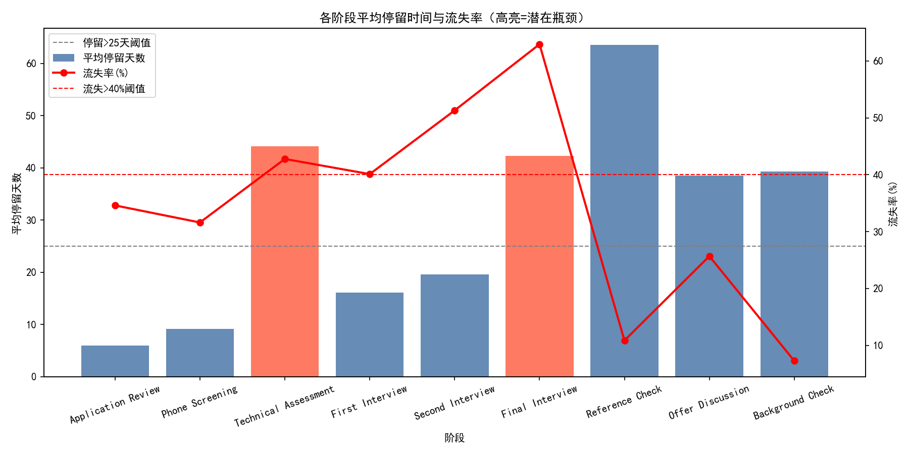
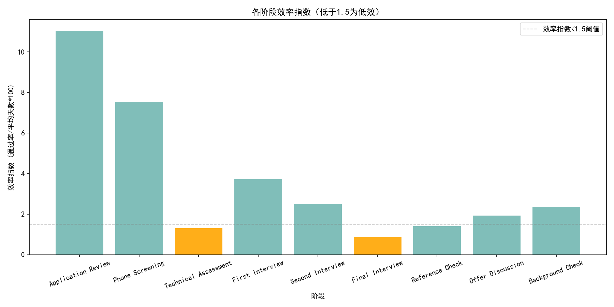

# 招聘漏斗效率诊断与优化建议报告

## 摘要结论
- 关键瓶颈阶段（平均停留时间>25天且流失率>40%，且样本≥100）：Technical Assessment（技术测评）、Final Interview（终面）。
- 低效率阶段（效率指数<1.5，且样本≥100）：Technical Assessment、Final Interview。
- 次要观察：Second Interview（二面）流失率达51.3%，但平均停留时间约19.6天未超过25天阈值，不构成“双高”瓶颈，建议纳入监控清单。

可视化图片：
- 各阶段平均停留时间与流失率（高亮瓶颈）：stage_bottleneck.png
- 各阶段效率指数（低于1.5高亮）：stage_efficiency.png

## 数据与方法
数据源：SQLite 表 lever__opportunity_stage_history（n≈9019条），字段包含阶段、机会ID、进入/离开时间、days_in_stage 等。  
判断“是否推进到下一阶段”：同一机会是否出现顺序更后的阶段（采用标准漏斗顺序），从而计算阶段的通过率与流失率。

漏斗阶段顺序：
Application Review → Phone Screening → Technical Assessment → First Interview → Second Interview → Final Interview → Reference Check → Offer Discussion → Background Check → Hired

核心指标定义：
- 平均停留时间：各阶段 days_in_stage 的平均值。
- 通过率：阶段中有更后续阶段记录的机会数 / 阶段样本数。
- 流失率：1 - 通过率。
- 效率指数：通过率 / 平均停留天数 × 100。该指标综合反映阶段推进速度与推进质量，数值越高越好。

说明：仅对样本数≥100的阶段提出策略建议；不进行数据清洗。

## 关键结果
数据统计（样本≥100的主要阶段）：
- Application Review：样本=3000，平均停留=5.92天，通过率=65.4%，流失率=34.6%，效率指数=11.05（健康）
- Phone Screening：样本=1962，平均停留=9.12天，通过率=68.40%，流失率=31.60%，效率指数=7.50（偏健康）
- Technical Assessment：样本=1342，平均停留=44.11天，通过率=57.23%，流失率=42.77%，效率指数=1.30（瓶颈且低效）
- First Interview：样本=768，平均停留=16.10天，通过率=59.90%，流失率=40.10%，效率指数=3.72（需关注）
- Second Interview：样本=460，平均停留=19.56天，通过率=48.70%，流失率=51.30%，效率指数=2.49（高流失但非双高瓶颈）
- Final Interview：样本=224，平均停留=42.28天，通过率=37.05%，流失率=62.95%，效率指数=0.88（瓶颈且低效）

参考小样本阶段（样本<100，仅观察不建议）：Reference Check（效率指数=1.40）、Offer Discussion（1.93）、Background Check（2.36）。

## 可视化
- 各阶段平均停留时间与流失率（高亮=潜在瓶颈）


- 各阶段效率指数（低于1.5为低效，橙色高亮）


## 诊断（为什么）
1) Technical Assessment（技术测评）
- 症状：平均停留时间极长（44.1天），流失率高（42.8%），效率指数仅1.30。
- 可能原因：
  - 测评安排与评分周期过长（排期拥堵、评审人力紧张）。
  - 题目难度不均或与岗位要求不匹配，造成不必要的淘汰。
  - 候选人体验差（耗时且反馈慢），中途退出或接受其他offer。
  - 前序筛选不充分，进入测评的候选人质量分布偏低。

2) Final Interview（终面）
- 症状：平均停留时间很长（42.3天），流失率最高（62.9%），效率指数最低（0.88）。
- 可能原因：
  - 决策流程复杂（多轮评审/委员会），协调与签批耗时。
  - 终面标准不一致或过于苛刻，导致高淘汰率。
  - 终面后沟通（薪酬/职位信息/入职条件）滞后，候选人流失。
  - 与用人经理或团队存在期望错位，临门一脚阶段反复否定。

3) Second Interview（二面）
- 症状：流失率达51.3%，但平均停留时间未超阈值。说明“质量门”在此处较严格，或评估标准与岗位需求存在偏差。

## 预测性分析（情景推演）
- Technical Assessment：若通过流程优化将平均停留从44.11天降至30天（约-32%），在保持当前通过率不变的情况下，效率指数将由1.30提升至 0.5723/30×100 ≈ 1.91（约+47%）。
- Final Interview：若将平均停留从42.28天降至28天（约-34%），效率指数将由0.88提升至 0.3705/28×100 ≈ 1.32。若同时将通过率提升至45%（通过标准一致化与预沟通），则效率指数 ≈ 0.45/28×100 ≈ 1.61（越过1.5阈值）。

## 规范性建议（样本≥100的阶段）
A. 针对 Technical Assessment（关键瓶颈）
- 流程加速
  - 设定测评评分SLA（如48–72小时出分），引入并行评审或AI/自动化评分辅助。
  - 拆分测评为短时多段，采用在线异步测评与统一时间窗口，减少排期延迟。
- 质量前置
  - 强化前序筛选（简历要点、岗位必备技能预检），减少不匹配候选人进入测评。
  - 题库分层，以岗位级别与方向定制测评，避免“过度难/不相关”导致无效淘汰。
- 候选人体验
  - 明确测评时长与时间线，及时反馈与提醒，降低中途退出。
- 指标跟踪
  - 每周监控：测评分配耗时、中位 days_in_stage、评分SLA达成率、候选人完成率。

B. 针对 Final Interview（关键瓶颈）
- 决策机制
  - 建立用人委员会的统一评分标准与决策门槛，减少“终面否定回溯”。
  - 明确终面后24–48小时出结论的SLA，指定责任人，减少等待。
- 预沟通与预闭环
  - 在终面前完成薪酬范围、职位职责、团队期望的充分沟通，降低因信息不对称导致的流失。
  - 终面后的立即跟进：预offer讨论或入职条件确认，缩短候选人决策窗口。
- 排期与协调
  - 集中面试日（panel day）、关键决策者同步出席，减少多次无效面谈。
- 指标跟踪
  - 每周监控：终面 via days_in_stage 中位数、决策SLA达成率、候选人接受率。

C. 监控 Second Interview（高流失）
- 行动建议（轻量级）
  - 回溯近季度二面未通过样本的常见否决原因，优化评估标准与题目。
  - 引入结构化面试与Rubric统一，减少主观差异。
  - 若岗位需求变化，及时更新二面标准，避免“错杀”。

## 方法与代码片段
以下为用于生成上述两张图片的核心Python代码（已在当前目录输出 stage_bottleneck.png 与 stage_efficiency.png）：
```python
import sqlite3
import pandas as pd
import numpy as np
import matplotlib.pyplot as plt

# 字体设置（中文/负号）
plt.rcParams['font.sans-serif'] = ['SimHei']
plt.rcParams['axes.unicode_minus'] = False

db_path = 'dacomp-071.sqlite'
conn = sqlite3.connect(db_path)

df = pd.read_sql("""
SELECT opportunity_id, stage, valid_from, valid_ending_at, days_in_stage
FROM lever__opportunity_stage_history
""", conn)
conn.close()

stage_order_list = [
    'Application Review','Phone Screening','Technical Assessment',
    'First Interview','Second Interview','Final Interview',
    'Reference Check','Offer Discussion','Background Check','Hired'
]
stage_to_order = {s: i for i, s in enumerate(stage_order_list)}
df = df[df['stage'].isin(stage_to_order.keys())].copy()
df['stage_order'] = df['stage'].map(stage_to_order)
df['is_terminal'] = df['stage'].eq('Hired')
max_stage_order = df.groupby('opportunity_id')['stage_order'].max().rename('max_stage_order')
df = df.merge(max_stage_order, on='opportunity_id', how='left')
df['advanced'] = (df['stage_order'] < df['max_stage_order']).astype(int)
agg = df[~df['is_terminal']].groupby('stage').agg(
    samples=('opportunity_id', 'count'),
    avg_days=('days_in_stage', 'mean'),
    advanced_cnt=('advanced', 'sum')
).reset_index()
agg['pass_rate'] = agg['advanced_cnt'] / agg['samples']
agg['attrition_rate'] = 1 - agg['pass_rate']
agg['efficiency_index'] = agg['pass_rate'] / agg['avg_days'] * 100

# 图1：平均停留时间 + 流失率（双轴）
stages = agg.sort_values('stage').sort_values('stage', key=lambda s: s.map(stage_to_order))['stage']
avg_days = agg.loc[agg['stage'].isin(stages), 'avg_days'].values
attrition_pct = (agg.loc[agg['stage'].isin(stages), 'attrition_rate'] * 100).values
fig, ax1 = plt.subplots(figsize=(12, 6))
ax1.bar(stages, avg_days, color='#4C78A8', alpha=0.85)
ax1.set_ylabel('平均停留天数'); ax1.set_xlabel('阶段'); ax1.tick_params(axis='x', rotation=20)
ax2 = ax1.twinx()
ax2.plot(stages, attrition_pct, color='red', marker='o', linewidth=2)
ax2.set_ylabel('流失率(%)')
plt.tight_layout()
plt.savefig('stage_bottleneck.png', dpi=150)

# 图2：效率指数
fig2, ax = plt.subplots(figsize=(12, 6))
ax.bar(stages, agg.loc[agg['stage'].isin(stages), 'efficiency_index'], color='#72B7B2', alpha=0.9)
ax.set_ylabel('效率指数 (通过率/平均天数*100)'); ax.set_xlabel('阶段'); ax.tick_params(axis='x', rotation=20)
plt.tight_layout()
plt.savefig('stage_efficiency.png', dpi=150)
```

## 管理层行动要点
- 将“技术测评”和“终面”设为优先优化对象：明确SLA、统一标准、前置沟通与自动化工具引入。
- 建立关键指标看板：每周跟踪两阶段的平均停留、中位数、通过率与效率指数，目标在一个月内将效率指数分别提升至≥1.9与≥1.6。
- 对“二面”设观察阈值：若连续2周流失率>50%且效率指数<2.0，则启动专项复盘。

以上建议聚焦在样本充足的阶段（≥100），可落地且可测量，预计将显著缩短总周期并提高整体转化效率。
