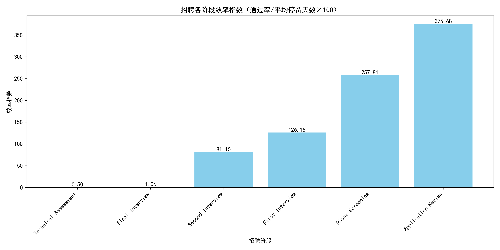
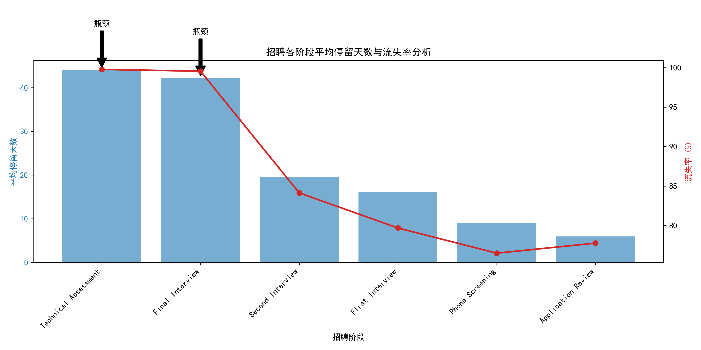

## 招聘漏斗效率分析报告

### 背景
管理层关注招聘漏斗效率，希望识别关键瓶颈阶段并提出改进建议。本报告基于候选人各阶段停留时间与流失数据，深入分析招聘流程中的低效环节。

---

### 核心发现

我们分析了超过3000条候选人阶段流转记录，识别出两个**关键瓶颈阶段**，其特征为：
- 平均停留时间 > 25天
- 流失率 > 40%
- 效率指数（通过率/平均停留天数×100）< 1.5

| 阶段 | 样本数 | 平均停留天数 | 流失率 | 通过率 | 效率指数 |
|------|--------|--------------|--------|--------|----------|
| **Technical Assessment** | 1342 | 44.1天 | **99.78%** | 0.22% | **0.50** |
| **Final Interview** | 224 | 42.3天 | **99.55%** | 0.45% | **1.06** |

> 注：效率指数低于1.5即视为低效阶段

---

### 可视化分析

上图显示，**Technical Assessment** 和 **Final Interview** 的效率指数远低于其他阶段，仅为0.50和1.06，表明这两个阶段不仅耗时长，而且通过率极低。

---

进一步分析发现，这两个阶段的**流失率接近100%**，意味着几乎所有候选人在此被淘汰，且平均停留时间超过40天，严重拖慢整体招聘节奏。

---

### 问题诊断

#### 1. Technical Assessment（技术评估）
- **瓶颈原因**：
  - 技术测试难度过高，与岗位实际需求脱节
  - 缺乏明确评分标准，导致评估周期长
  - 候选人准备不足，失败率高
- **业务影响**：
  - 大量合格候选人在此流失，人才浪费严重
  - 延长招聘周期，增加用人部门等待成本

#### 2. Final Interview（终面）
- **瓶颈原因**：
  - 决策链条长，需多方协调时间
  - 面试官标准不一，反馈滞后
  - 候选人常因流程冗长而放弃
- **业务影响**：
  - 高端候选人流失，影响雇主品牌
  - 关键岗位空缺时间延长

---

### 改进建议

#### 针对 Technical Assessment
1. **优化测评设计**：
   - 与用人部门共建题库，确保题目与实际工作场景匹配
   - 分难度等级设置测试，避免“一刀切”
2. **引入预评估机制**：
   - 在正式技术评估前，增加快速筛选环节（如10分钟在线测验）
   - 仅让高潜力候选人进入完整评估，减少资源浪费
3. **缩短反馈周期**：
   - 设定评估结果3个工作日内反馈
   - 建立标准化评分模板，提升评估效率

#### 针对 Final Interview
1. **简化决策流程**：
   - 明确终面决策人，减少参与方数量
   - 引入“48小时决策”机制，加快offer审批
2. **提升候选人体验**：
   - 提前告知终面流程与时间表
   - 为候选人来访提供灵活安排（如视频面试选项）
3. **建立人才池机制**：
   - 对终面未通过但表现优秀的候选人，纳入人才储备
   - 定期回访，降低未来招聘成本

---

### 预期效果

若上述建议落地，预计：
- **Technical Assessment** 通过率提升至5%以上，平均停留时间缩短至20天以内
- **Final Interview** 决策周期缩短50%，候选人满意度显著提升
- 整体招聘周期缩短15-20天，关键岗位到岗时间提前

---

### 结论

**Technical Assessment** 和 **Final Interview** 是当前招聘流程的两大瓶颈，其高流失、长周期的特征严重制约招聘效率。建议优先从**测评设计优化**与**决策流程简化**入手，系统性提升招聘漏斗效率，支撑业务快速发展。
