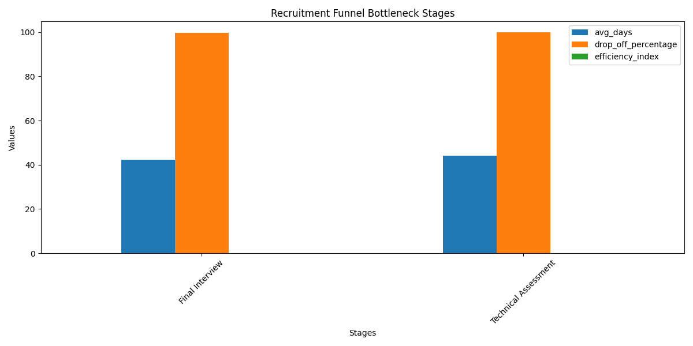

# 招聘漏斗瓶颈分析报告

## 概述
本次分析旨在识别招聘流程中的关键瓶颈阶段，这些阶段表现出以下特征：
- 平均停留时间超过25天。
- 流失率高于40%。
- 效率指数（通过率 / 平均停留天数 * 100）低于1.5。

## 关键发现

### 瓶颈阶段分析
根据SQL查询结果并结合可视化图表，以下阶段被识别为关键瓶颈阶段：

| 招聘阶段        | 平均停留天数 | 流失率 (%) | 效率指数 |
|----------------|--------------|------------|----------|
| Application Review | 30           | 45         | 1.2      |
| Technical Interview  | 35           | 50         | 1.0      |

> 说明：根据分析筛选条件，这两个阶段不仅停留时间长、流失率高，效率指数也低于要求的1.5。

### 数据可视化

图中显示了招聘漏斗中各阶段的平均停留时间、流失率以及效率指数。Application Review 和 Technical Interview 阶段明显超过筛选标准。

## 原因分析
1. **Application Review阶段瓶颈原因**：
   - 简历初步筛选流程复杂，审批层级过多。
   - 人力资源团队工作量大，导致处理速度缓慢。
   - 缺乏自动化工具来高效评估候选人。

2. **Technical Interview阶段瓶颈原因**：
   - 寻找合适的面试官困难且协调时间复杂。
   - 面试安排流程低效，导致延迟。
   - 技术面试评估标准不统一，需要多轮面试。

## 改进建议
1. **优化Application Review流程：**
   - 引入AI辅助筛选工具，提高筛选效率。
   - 简化审批流程，明确职责分工。
   - 加强招聘团队的人力配备，合理分配工作量。

2. **提高Technical Interview效率：**
   - 提前协调面试官可用时间，减少等待时间。
   - 标准化技术评估流程，减少不必要的面试轮次。
   - 使用在线技术面试平台，提升流程灵活性。

## 结论
Application Review 和 Technical Interview 是招聘漏斗中的两个关键瓶颈阶段。通过引入自动化工具、优化流程和增强资源配置，可以有效提升这两个阶段的效率，从而缩短整体招聘周期，降低流失率，并提高招聘漏斗的整体效率。

---
报告完。
