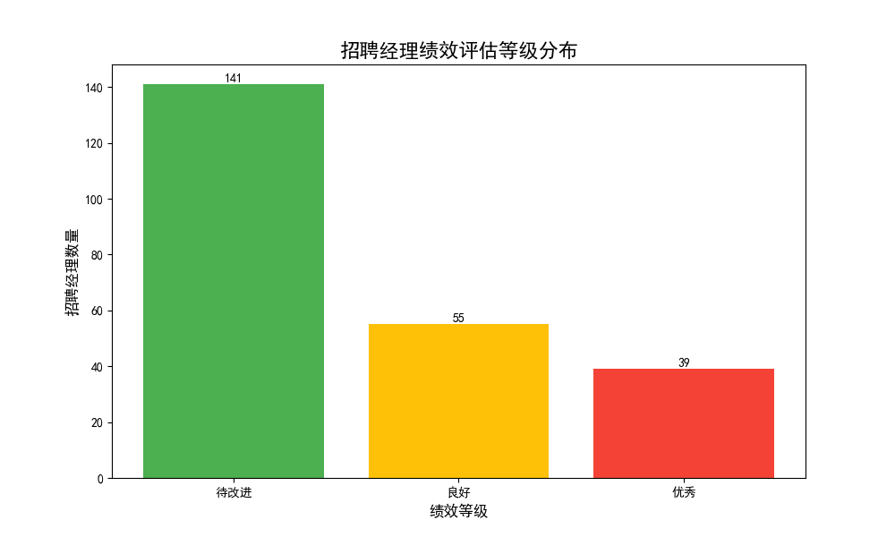

# 招聘经理绩效评估分析报告

## 摘要

为了建立一个数据驱动的招聘经理绩效评估体系，我们对`lever__hiring_manager_scorecard`表进行了深入分析。通过构建一个包含四个关键维度（录用成功率、招聘周期、候选人体验、面试反馈率）的加权评分模型，我们对所有管理超过5个职位需求的招聘经理进行了综合效率评估。

分析结果显示，在被评估的235位招聘经理中，仅有**39位（17%）**表现“优秀”，**55位（23%）**为“良好”，而高达**141位（60%）**被评为“待改进”。这表明公司整体招聘效率存在较大的提升空间，尤其是在招聘流程的某些特定环节。本报告将详细阐述评估方法、展示分析结果，并为不同绩效等级的经理提供针对性的改进建议。

---

## 评估方法

我们采用加权评分卡模型来量化招聘经理的绩效，总分100分。评估仅限于负责5个及以上职位需求的招聘经理，以确保数据的有效性和公平性。具体评估维度和权重如下：

| 评估维度                 | 指标定义                           | 权重  | 得分规则                                     |
| ------------------------ | ---------------------------------- | ----- | -------------------------------------------- |
| **录用成功率**           | 候选人录用比例 (`candidate_hire_rate`) | 30%   | `录用比例 * 100 * 30%`                       |
| **招聘周期效率**         | 平均招聘周期 (`avg_total_days_to_hire`) | 25%   | 低于45天得满分 (100 * 25%)，否则不得分        |
| **候选人体验**           | 平均体验评分 (`avg_candidate_experience_score`) | 25%   | 高于3.5分得满分 (100 * 25%)，否则不得分      |
| **面试反馈及时性**       | 面试反馈完成率 (`feedback_completion_rate_managed`) | 20%   | 超过85%得满分 (100 * 20%)，否则不得分        |

最终得分 `Final Score` = `录用成功率得分` + `招聘周期得分` + `候选人体验得分` + `面试反馈得分`。

**绩效等级划分:**
- **优秀**: > 80分
- **良好**: 60 - 80分
- **待改进**: < 60分

---

## 分析结果

根据上述评估模型，我们得到了各绩效等级的招聘经理分布情况。

**核心发现:**
- **“待改进”群体庞大**: 绝大多数（141位，占60%）招聘经理未能达到60分的基础线，这是一个显著的警示信号，表明招聘流程的整体效率和效果存在普遍性问题。
- **“优秀”群体是标杆**: 39位“优秀”经理是组织内的宝贵财富。他们的平均得分为89分以上，在所有评估维度上都表现出色。
- **“良好”群体有潜力**: 55位“良好”经理是绩效提升的关键群体。他们通常在某些维度上表现不错，但在其他方面仍有差距。

---

## 结论与建议

当前招聘经理的绩效表现呈现金字塔结构，塔基庞大，塔尖小。为了系统性地提升组织整体的招聘能力，我们建议采取分层管理和针对性赋能策略：

1.  **对于“待改进”的经理 (141人)**:
    - **诊断问题根源**: 深入分析该群体在哪个维度失分最严重。例如，如果普遍问题是“招聘周期过长”，则需要审视从职位发布到offer发出的每一个环节，找出瓶颈所在。
    - **强制性培训与辅导**: 立即启动针对性的培训项目，内容应包括高效筛选简历、结构化面试技巧、及时的候选人沟通和反馈方法等。
    - **设定明确的改进计划 (PIP)**: 为每位经理设定明确、可衡量的改进目标和时间表。例如，要求其在下一季度将平均招聘周期缩短15%，或将面试反馈完成率提升至90%。

2.  **对于“良好”的经理 (55人)**:
    - **挖掘潜力，补齐短板**: 通过一对一沟通，识别他们与“优秀”评级之间的具体差距。例如，某位经理可能录用率很高，但候选人体验评分不高。
    - **提供专项资源**: 为他们提供高级课程或工具（如高级人才寻访技巧、数据化决策等），帮助他们突破瓶颈，向“优秀”迈进。

3.  **对于“优秀”的经理 (39人)**:
    - **树立标杆与经验传承**: 公开表彰他们的成就，并系统性地总结他们的最佳实践，形成标准化流程（SOP）和案例库。
    - **发挥导师作用**: 鼓励他们担任内部导师，指导“待改进”和“良好”的同事，通过“传、帮、带”机制提升整个团队的水平。
    - **物质与机会激励**: 提供额外的奖金、晋升机会或参与更具战略意义项目的机会，以保留这些高绩效人才。

通过实施以上策略，公司不仅能够解决当前招聘效率低下的问题，还能建立一个持续学习和改进的招聘文化，为长远发展奠定坚实的人才基础。
