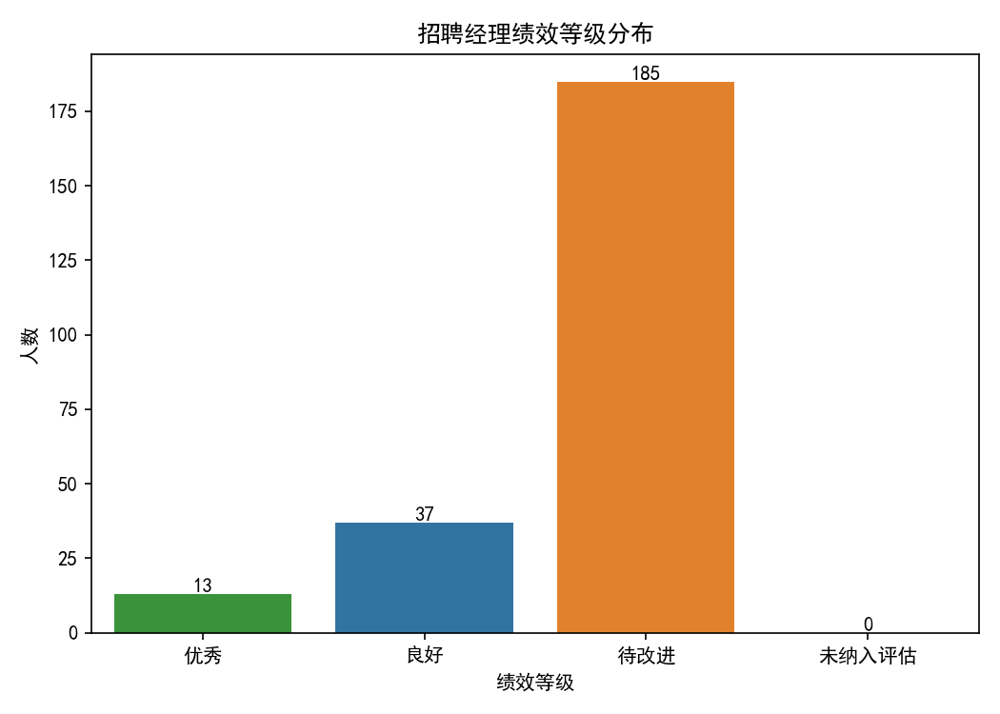
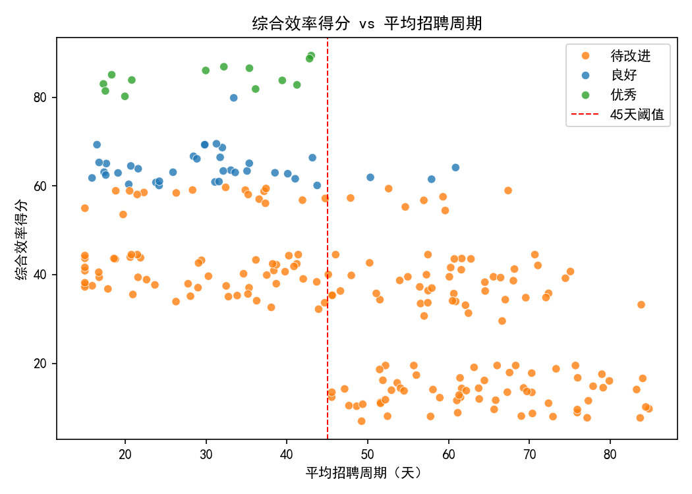
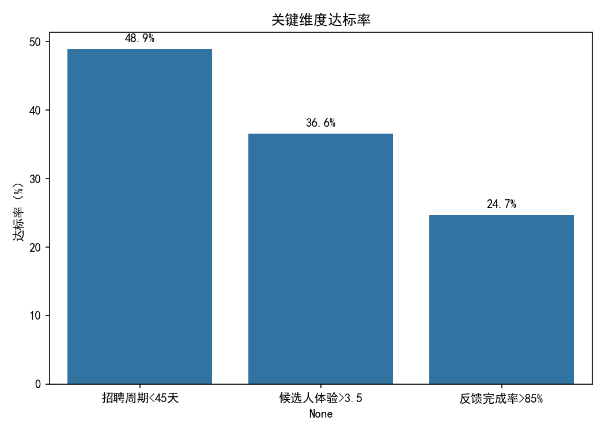

# 招聘经理绩效评估体系构建与分析报告

## 背景与目标
我们希望基于 lever__hiring_manager_scorecard 表，建立一套数据驱动的招聘经理绩效评估体系，衡量综合效率并分级：
- 维度与权重：
  - 录用成功率（权重30%）
  - 平均招聘周期是否低于45天（权重25%）
  - 候选人体验评分是否高于3.5分（权重25%）
  - 面试反馈完成率是否超过85%（权重20%）
- 分级标准：
  - 优秀：综合效率得分≥80
  - 良好：60–80
  - 待改进：<60
- 纳入评估范围：每位招聘经理需管理≥5个职位需求。数据中所有经理均满足（最小需求数为9）。

## 方法说明
- 数据来源：SQLite 数据库 dacomp-072.sqlite 中的表 lever__hiring_manager_scorecard。
- 指标口径与计算：
  - 录用成功率（candidate_hire_rate）：原值为比例（0–1），评分折算为百分制：hire_rate_score = candidate_hire_rate × 100。
  - 招聘周期（avg_total_days_to_hire）：阈值判定分：周期<45天得100分，否则0分。
  - 候选人体验（avg_candidate_experience_score）：评分>3.5得100分，否则0分。
  - 面试反馈完成率（feedback_completion_rate_managed）：>85%得100分，否则0分。
  - 综合效率得分：final_score = 0.30×hire_rate_score + 0.25×cycle_score + 0.25×cx_score + 0.20×fb_score。
- 分级规则：按最终得分划分为“优秀/良好/待改进”；所有经理因需求数≥5而“未纳入评估”人数为0。

说明：本分析严格按原始数据进行，没有进行数据清洗或修正。

## 关键结果
- 等级分布（总计235位经理）：
  - 优秀：13人
  - 良好：37人
  - 待改进：185人

- 分层特征均值与通过率：
  - 优秀（13人）：录用成功率均值48.6%，平均招聘周期30.3天，候选人体验4.15分，反馈完成率93.8%，四项阈值通过率均为100%，平均综合效率得分84.6。
  - 良好（37人）：录用成功率均值50.5%，平均招聘周期30.7天，候选人体验3.72分，反馈完成率77.6%，“周期<45天”通过率91.9%，“体验>3.5”通过率81.1%，“反馈>85%”通过率29.7%，平均综合效率得分64.4。
  - 待改进（185人）：录用成功率均值45.7%，平均招聘周期50.2天，候选人体验2.93分，反馈完成率68.5%，“周期<45天”通过率36.8%，“体验>3.5”通过率23.2%，“反馈>85%”通过率18.4%，平均综合效率得分32.4。

- 整体维度达标率（全体经理）：
  - 招聘周期<45天：48.9%
  - 候选人体验>3.5：36.6%
  - 反馈完成率>85%：24.7%

- 相关性（与综合效率得分的皮尔逊相关）：
  - 平均招聘周期：-0.620（负相关显著，周期越短得分越高）
  - 候选人体验：0.523（正相关显著）
  - 反馈完成率：0.462（正相关中等）
  - 录用成功率：0.186（正相关较弱）

解读要点：
- 决定性维度是“平均招聘周期”和“候选人体验”：二者与总分的相关性最高，且优秀组在这两个维度表现出绝对优势。
- 面试反馈完成率是良好组的主要短板：仅约30%达标，导致大量经理被“卡”在良好而不是优秀。
- 录用成功率的相关性偏弱，原因可能是其权重虽高（30%），但值域较集中、同时其他三个维度采取“阈值式满分/零分”的设计，在是否达标时对总分的边际影响更大（如周期与反馈一旦达标，能瞬间增加25/20分）。

## 可视化
- 招聘经理绩效等级分布：见 tier_distribution.png
- 综合效率得分 vs 平均招聘周期散点图：见 score_vs_days.png
- 关键维度达标率：见 dimension_pass_rates.png

图片：






## 榜单（示例）
- Top 10 综合效率得分（均为纳入评估经理）：
  - Lorraine Gibbs | 89.4 | 录用成功率64.6% | 平均周期43.0天 | 体验3.90 | 反馈85.5% | 需求25
  - Melissa Russell | 88.7 | 62.3% | 42.8 | 4.53 | 93.8% | 31
  - Kyle Andrews | 86.9 | 56.2% | 32.2 | 4.13 | 98.0% | 16
  - Erin Walters | 86.5 | 55.1% | 35.4 | 3.83 | 89.1% | 11
  - Victoria Valdez | 86.0 | 53.4% | 30.0 | 4.09 | 90.9% | 17
  - William Tran | 85.1 | 50.2% | 18.3 | 4.27 | 94.9% | 38
  - Andrew Gonzales | 83.9 | 46.2% | 20.8 | 3.65 | 92.1% | 34
  - Keith Stephens MD | 83.8 | 46.0% | 39.4 | 3.84 | 98.0% | 18
  - Mr. James Duncan | 83.0 | 43.3% | 17.3 | 4.73 | 96.7% | 28
  - Kelly Foster | 82.8 | 42.6% | 41.2 | 3.91 | 98.0% | 23

- Bottom 10 综合效率得分（均为纳入评估经理）：
  - Michael Hamilton | 6.9 | 23.1% | 49.2 | 2.94 | 72.2% | 44
  - Zachary Cole | 7.7 | 25.6% | 83.7 | 3.03 | 43.9% | 29
  - Dr. Sara Hoffman DDS | 7.7 | 25.7% | 77.1 | 2.72 | 75.3% | 35
  - Robert Miller | 8.0 | 26.6% | 72.9 | 1.50 | 61.6% | 42
  - Donald Ellis | 8.0 | 26.7% | 57.8 | 1.91 | 58.4% | 27
  - Pamela Thompson | 8.1 | 26.9% | 52.4 | 3.01 | 55.4% | 60
  - Kathryn Perry | 8.1 | 27.0% | 69.0 | 3.20 | 63.4% | 32
  - Jose Townsend | 8.7 | 29.0% | 70.4 | 1.50 | 73.1% | 60
  - David Scott | 8.8 | 29.5% | 61.1 | 3.43 | 81.7% | 19
  - Caitlin Collins | 8.9 | 29.6% | 75.9 | 3.48 | 81.8% | 60

## 诊断性洞察（为什么）
- 周期与体验是“优秀”的门槛：优秀组在这两项100%达标，低周期显著提升总分（+25分），高体验再加25分，二者叠加基本锁定优秀。
- 反馈完成率是“良好”晋级的关键瓶颈：良好组在周期与体验通过率已很高，但反馈通过率仅约30%，因此大多停留在64分左右。
- 待改进组主要问题是“周期过长”和“体验不足”：平均周期50天、体验均值2.93，导致阈值分基本拿不到，综合得分低。

## 预测性与情景分析（将会发生什么）
- 如果“良好”组中有50%的经理将反馈完成率提升至>85%（由未达标变达标），每人预计+20分。以当前良好组均分约64.4估算，超过半数将跨越80分门槛晋级“优秀”。
- 如果“待改进”组中有50%的经理将平均招聘周期压至<45天（由未达标变达标），每人预计+25分。在不改变其他维度的情况下，组内均分可能从约32.4提升至≈44.9；若同时将体验提升至>3.5，再+25分，则可达≈69.9，显著接近“良好”甚至部分冲刺“优秀”（还需反馈/录用率配合）。

## 规范性建议（我们应该做什么）
- 影响周期的流程优化：
  - 设定环节SLA（例如筛选、安排面试、决策），在ATS中配置自动提醒与升级路径。
  - 增加并行面试与预留时段，减少排期等待；对关键岗位设“快速通道”。
  - 强化决策纪律：面试后一周内完成评估与去留决定。
- 候选人体验提升：
  - 标准化面试提纲与评分表，减少主观波动；为面试官进行“结构化面试”培训。
  - 提升沟通频次与质量（状态更新、预期沟通），减少信息不透明引发的负面体验。
- 面试反馈完成率提升：
  - 明确反馈SLA（如48小时），ATS内强制关卡（无反馈不可推进）；启用自动提醒+经理看板。
  - 简化反馈表单、引入模板，减少填写负担；对长期不达标者进行通报与上级审核。
  - 将反馈完成率纳入绩效考核与团队激励，设定季度目标（如>90%）。
- 录用成功率改善（尽管相关性较弱，但权重大）：
  - 明确岗位画像与提早校准，降低不匹配；加强候选人来源质量与预筛。
  - 用数据复盘高转化岗位的JD与流程要素，推广至其他岗位。

## 评价体系的可持续迭代
- 权重与阈值的检视：当前三项阈值是“0或100”，对总分边际影响很大。可考虑引入分段或连续得分（例如反馈完成率线性映射），以更精细地区分提升幅度。
- 增加风险控制维度：如offer拒绝率、试用期淘汰率、岗位级别复杂度加权等，避免单纯追求速度与通过率。

## 附：绘图代码片段（含字体设置）
```python
import matplotlib.pyplot as plt
import seaborn as sns

plt.rcParams['font.sans-serif'] = ['SimHei']
plt.rcParams['axes.unicode_minus'] = False

# 等级分布示意
# sns.barplot(x=tier_counts.index, y=tier_counts.values, palette=['#2ca02c','#1f77b4','#ff7f0e','#7f7f7f'])
# 关键维度达标率示意
# sns.barplot(x=pass_rates.index, y=(pass_rates.values*100), color='#1f77b4')
# 得分-招聘周期散点示意
# sns.scatterplot(data=df, x='avg_total_days_to_hire', y='final_score',
#                 hue='performance_tier_computed',
#                 palette={'优秀':'#2ca02c','良好':'#1f77b4','待改进':'#ff7f0e','未纳入评估':'#7f7f7f'},
#                 alpha=0.8)
```

## 结论
- 综合效率得分体现了“快、好、全”的三要素：快（周期<45）、好（体验>3.5）、全（反馈>85%），辅以录用成功率。
- 目前优秀占比偏低（约5.5%），主要瓶颈在反馈完成率与周期控制。围绕上述建议执行后，预计“良好”中的大批经理能晋级“优秀”，整体效率与候选人体验将同步改善。
