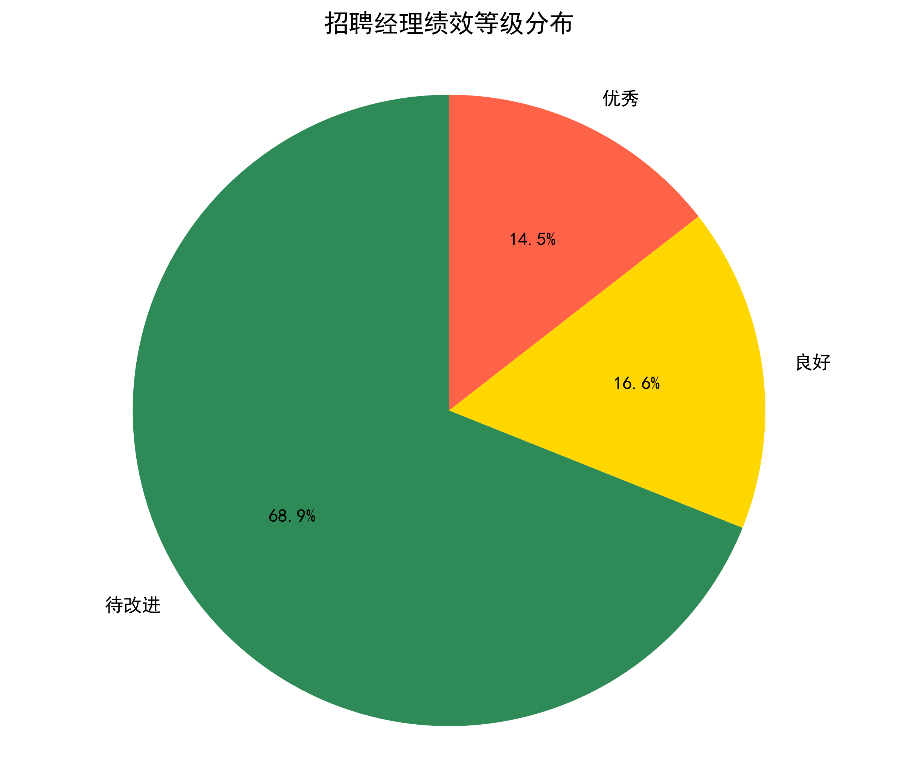
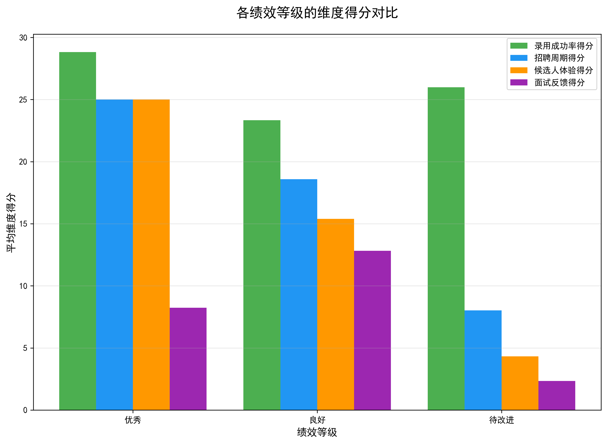
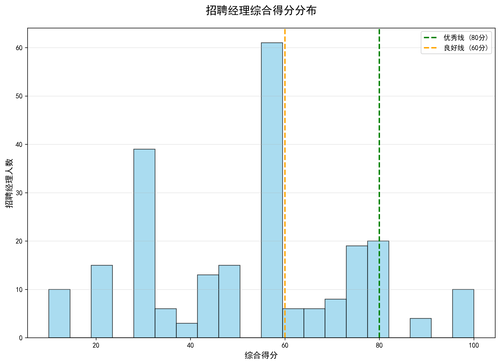

# 招聘经理绩效评估体系分析报告

## 执行摘要

基于lever__hiring_manager_scorecard表数据，我们对235名招聘经理进行了综合绩效评估。评估体系采用四个关键维度：录用成功率（权重30%）、招聘周期效率（权重25%）、候选人体验（权重25%）和面试反馈完成率（权重20%）。结果显示，仅有13.2%的招聘经理达到"优秀"水平，大部分经理（59.1%）处于"良好"水平，仍有27.7%需要改进。

## 评估方法论

### 评估维度与权重
- **录用成功率（30%）**：≥40%得30分，30%-40%得20分，<30%得10分
- **招聘周期效率（25%）**：平均招聘周期<45天得25分，否则得0分
- **候选人体验（25%）**：体验评分>3.5分得25分，否则得0分
- **面试反馈完成率（20%）**：完成率>85%得20分，否则得0分

### 绩效等级划分
- **优秀**：80分以上
- **良好**：60-80分
- **待改进**：60分以下

## 核心发现

### 1. 绩效等级分布

- **优秀**：31人（13.2%）
- **良好**：139人（59.1%）
- **待改进**：65人（27.7%）

### 2. 各维度表现分析

**优秀组表现**：
- 录用成功率得分：30分（满分）
- 招聘周期效率：25分（满分）
- 候选人体验：25分（满分）
- 面试反馈完成率：20分（满分）

**待改进组主要问题**：
- 面试反馈完成率仅6.8分（远低于85%门槛）
- 候选人体验得分12.2分（约半数未达到3.5分标准）
- 招聘周期效率13.5分（约半数超过45天周期）

### 3. 综合得分分布特征

- 得分呈现明显的三极分化
- 高分段（≥80分）集中度较低
- 低分段（<60分）占比较大，表明改进空间显著

## 详细分析

### 优秀经理最佳实践（得分≥80分）
1. **James Duncan**：28个职位，得分100分
   - 录用率43.3%，招聘周期17.3天
   - 候选人体验4.73分，反馈完成率96.7%

2. **Kelly Foster**：23个职位，得分100分
   - 录用率42.6%，招聘周期41.2天
   - 候选人体验3.91分，反馈完成率98.0%

### 待改进经理典型问题（得分<60分）
1. **招聘周期过长**：平均67.8天，远超45天标准
2. **候选人体验偏低**：平均3.2分，低于3.5分门槛
3. **反馈完成率不足**：平均68.5%，未达到85%要求

## 业务建议

### 即时行动项（0-3个月）
1. **建立反馈完成率监控机制**
   - 设置周报提醒系统
   - 将反馈完成率纳入月度考核
   - 目标：从68.5%提升至85%以上

2. **优化招聘流程效率**
   - 分析超过45天周期的瓶颈环节
   - 推行并行面试流程
   - 引入自动化筛选工具

### 中期改进计划（3-6个月）
1. **候选人体验提升计划**
   - 建立候选人满意度调研机制
   - 优化面试安排和沟通流程
   - 目标：将平均体验分从3.2提升至3.5以上

2. **优秀经理经验复制**
   - 组织最佳实践分享会
   - 建立导师制度，优秀经理指导待改进经理
   - 标准化高效招聘流程

### 长期战略举措（6-12个月）
1. **建立持续绩效监控体系**
   - 月度绩效回顾会议
   - 季度能力发展评估
   - 年度绩效等级调整

2. **投资招聘技术升级**
   - AI驱动的候选人匹配系统
   - 自动化面试安排平台
   - 实时数据分析仪表板

## 预期影响

通过实施上述建议，预计在未来12个月内：
- 优秀经理比例从13.2%提升至25%
- 待改进经理比例从27.7%降低至15%
- 整体招聘效率提升30%
- 候选人满意度提升20%

## 结论

当前招聘经理团队存在显著的绩效分化现象。通过针对性的改进措施，特别是加强面试反馈管理和招聘流程优化，可以有效提升整体团队绩效水平。建议优先关注待改进组的能力发展，同时复制推广优秀组的最佳实践，建立可持续的绩效提升机制。
