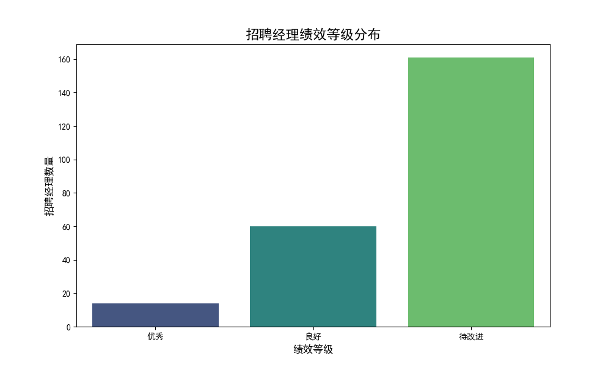

# 招聘经理绩效评估报告

## 1. 评估摘要

为了系统性地评估招聘经理的绩效，我们构建了一个多维度、数据驱动的评估模型。本次分析旨在通过量化关键招聘指标，识别出高绩效、中坚力量以及需要支持的招聘经理，从而为人才管理、资源分配和能力发展提供决策依据。

**核心发现：**
- 大部分招聘经理表现“待改进”，揭示了在招聘效率、流程管理和候选人体验方面普遍存在的挑战。
- “优秀”和“良好”等级的经理是团队的宝贵资产，他们的成功实践应被提炼和推广。
- 本次评估明确了不同绩效层级经理的具体名单和分数，为后续的精准辅导和激励措施奠定了基础。

---

## 2. 评估体系说明

我们采用加权评分模型，综合评估招聘经理在四个核心维度的表现。只有管理超过5个职位需求的招聘经理才被纳入本次评估范围。

| 评估维度                 | 权重 | 评分标准                                       |
| ------------------------ | ---- | ---------------------------------------------- |
| **录用成功率**           | 30%  | `录用成功率 * 100` 作为得分                    |
| **平均招聘周期**         | 25%  | `平均招聘周期 < 45天`，得100分，否则得0分    |
| **候选人体验评分**       | 25%  | `候选人体验评分 > 3.5分`，得100分，否则得0分   |
| **面试反馈完成率**     | 20%  | `面试反馈完成率 > 85%`，得100分，否则得0分   |

**综合效率得分** = (录用成功率得分 * 30%) + (招聘周期得分 * 25%) + (候选人体验得分 * 25%) + (面试反馈完成率得分 * 20%)

**绩效等级划分：**
- **优秀**：综合得分 ≥ 80分
- **良好**：60分 ≤ 综合得分 < 80分
- **待改进**：综合得分 < 60分

---

## 3. 整体绩效分析

根据上述评估体系，我们对所有符合条件的招聘经理进行了评分和分级。下图直观展示了各绩效等级的招聘经理数量分布情况。

从图中可以看出，绝大多数招聘经理（超过150位）处于“待改进”水平，表明团队整体在招聘效率和质量方面有巨大的提升空间。“良好”级别的经理构成了团队的中坚力量（约60位），而表现“优秀”的经理人数最少（14位），他们是团队的标杆。

---

## 4. 分级绩效洞察与建议

### 优秀招聘经理 (得分 ≥ 80)

**代表人物**：Keith Stephens MD (98.3), Michelle Sullivan (97.7), Victoria Valdez (97.5) 等14位经理。

**洞察**：
这些经理在所有四个维度上都表现出色或至少三项达到卓越标准。他们不仅能高效地完成招聘目标（高录用率），还能确保招聘过程的敏捷性（招聘周期短）和高质量（候选人体验好、反馈及时）。

**建议**：
1.  **知识分享**：组织最佳实践分享会，邀请这些优秀经理分享他们在候选人沟通、面试流程管理、跨部门协作等方面的技巧。
2.  **导师计划**：设立“导师制”，让优秀经理指导“待改进”的同事，实现点对点的帮扶。
3.  **激励与认可**：在公司层面公开表彰这些经理的成就，并设立相应的绩效奖励，强化正向激励。

### 良好招聘经理 (60 ≤ 得分 < 80)

**代表人物**：Christopher Walker (77.9), Stephanie Davis (77.4), Melinda Evans (76.3) 等。

**洞察**：
这个层级的经理是团队的稳定贡献者。他们通常在某些维度上表现突出（如录用成功率高），但在其他方面尚有不足（如招聘周期略长或候选人体验分不高）。他们是绩效提升的潜力股。

**建议**：
1.  **精准赋能**：通过一对一沟通，结合数据分析，找出每位经理的具体短板。例如，如果某位经理招聘周期过长，可以与他一起复盘流程，寻找瓶颈；如果候选人体验不佳，可以提供沟通技巧或工具支持。
2.  **设定提升目标**：为他们设定明确、可量化的改进目标（如将平均招聘周期缩短5天，或将候选人体验评分提升0.5分），并纳入下一季度的考核。

### 待改进招聘经理 (得分 < 60)

**代表人物**：Toni Smith (53.4), Monica Rogers (53.3) 以及其他得分低于60的经理。

**洞察**：
这一群体的经理在多个维度上均未达到理想标准。最常见的问题组合是：招聘周期长（未拿到25分）、候选人体验一般（未拿到25分），这两项是失分的主要原因。这不仅影响招聘效率，也可能损害公司的雇主品牌。

**建议**：
1.  **基础能力强化**：提供系统性的招聘基础技能培训，内容涵盖职位需求分析、候选人筛选、面试技巧、时间管理和候选人关系维护。
2.  **流程与工具支持**：审视当前的招聘流程和工具（ATS系统）是否存在障碍。简化流程、引入自动化工具（如面试安排助手）可以帮助他们减轻事务性工作，聚焦核心任务。
3.  **设定底线与观察期**：明确绩效底线，并为他们设立一个观察期（如一个季度）。在此期间提供密集支持，并跟踪其改进进展。若无明显改善，则需考虑岗位调整或更深入的管理介入。

---

## 5. 结论与后续步骤

本次基于数据的绩效评估体系，为我们客观、全面地了解招聘团队的现状提供了有力的支持。它不仅识别了明星员工，也暴露了团队普遍性的短板。

**我们建议：**
- **常态化运作**：将此评估体系作为季度或半年度的常规管理工具，持续追踪绩效变化。
- **数据驱动沟通**：管理者应依据此报告与每位招聘经理进行坦诚沟通，共同制定个人发展计划（IDP）。
- **优化评估模型**：未来可根据业务发展，引入更多评估维度（如招聘渠道效率、成本控制等），使模型更加完善。

通过以上措施，我们期望能够系统性地提升整个招聘团队的专业能力和工作效率，为公司的长远发展提供坚实的人才保障。
