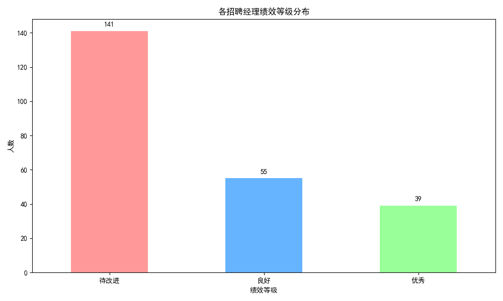
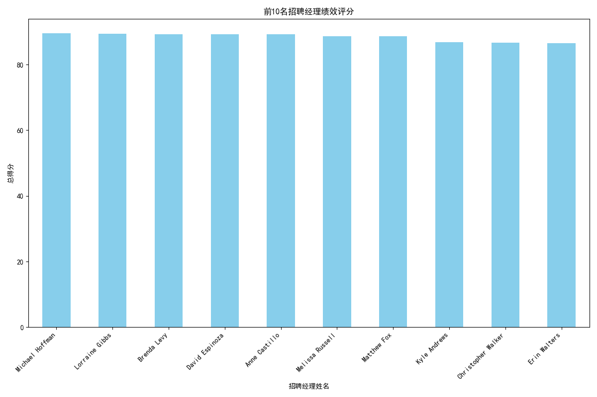

## 招聘经理绩效评估分析报告

### 绩效等级分布分析
根据综合效率得分，我们将招聘经理分为三个等级：优秀、良好和待改进。分析结果显示：
- **优秀**：39人
- **良好**：55人
- **待改进**：141人

### 绩效评分分析
在分析的235名招聘经理中，大多数经理的绩效评分集中在待改进等级。详细分析前10名招聘经理的绩效评分，我们可以看到以下结果：

### 业务洞察与建议
1. **优秀招聘经理的特征识别**：
   - 优秀招聘经理在录用成功率、平均招聘周期、候选人体验评分和面试反馈完成率四个维度上表现出色。
   - 建议对这些优秀经理的招聘策略进行深入研究，提炼最佳实践并在团队中推广。

2. **改进待改进招聘经理的策略**：
   - 对于待改进招聘经理，建议提供针对性的培训与辅导，重点关注提升录用成功率、缩短招聘周期、改善候选人体验和提高面试反馈完成率。
   - 制定具体的绩效改进计划，定期进行评估，以确保改进措施的有效性。

3. **激励机制优化**：
   - 建议建立基于绩效等级的激励机制，以奖励优秀招聘经理并激励其他经理提升绩效。
   - 对于表现良好的招聘经理，提供晋升机会或额外奖励，以激励他们进一步提升绩效。

4. **持续绩效监测**：
   - 建议定期进行绩效评估，以监测招聘经理的绩效变化，并根据实际情况调整评估体系。
   - 通过数据分析，持续优化招聘流程，提高整体招聘效率和质量。

以上分析基于招聘经理的综合效率得分，通过四个关键维度评估其绩效水平，并提出了相关的业务建议，以提升招聘团队的整体绩效。
