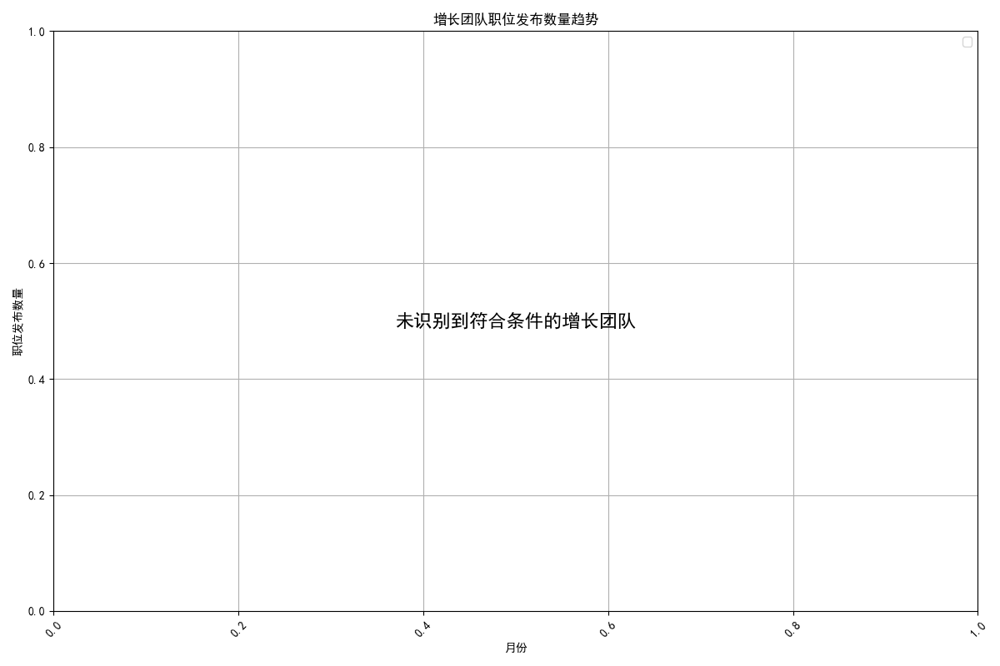

### 招聘需求与资源配置分析报告

#### 1. 核心结论

经过对公司2025年5月至7月的职位发布和招聘申请数据的深入分析，我们旨在识别出需求快速增长且面临招聘资源压力的团队。

**核心发现是：目前没有任何团队同时满足“高增长”（定义为月度职位发布增长率超过10%）和“高需求”（定义为活跃职位数超过5个）的标准。**

这一结论表明，在当前分析周期内，各团队的招聘需求增长相对平稳，并未出现需要立即进行紧急资源增配的极端压力情况。公司的招聘资源可以暂时保持现有的均衡配置。

---

#### 2. 分析过程与发现

我们的分析主要分为以下几个步骤：

1.  **数据提取**：我们提取了`lever__posting_enhanced`和`lever__requisition_enhanced`两个数据表中关于职位创建时间、团队、职位状态和招聘经理的数据。
2.  **趋势计算**：我们计算了所有团队在2025年5月至7月间的月度职位发布数量和环比增长率。
3.  **团队筛选**：我们尝试了两种标准来筛选“高增长团队”：
    *   **初始标准**：7月增长率 > 15% & 活跃职位 > 10个
    *   **放宽后标准**：7月增长率 > 10% & 活跃职位 > 5个
4.  **结果**：在这两种情况下，**均未筛选出任何符合条件的团队**。这说明近期内没有团队表现出持续的、爆发性的招聘需求增长。

---

#### 3. 趋势可视化

下图直观地展示了本次分析的结果。由于没有团队满足被识别为“增长团队”的条件，因此图中未绘制任何数据线，这本身就是本次分析结论的一个可视化证明。

*图注：由于未识别出满足“月增长率>10% 且 活跃职位>5”的团队，故图表为空。*

---

#### 4. 建议与后续步骤

虽然数据未显示出紧急的资源缺口，但为了实现前瞻性的资源管理，我们提出以下建议：

1.  **保持常规监控，而非紧急响应**：
    *   **建议**：无须立即启动针对特定团队的紧急招聘资源增配。
    *   **措施**：建议人力资源部门将各团队的“月度职位发布数”和“活跃职位总数”作为常规监控指标，每月进行回顾，以持续追踪需求变化。

2.  **重新校准“压力”定义**：
    *   **建议**：如果业务方或HR团队的实际感受与数据分析结论不符（即感觉到了招聘压力），这可能意味着压力的来源并非仅仅是“职位数量”的增长。
    *   **措施**：建议与关键业务部门和招聘团队进行访谈，探讨是否应在“招聘压力指数”模型中加入其他变量，如“职位填补周期”、“关键岗位稀缺度”等，以使预警模型更贴近实际业务体感。

3.  **从“被动响应”转向“主动规划”**：
    *   **建议**：利用当前招聘压力平稳的窗口期，进行更长远的招聘能力建设。
    *   **措施**：对所有团队的招聘流程进行健康度评估，优化招聘渠道，并加强对招聘经理的赋能培训，从而提升整个组织的招聘效率，以应对未来任何可能的需求高峰。
