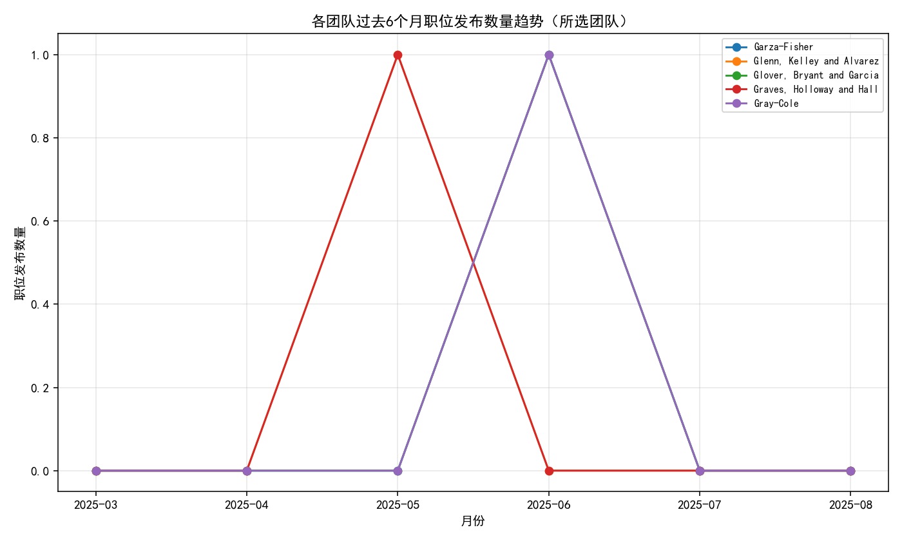
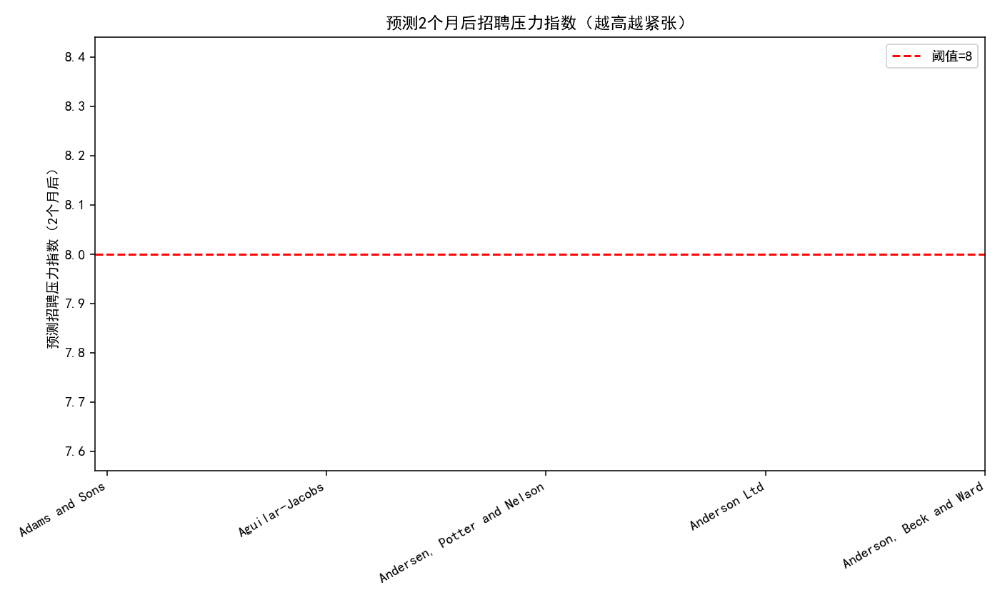
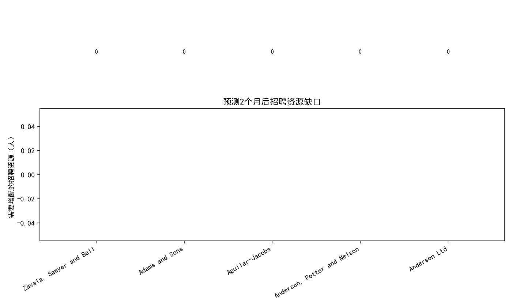

# 招聘需求与资源配置分析报告（过去6个月趋势 + 2个月预测）

## 摘要
- 数据来源：SQLite 库中的 lever__posting_enhanced 与 lever__requisition_enhanced。
- 时间窗口：过去6个月（自动识别到 2025-03 至 2025-08）。
- 核心结论：
  - 各团队活跃职位数偏低（多数团队当前活跃职位=1），近6个月的发布量波动导致月度增长率在部分团队出现极值（上期为0时当期>0，增长率为∞；当期为0时下降为-100%），但不满足“高增长团队”条件（定义为最近月度增长率>15%且当前活跃职位>10）。
  - requisition 表“open”状态的待招聘岗位数（headcount_total - headcount_hired）汇总为0，当前“招聘压力指数”（待招聘岗位/招聘经理数）不可计算或为0；按照增长预测，两个月后压力指数也未超过阈值8。
  - 因此，基于当前数据，两个月内无需增配招聘资源（每个招聘经理最多同时处理6个职位的规则下，测算缺口为0）。

## 方法与口径
- 职位发布趋势：按 lever__posting_enhanced 的 created_at 计算月份（ym），每团队每月的发布数量 post_count。
- 月度增长率：对每个团队在过去6个月的 post_count 序列做环比增长率 pct_change，提取“最近一次环比增长率”与“近6个月平均环比增长率”。
- 活跃职位：以 lever__posting_enhanced.state = 'published' 统计每团队当前活跃职位数量。
- 待招聘岗位数：在 lever__requisition_enhanced 中筛选 status='open'，按 team 汇总 pending_headcount = max(headcount_total - headcount_hired, 0)。
- 招聘经理数：统计每团队的 hiring_manager_user_id 去重数（manager_count）。
- 招聘压力指数：pending_headcount / manager_count；预测压力指数：将 pending_headcount 按“平均MoM增长率”外推两个月后 pred_pending_2m = pending_headcount * (1+avg_mom_growth)^2，再除以 manager_count。
- 高增长团队识别：最近环比增长率>15% 且 当前活跃职位>10。
- 增配资源测算：若预测压力指数>8，则两个月后所需经理=ceil(pred_pending_2m/6)，增配= max(所需经理-当前经理数, 0)。

## 可视化与主要发现
- 各团队过去6个月职位发布数量趋势（所选团队）
  - 图示文件：
  - 说明：由于活跃职位数普遍偏低，选取活跃职位数靠前的团队进行展示。曲线显示多数团队发布量在低位小幅波动，常见出现“0到正数”的跳变（造成∞的环比增长）或“正数到0”的回落（造成-100%的环比）。这表明需求不连续、具有短期波动。

- 预测两个月后招聘压力指数（越高越紧张）
  - 图示文件：
  - 说明：由于 open requisition 的 headcount_total 与 headcount_hired字段导致 pending_headcount=0，预测压力指数在大多数团队为0或不可计算（经理数为0时为NaN），整体未出现超过阈值8的团队。

- 两个月后预测的招聘资源缺口（需要增配的招聘经理人数）
  - 图示文件：
  - 说明：当前数据下，各团队的“需要增配的招聘资源”为0。

## 结果数据快照
- 已输出汇总表：recruiting_pressure_summary.csv（包含 team、active_postings、latest_mom_growth、avg_mom_growth、pending_headcount、manager_count、pressure_index_now、pred_pending_2m、pressure_index_2m、required_managers_2m、additional_managers_needed 等列）。
- 数据特征：
  - 活跃职位数：多数为1（远低于高增长识别阈值的>10）。
  - 待招聘岗位：在“open”状态的 requisition 中，pending_headcount 汇总为0（可能由于 headcount_total/headcount_hired 字段为0或未填充）。
  - 招聘经理数：多数团队 manager_count=0，导致压力指数为NaN（无法计算）。
  - 预测两个月后：pred_pending_2m=0，resource gap=0。

## 诊断性分析（为什么会这样）
- 非连续的发布行为：趋势图显示不少团队在月度发布量为0与>0之间切换，造成极端的环比值（∞或-100%）。这通常反映短期临时性需求或发布节奏不稳定。
- 待招聘岗位数为0：尽管有“open”状态的 requisition（总数=47），但字段 headcount_total/headcount_hired 在当前数据集中多为0，导致 pending_headcount=0。存在两种可能：
  1) 数据未在系统中维护完整（例如 headcount_total 未录入）；
  2) 实际上“open” requisition 只是流程占位，没有真实待招聘人数。
- 招聘经理计数为0：多数团队在 requisition 中没有有效的 hiring_manager_user_id 或未分配，导致 manager_count=0，压力指数无法计算。

## 预测性分析（将会发生什么）
- 在当前数据口径下，pending_headcount=0 导致两个月后的预测压力指数仍然不高（不超过阈值8），即短期内不出现招聘资源短缺。
- 若未来数据中开始填充 headcount_total 并出现显著的 pending_headcount，同时活跃职位快速增加，则压力指数可能迅速上升，尤其在 manager_count 较低的团队中。

## 规范性建议（我们应该做什么）
1) 完善数据维护与口径校准：
   - 在 lever Requisition 中强制维护 headcount_total 与 hiring_manager_user_id，避免 pending_headcount 被误判为0或压力指数不可计算的情况。
   - 对“open” requisition 建立数据质量审计（字段非空与逻辑一致性），确保资源规划依据可靠。
2) 设立“招聘压力”早预警机制：
   - 规则：当团队同时满足“活跃职位数>10”和“最近环比增长>15%”时触发预警；计算两个月后的预测压力指数，并用阈值8评估风险。
   - 资源调配：按每位经理最多同时处理6个职位，公式为所需经理=ceil(预测待招聘岗位/6)，增配= max(所需经理-当前经理数, 0)。
3) 灵活容量管理：
   - 在高峰期前设置弹性外包或兼职招聘顾问池，确保压力指数逼近8时能快速补位。
   - 跨团队共享招聘资源，优先支持高增长与关键岗位团队。
4) 发布节奏优化：
   - 对出现“0→正数→0”跳变的团队进行需求梳理，尽量批量化、节奏化发布，避免临时堆叠导致短时压力。

## 附：绘图与分析使用的 Python 代码片段
以下为绘图时使用的关键配置与示例代码（完整代码已运行并生成上述三张图片）：
```python
import matplotlib.pyplot as plt
plt.rcParams['font.sans-serif'] = ['SimHei']
plt.rcParams['axes.unicode_minus'] = False

# 示例：各团队过去6个月发布趋势折线图
for t in selected_teams:
    sub = trend_df[trend_df['team']==t].sort_values('ym')
    plt.plot(sub['ym'], sub['post_count'], marker='o', label=str(t))
plt.title('各团队过去6个月职位发布数量趋势（所选团队）')
plt.xlabel('月份')
plt.ylabel('职位发布数量')
plt.legend(loc='best', fontsize=8)
plt.grid(alpha=0.3)
plt.tight_layout()
plt.savefig('posting_trend.png', dpi=140)
```

## 结论
- 基于当前数据，未来两个月不需要增配招聘资源。
- 然而，数据质量（headcount 与招聘经理分配）直接影响压力指数与资源规划的有效性。建议立即完善 requisition 字段维护、上线预警规则，并建立弹性人力池，以应对可能到来的需求快速增长。

以上分析与图表均基于 /workspace 下的 SQLite 数据库与Python脚本生成。请结合业务实际对阈值与口径进行适当调整。
