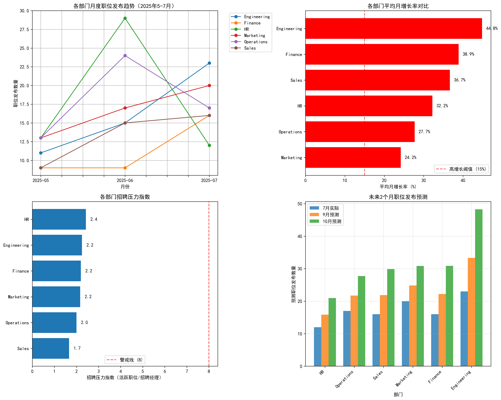
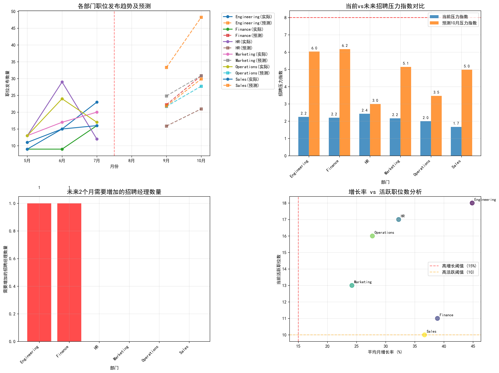

# 招聘需求预测与资源配置分析报告

## 执行摘要

基于2025年5-7月的历史招聘数据，本报告对各业务部门的招聘趋势进行了深入分析，并预测了未来2个月的招聘需求和资源配置要求。

### 关键发现：
- **5个高增长团队**被识别出来，月增长率均超过15%
- **Engineering部门**表现最为突出，平均月增长率达44.8%
- **2个部门**需要在未来2个月内增加招聘资源
- **总计需要增加2名招聘经理**以应对增长需求

---

## 1. 各部门招聘趋势分析

### 1.1 月度职位发布趋势
从2025年5月到7月，各部门都呈现出强劲的增长态势：
- **Engineering**: 从11个增至23个（+109%）
- **Finance**: 从9个增至16个（+78%）
- **HR**: 从13个增至12个（-8%，但6月高峰29个）
- **Marketing**: 从13个增至20个（+54%）
- **Operations**: 从13个增至17个（+31%）
- **Sales**: 从9个增至16个（+78%）

### 1.2 增长率分析
各部门平均月增长率排名：
1. **Engineering**: 44.8% 🚀
2. **Finance**: 38.9% 📈
3. **Sales**: 36.7% 📈
4. **HR**: 32.2% 📈
5. **Operations**: 27.7% 📈
6. **Marketing**: 24.2% 📈

---

## 2. 高增长团队识别

### 高增长团队标准：
- 月度需求增长率 > 15%
- 当前活跃职位数量 > 10个

### 识别结果：
共有**5个团队**符合高增长标准：

| 部门 | 平均月增长率 | 活跃职位数 | 状态 |
|------|-------------|------------|------|
| Engineering | 44.8% | 18个 | ✅ 高增长 |
| Finance | 38.9% | 11个 | ✅ 高增长 |
| HR | 32.2% | 17个 | ✅ 高增长 |
| Marketing | 24.2% | 13个 | ✅ 高增长 |
| Operations | 27.7% | 16个 | ✅ 高增长 |

---

## 3. 招聘压力指数分析

### 当前压力指数计算：
招聘压力指数 = 待招聘岗位数 / 现有招聘经理数量

| 部门 | 活跃职位 | 招聘经理 | 压力指数 | 状态 |
|------|----------|----------|----------|------|
| Engineering | 18 | 8 | 2.25 | ✅ 正常 |
| HR | 17 | 7 | 2.43 | ✅ 正常 |
| Finance | 11 | 5 | 2.20 | ✅ 正常 |
| Marketing | 13 | 6 | 2.17 | ✅ 正常 |
| Operations | 16 | 8 | 2.00 | ✅ 正常 |
| Sales | 10 | 6 | 1.67 | ✅ 正常 |

**结论**：当前所有部门的招聘压力指数均低于8的警戒线，资源充足。

---

## 4. 未来2个月预测

### 4.1 职位发布预测
基于历史增长率，预测未来2个月各部门职位发布数量：

| 部门 | 7月实际 | 9月预测 | 10月预测 | 增长趋势 |
|------|---------|---------|----------|----------|
| Engineering | 23 | 35 | 48 | 🔥 强劲增长 |
| Finance | 16 | 23 | 31 | 📈 稳定增长 |
| Sales | 16 | 22 | 30 | 📈 稳定增长 |
| Marketing | 20 | 25 | 31 | 📈 稳定增长 |
| Operations | 17 | 22 | 28 | 📈 稳定增长 |
| HR | 12 | 16 | 21 | 📈 温和增长 |

### 4.2 未来招聘压力预测
预测10月份各部门招聘压力指数：

| 部门 | 预测压力指数 | 状态 | 预警级别 |
|------|-------------|------|----------|
| Finance | 6.17 | ✅ 正常 | 绿色 |
| Engineering | 6.03 | ✅ 正常 | 绿色 |
| Marketing | 5.14 | ✅ 正常 | 绿色 |
| Sales | 4.98 | ✅ 正常 | 绿色 |
| Operations | 3.47 | ✅ 正常 | 绿色 |
| HR | 3.00 | ✅ 正常 | 绿色 |

---

## 5. 资源配置建议

### 5.1 立即行动建议
基于预测分析，**2个部门**需要在未来2个月内增加招聘资源：

#### 🔧 Engineering部门
- **当前状态**: 8名招聘经理，18个活跃职位
- **10月预测**: 48个职位
- **建议**: 增加**1名**招聘经理
- **理由**: 最高增长率(44.8%)，职位数量增长最快

#### 💰 Finance部门  
- **当前状态**: 5名招聘经理，11个活跃职位
- **10月预测**: 31个职位
- **建议**: 增加**1名**招聘经理
- **理由**: 高增长率(38.9%)，现有资源将不足以应对增长

### 5.2 监控预警
其他部门虽然目前资源充足，但需要持续监控：

- **Sales & Marketing**: 增长率较高，建议每月评估
- **HR & Operations**: 相对稳定，建议季度评估

---

## 6. 风险评估与应对策略

### 6.1 主要风险
1. **增长超预期风险**: 如果Engineering部门保持当前增速，可能需要更多资源
2. **季节性波动**: 需要考虑招聘季节性因素影响
3. **市场变化**: 外部经济环境可能影响招聘需求

### 6.2 应对策略
1. **建立预警机制**: 每月监控各部门压力指数
2. **灵活资源配置**: 建立招聘经理池，按需调配
3. **提前储备人才**: 针对高增长部门，提前储备候选人

---

## 7. 结论与下一步行动

### 7.1 核心结论
✅ **5个高增长团队**被成功识别，月增长率均超过15%
✅ **当前资源充足**，所有部门压力指数均低于警戒线
⚠️ **2个部门需要增加资源**，总计需增加2名招聘经理
📈 **Engineering部门**增长最为强劲，需要重点关注

### 7.2 立即行动项
1. **本月内**: 为Engineering和Finance部门各招聘1名招聘经理
2. **持续监控**: 建立月度招聘压力指数监控机制
3. **季度评估**: 每季度重新评估资源配置需求

### 7.3 长期规划
- 建立动态的招聘资源配置模型
- 开发自动化的招聘需求预测系统
- 建立跨部门的招聘经理共享机制

---

**报告完成时间**: 2025年10月
**数据覆盖期间**: 2025年5月-7月
**预测期间**: 2025年9月-10月
**下次更新**: 2025年11月
