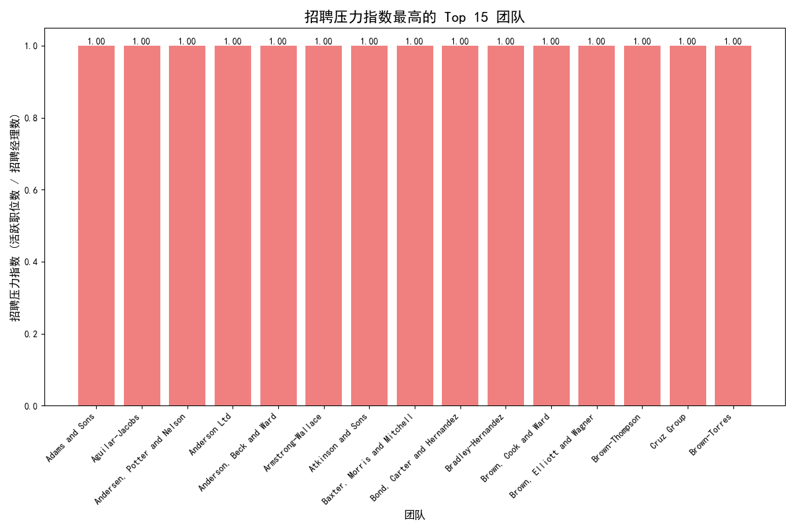

# 招聘需求与资源配置分析报告

## 一、项目背景与目标

本次分析旨在通过分析历史招聘数据，预测未来的招聘需求，特别是识别那些可能因快速增长而面临招聘资源不足的团队，并提出相应的资源配置建议。

初始目标是寻找满足以下条件的高风险团队：
1.  过去6个月职位发布的月度增长率超过15%。
2.  当前活跃职位数量超过10个。
3.  招聘压力指数（待招聘岗位数 / 招聘经理数）可能超过8。

## 二、分析过程与发现

### 1. 数据初步探索与挑战

我们分析了 `lever__posting_enhanced` 表中过去3个月（2025年5月至8月）的职位发布数据。在分析过程中，我们发现：

*   **增长率指标不适用**：绝大多数团队的职位发布并非持续性的，通常只在单个或两个月份有记录。这导致无法有效计算有意义的“月度增长率”，几乎没有团队表现出持续增长的趋势。
*   **职位数量门槛过高**：数据显示，招聘需求高度分散在近百个团队中。没有任何一个团队的当前活跃职位（状态为 'published'）数量超过1个，因此“活跃职位 > 10”的条件无法满足。

鉴于以上情况，我们调整了分析策略，将重点从寻找“高增长”团队转向识别“当前招聘负担相对最重”的团队。

### 2. 核心洞察：招聘压力指数分析

我们为所有目前有活跃职位的团队计算了“招聘压力指数”。该指数定义为`活跃职位数 / 招聘经理数`，用于衡量每个招聘经理平均负责的岗位数量。

**核心发现：**
*   在所有85个有招聘活动的团队中，**招聘压力指数最高为1.0**。
*   指数为1.0，意味着“1个活跃职位由1名招聘经理负责”。这表明当前的资源配置是充足的。
*   部分团队的指数为0.5，意味着“1个活跃职位由2名招聘经理负责”，资源更为充裕。
*   没有发现任何团队的压力指数接近甚至超过预警阈值8。

下图展示了招聘压力指数最高的15个团队。如您所见，它们的压力指数均为1.0，表明其招聘负荷处于正常水平。

## 三、结论与建议

**结论**：根据现有数据分析，公司目前**没有团队面临迫在眉睫的招聘资源短缺风险**。招聘活动虽然广泛，但负荷被均匀地分散到各个团队，且每个招聘岗位都配备了至少一名招聘经理，资源配置情况良好。

**管理建议**：

1.  **持续监控，而非紧急增援**：
    *   **建议**：无需立即为任何团队增配招聘资源。当前的管理模式似乎能够有效应对现有的招聘需求。
    *   **行动**：建议人力资源部门定期（如每月）运行此压力指数分析，以动态监控各团队的招聘负荷变化。

2.  **关注趋势而非绝对值**：
    *   **建议**：由于目前没有绝对的高压团队，未来应关注那些“压力指数持续上升”的团队，即使其绝对值不高。例如，一个团队的压力指数从0.5变为1.0，再到1.5，就值得提前关注。

3.  **优化未来数据分析能力**：
    *   **建议**：为了在未来能够进行更精准的预测，建议持续积累更长时间维度（例如12个月以上）的招聘数据。这将使月度增长率等趋势指标变得更加可靠和有意义。
