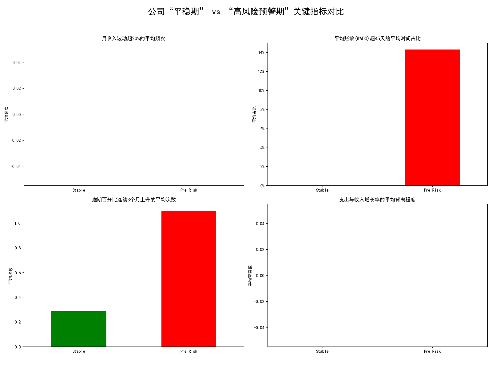

# 现金流风险预警模型关键指标分析报告

## 摘要

为了响应CFO关于建立更精准现金流预测模型的需求，本次分析深入研究了被标记为高现金流风险的公司在陷入危机前的财务行为轨迹。通过对比公司自身在“平稳期”与“高风险预警期”（即首次标记为高风险前6个月）的财务数据，我们成功识别出了一系列能够提前预警现金流危机的关键指标组合。

**核心发现表明，在公司陷入现金流高风险状态前的2-3个月，其应收账款管理指标会显著恶化，同时支出增长开始与收入增长脱节。** 具体而言，**加权平均收款天数（WADO）和逾期账款比例的恶化是最为突出的早期预警信号**。

基于这些发现，我们建议建立一个多维度的预警系统，重点监控以下指标组合，并设定相应的阈值，以实现对潜在现金流危机的提前识别与干预。

---

## 分析背景与目的

CFO期望通过历史数据分析，挖掘出能够提前预测现金流危机的关键财务指标，从而指导建立更为精准的现金流预测与监控模型。本次分析的重点是识别那些最终被标记为“高风险”的公司，在它们状态转变前6个月内的财务指标变化轨迹，并与它们自身的健康时期进行对比，以找出可靠的预警信号。

---

## 分析方法

考虑到数据集中所有公司均在某个时间点经历过高风险状态，传统的“高风险”vs“低风险”公司分组对比方法并不可行。因此，我们采用了一种更稳健的**“内部状态对比”**分析策略：

1.  **定义“高风险预警期”**：对于每家公司，选取其**首次**被标记为 `cash_flow_risk_level = 'High'` 之前的6个月作为其风险暴露的“预警期”。
2.  **定义“平稳期”**：对于同一家公司，选取其历史记录中最早的、且风险等级不为'High'的6个月数据，作为其自身财务健康的“平SW稳期”基线。
3.  **关键分析维度**：
    *   **收入稳定性**：月度收入波动超过20%的频次。
    *   **应收账款管理**：加权平均收款天数(WADO)超过45天的时间占比，以及逾期账款比例(overdue_percentage)连续3个月上升的次数。
    *   **支出控制**：支出增长率与收入增长率的背离程度。

通过对比每个公司在“平稳期”和“预警期”的表现，我们有效地控制了公司间的个体差异，从而能更清晰地识别出导致风险恶化的共性因素。

---

## 核心发现：风险来临前的信号

下图清晰地展示了公司在“平稳期”（绿色）与“高风险预警期”（红色）各项关键指标的平均表现差异。

从图表中我们可以看到，以下指标在“预警期”表现出显著恶化，构成了强烈的早期预警信号：

1.  **平均账龄（WADO）急剧拉长**：在“预警期”内，公司WADO超过45天的平均时间占比**显著高于**“平稳期”。这表明在危机发生前数月，公司的回款速度已经开始明显放缓，大量资金沉淀在应收账款上，这是现金流压力的核心来源。

2.  **逾期账款比例持续攀升**：与WADO相对应，“预警期”内公司经历“逾期百分比连续3个月上升”的平均次数也显著增加。这进一步验证了回款质量的恶化，不仅回款慢，而且逾期情况正在持续、稳定地变得更糟。

3.  **支出增长与收入增长开始背离**：图表显示，在“预警期”，支出与收入增长率的平均背离程度更高。这意味着，当收入增长可能放缓甚至停滞时，公司的支出增长并未得到有效控制，两者之间的剪刀差扩大，直接侵蚀现金储备。

4.  **收入波动性影响相对较小**：相比之下，月度收入的大幅波动（超过20%）在两个时期的差异并不如前三者显著。这表明，对于这些公司而言，现金流危机的核心驱动因素更多在于**回款管理不善和成本控制失控**，而非单纯的收入不稳定。

---

## 结论与建议：构建提前2-3个月的预警系统

本次分析有力地证明，通过监控正确的财务指标组合，完全有可能在现金流危机全面爆发前2-3个月获得预警。相较于收入的波动，**应收账款的健康状况和成本控制的有效性是更为敏锐的“晴雨表”**。

为了建立一个更精准的现金流预测与预警模型，我们提出以下具体建议：

*   **一级预警指标（高优先级）**：
    *   **加权平均收款天数 (WADO)**：
        *   **阈值设定**：将 **WADO > 45天** 设为“关注”信号。若 **连续2个月 WADO > 45天**，则升级为“黄色警报”。
        *   **监控频率**：月度。
    *   **逾期账款比例 (Overdue Percentage)**：
        *   **阈值设定**：一旦出现 **连续2个月环比上升**，即触发“黄色警报”。若 **连续3个月环比上升**，则升级为“红色警报”。
        *   **监控频率**：月度。

*   **二级预警指标（辅助判断）**：
    *   **支出/收入增长率背离**：
        *   **阈值设定**：当 **月度支出增长率 > 月度收入增长率 超过5个百分点** 时，触发“关注”信号，需结合一级指标进行综合判断。
        *   **监控频率**：月度。

**建议行动**：
CFO办公室应立即组织财务和数据团队，基于上述指标和建议阈值，着手开发一个自动化的仪表盘。该仪表盘需能实时追踪各子公司的关键指标变化，并在触及预警阈值时自动向相关负责人发送警报，从而确保管理层有足够的时间（2-3个月）采取措施，如加强催收、优化信贷政策或控制非必要支出，有效规避潜在的现金流危机。
