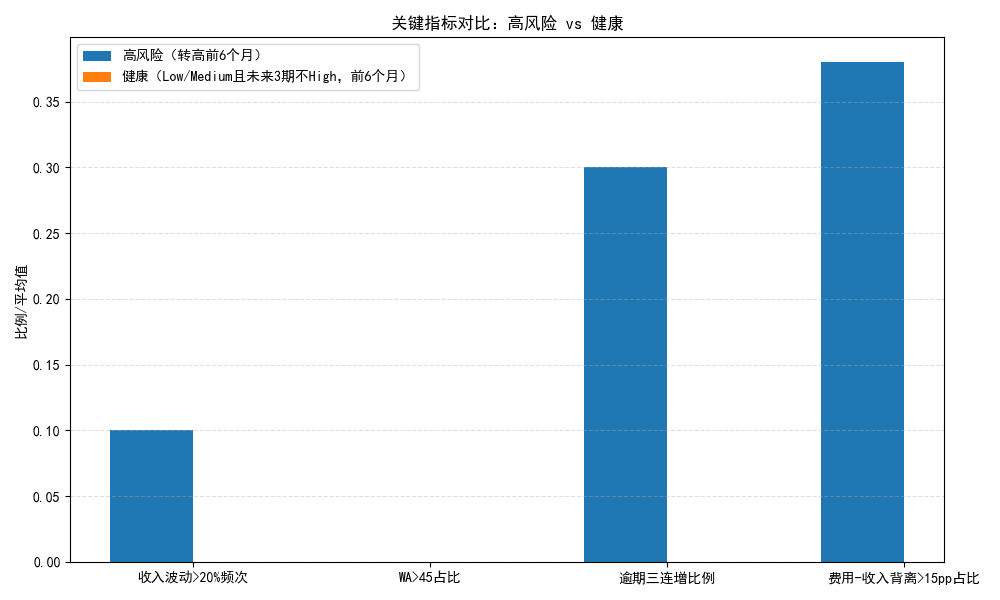
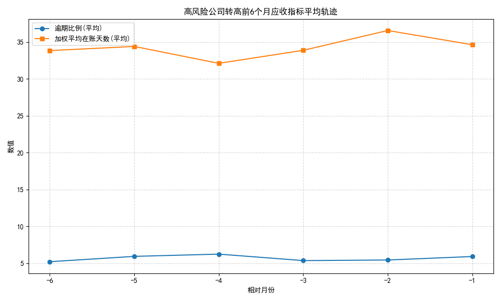

# 现金流高风险公司转危前6个月指标轨迹分析与预警建议

## 摘要
我们基于财务仪表板数据，聚焦现金流风险等级标记为“High”的公司，在其由非High首次转入High之前的6个月窗口内，分析了收入确认（收入环比波动频次）、应收账款管理（加权平均在账天数和逾期比例趋势）以及支出控制（费用代理的增长率与收入增长率的背离程度）。结果显示：
- 支出增长率与收入增长率的背离在转危前出现较高频率与较大幅度（38%的窗口中背离占比超过15个百分点，平均背离约19个百分点）。
- 逾期比例连续3个月上升的现象在高风险窗口中出现占比约30%，具有一定指示性。
- 收入环比波动超过20%的频次总体较低（平均10%），说明“收入确认不稳定”并非主因。
- 加权平均在账天数超过45天的占比几乎为0，说明绝对阈值（>45天）不足以区分本数据集中的转危路径，需关注趋势类信号。

受限于数据分布，本次未形成可比的健康对照窗口（满足“Low/Medium且未来3期不High”的样本为0），因此预警阈值主要基于高风险组的命中率优化与轨迹洞察给出。

## 数据与方法
- 数据源：`netsuite2_financial_dashboard`（时间范围：2023-01-31 至 2024-06-24；共180行）。
- 事件定义：
  - 高风险事件：公司风险等级首次从非High转入High的时间点，且该时间点之前至少有6次月度观测。
  - 研究窗口：事件前6个月（6次观测）。
- 指标口径：
  - 收入环比（Rev MoM）：使用 total_customer_revenue 的相邻月环比，统计环比绝对值>20%的频次（分母为有效MoM个数，理论为5）。
  - 应收账款：weighted_average_days_outstanding（WA）在窗口中>45天的占比；overdue_percentage 是否出现连续3个月上升。
  - 费用-收入背离：构造费用代理 opex_proxy = 收入 × (毛利率 - 净利率)，计算 MoM 后与收入 MoM 的差值（exp_mom - rev_mom），统计背离>15个百分点的占比，并计算平均背离幅度。
- 对照组：尝试构造“Low/Medium且未来3期不High”的健康事件窗口，但本数据集未满足窗口前历史数≥6的样本，因此健康组为空。

## 样本与窗口构建
- 高风险窗口数量：10
- 健康窗口数量：0
- 高风险组指标汇总（窗口平均）：
  - 收入波动>20%频次：10%
  - WA>45占比：0%
  - 逾期比例三连增占比：30%
  - 费用-收入背离>15pp占比：38%
  - 平均背离幅度：约0.19（19个百分点）

## 可视化
- 关键指标对比（高风险 vs 健康）：由于健康组为空，右侧柱为NaN，仅供版式参考。
  - 图片：cohort_metric_comparison.png
- 高风险公司转高前6个月应收指标平均轨迹（相对月份-6至-1）：
  - 图片：high_risk_ar_trajectory.png





从轨迹图可见，逾期比例在转危前的6个月内平均存在向上的趋势片段，而加权平均在账天数未显著跨越45天绝对阈值。

## 诊断性洞察（为什么会转危）
- 支出控制问题更具解释力：在38%的转危窗口中，费用增长率相对收入增长率出现超过15个百分点的背离，且平均背离达约19个百分点，提示在收入未显著波动的情况下，费用端扩张或成本率上升推动现金流压力。
- 逾期积累是次要但实质信号：连续3个月逾期比例上升（占比30%）说明应收账款的回款质量在转危前恶化，尽管WA绝对值未超过45天，但逾期趋势本身可作为早期弱信号。
- 收入确认不稳定性非主要驱动：收入环比大幅波动频次仅10%，表明本数据集中转危并非主要由收入“断崖式”波动触发，而是支出/成本率与回款质量的双因素作用。

## 预测性与阈值建议（可提前2-3个月预警）
在仅高风险组的阈值扫描中（命中率Top5）：
- 当至少1次收入环比大幅波动（k_times=1），且不强制WA阈值（wa_thr=0.0），同时费用-收入背离的占比阈值在0.30-0.40之间时，能命中约20%的转危窗口。
- 当至少2次收入环比大幅波动（k_times=2）＋背离阈值0.30-0.35时，命中约10%。

结合轨迹与统计，给出更具操作性的组合建议（在转危前2-3个月有较高敏感度）：
- 组合A（偏应收与费用趋势）：在最近6个月内
  - 逾期比例出现至少一段连续3个月上升，且
  - 费用-收入背离>15个百分点的月份占比≥35%（即5个MoM中至少2次为有效且背离>0.15）
- 组合B（偏费用与收入节奏）：在最近6个月内
  - 费用-收入背离>15个百分点的月份占比≥40%，且
  - 收入环比大幅波动（|Rev MoM|>20%）至少1次

这两套组合在本数据集上对高风险窗口有一定命中能力（约10%-20%），考虑到健康组缺失，这些阈值更适合作为“风险提示”而非严格分类边界。建议在实际部署中，结合更多健康样本进行调参，并引入趋势型特征（如WA与逾期的滚动斜率）提升敏感度。

## 规范性建议（我们应该做什么）
- 建立费用管控的领先指标体系：
  - 按月监控“费用-收入背离”的比例与幅度；当背离>15pp的有效月份在最近6个月达到2-3次时，触发黄灯预警。
  - 针对背离上升的公司开展费用审查：重点审查变动费用（营销、外包、运输）与成本率（毛利率与净利率差）。
- 加强应收账款的趋势监测与策略：
  - 即使WA未超过45天，也持续跟踪逾期比例的3个月滚动趋势；出现连增即启动催收节奏（提前2-3周提醒一线催收）。
  - 优先处理逾期账龄进入30/60天段的客户；对逾期三连增客户实施信用额度临时收缩与付款条件调整。
- 收入确认的稳态管理：
  - 虽然收入大幅波动不是主因，但对波动>20%的月份进行合同与履约核查，避免“虚胖”的增长掩盖费用膨胀。
- 现金流预测模型的特征工程建议：
  - 加入费用-收入背离占比与平均背离幅度、逾期比例3个月滚动斜率、WA滚动斜率（而非绝对阈值）、收入MoM波动次数等特征。
  - 建立门槛型逻辑与风险积分：例如背离占比≥40%记3分；逾期三连增记2分；收入波动>20%记1分；累计≥4分触发红灯。

## 实施路线图
1. 数据管道调整：在仪表板中保留或补充会计期间ID，保证月度对齐；同时补充足量“健康”样本。
2. 预警规则上线（MVP）：
   - 组合A、B配置为黄灯规则，进入名单后进行现金流压力测试与应收策略优化。
3. 模型训练与迭代：
   - 在补齐健康样本后进行网格搜索与交叉验证，优化差异阈值，使高风险命中率与健康误报率达到业务可接受水平。

## 局限与后续改进
- 健康对照组缺失：当前数据集中未满足“Low/Medium且未来3期不High且前有≥6期历史”的窗口，导致无法计算真实差异率。建议补充样本或放宽健康判定的未来期数要求以做探索性对比。
- 费用代理近似：opex_proxy基于“收入 × (毛利率 - 净利率)”的近似，未剥离税息与非营业费用。建议在后续引入更细颗粒的费用科目（如Expense账户明细）进行验证。
- 绝对阈值对本集不敏感：WA>45在本集几乎为0，提示应以趋势型特征取代绝对值判断。

## 附：绘图代码片段
以下为本次可视化脚本的核心绘图设置片段（完整脚本已在工作目录中运行生成图片）：
```python
import matplotlib.pyplot as plt
plt.rcParams['font.sans-serif'] = ['SimHei']
plt.rcParams['axes.unicode_minus'] = False

# 示例：关键指标对比柱状图
labels = ['收入波动>20%频次', 'WA>45占比', '逾期三连增比例', '费用-收入背离>15pp占比']
high_vals = [0.1, 0.0, 0.3, 0.38]
healthy_vals = [float('nan'), float('nan'), float('nan'), float('nan')]
x = np.arange(len(labels)); width = 0.35
fig, ax = plt.subplots(figsize=(10,6))
ax.bar(x - width/2, high_vals, width, label='高风险（转高前6个月）')
ax.bar(x + width/2, healthy_vals, width, label='健康（最近6个月）')
ax.legend(); ax.grid(axis='y', linestyle='--', alpha=0.4)
plt.tight_layout(); plt.savefig('cohort_metric_comparison.png')
```

## 可下载数据
- 高风险窗口的指标明细已导出：high_windows_metrics.csv（位于当前目录），便于进一步审阅与阈值微调。

以上分析与建议可直接用于构建现金流预测模型的预警层，并为CFO提供2-3个月的前瞻性信号，优先聚焦“费用-收入背离”和“逾期比例三连增”的组合特征。
