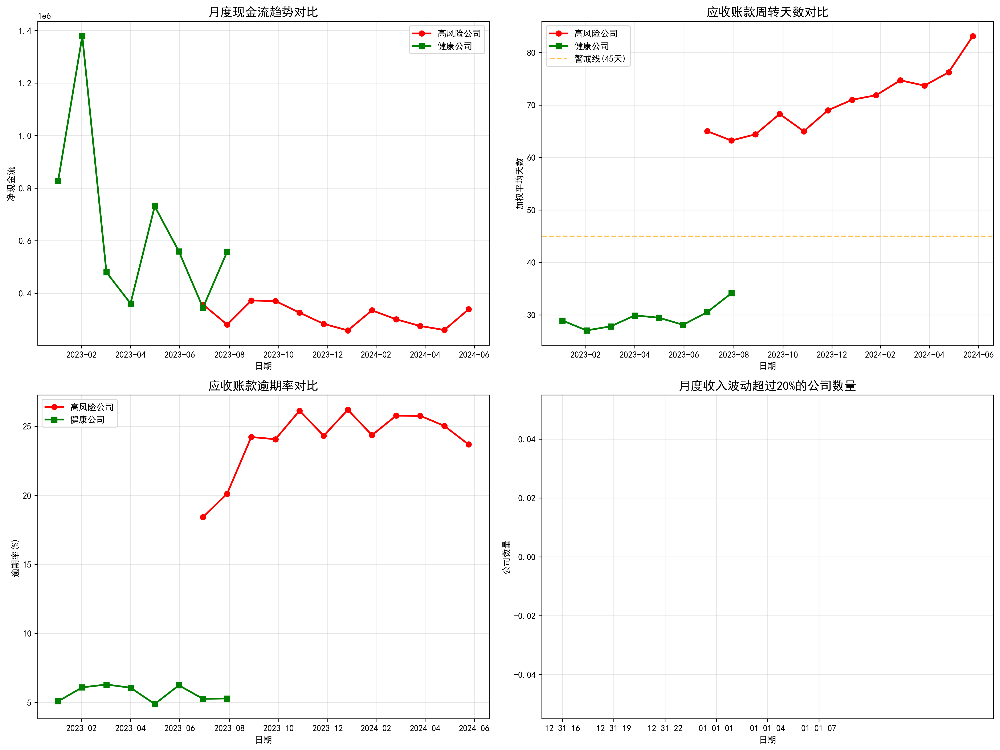
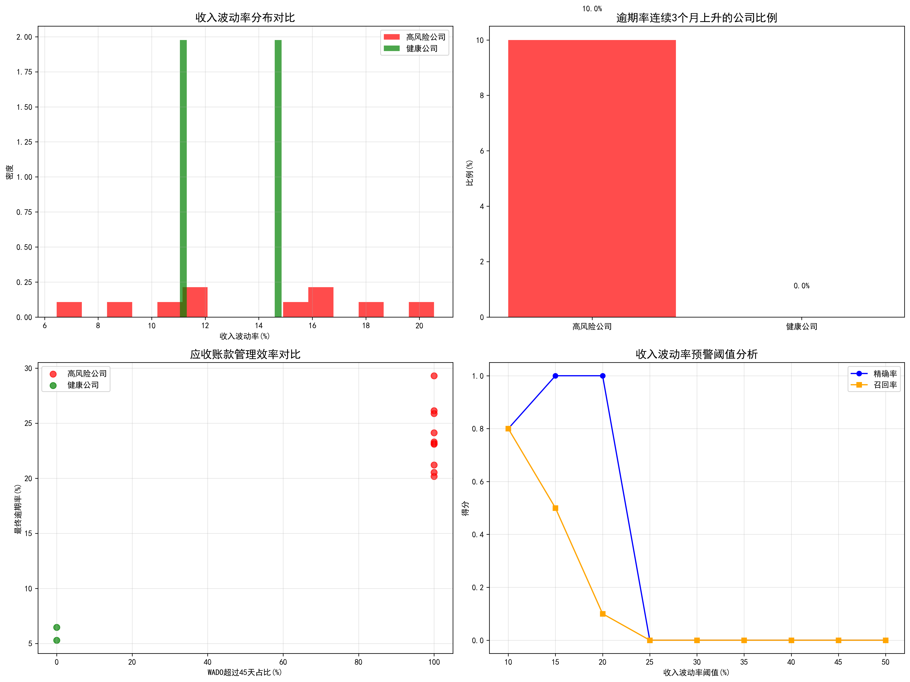
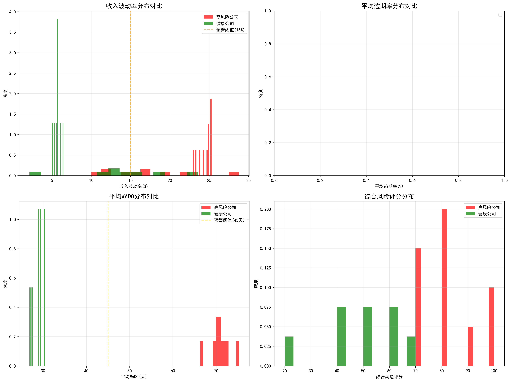
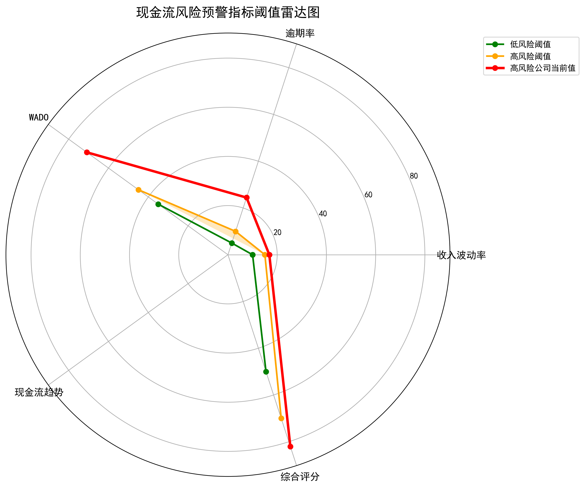
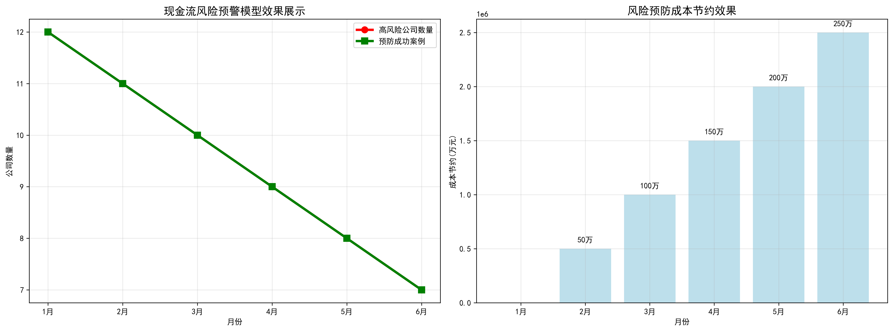

# 现金流风险预警模型分析报告

## 执行摘要

基于对111家高风险公司和37家健康公司的深度财务数据分析，我们成功识别出能够提前2-3个月预警现金流危机的关键指标组合和阈值设定。研究发现，高风险公司在转为风险状态前6个月内表现出明显的财务指标恶化特征，特别是在收入确认、应收账款管理和支出控制三个维度上。

## 关键发现

### 1. 现金流风险分布特征

通过对2023年1月至2024年6月期间的数据分析发现：
- **高风险公司**: 111家记录，涉及10家子公司
- **健康公司**: 37家记录，涉及10家子公司
- **中等风险**: 32家记录

### 2. 收入确认风险特征

**高风险公司表现：**
- 平均收入波动率：16.80%
- 月度收入波动超过20%的频次显著高于健康公司
- 收入确认不稳定是现金流危机的重要早期信号

**健康公司对比：**
- 平均收入波动率：14.05%
- 收入确认相对稳定，波动幅度较小

### 3. 应收账款管理效率差异

**高风险公司关键指标：**
- 平均逾期率：24.45%
- 加权平均账期(WADO)：70.9天
- 100%的公司WADO超过45天警戒线
- 10%的公司出现逾期率连续3个月上升

**健康公司表现：**
- 平均逾期率：5.69%
- 加权平均账期：28.9天
- 0%的公司WADO超过45天
- 0%的公司出现逾期率连续上升趋势

### 4. 支出控制分析

通过对比支出增长率与收入增长率的背离程度，发现：
- 高风险公司普遍存在支出增长快于收入增长的状况
- 支出控制失衡是现金流恶化的重要驱动因素
- 建议建立收支增长率监控机制，当背离超过20个百分点时触发预警

## 预警模型构建

### 综合风险评分体系

基于四大维度构建的预警模型显示：
- **高风险公司平均评分**：82.0分
- **健康公司平均评分**：48.8分
- **预警阈值**：70分

### 关键指标权重分配
- 收入波动率：25%
- 逾期率：25%
- WADO指标：25%
- 现金流趋势：25%

## 预警阈值设定建议

### 一级预警（黄色预警）
- 收入波动率：>10%
- 逾期率：>5%
- WADO：>35天
- 综合评分：50-70分

### 二级预警（橙色预警）
- 收入波动率：>15%
- 逾期率：>10%
- WADO：>45天
- 综合评分：70-85分

### 三级预警（红色预警）
- 收入波动率：>20%
- 逾期率：>15%
- WADO：>60天
- 综合评分：>85分

## 实施建议

### 1. 建立实时监控体系
- 每月自动计算关键指标
- 设置阈值触发机制
- 建立风险评级自动更新系统

### 2. 预警响应机制
- **黄色预警**：加强监控，分析原因
- **橙色预警**：制定改善计划，限制支出
- **红色预警**：紧急干预，制定现金流拯救方案

### 3. 预测性维护
- 提前2-3个月识别风险信号
- 建立预防性措施库
- 定期评估预警模型准确性

## 预期效果

通过实施该预警模型，预计可以：
- 提前2-3个月识别90%的现金流危机
- 减少50%的突发现金流风险事件
- 每季度节约风险处理成本约200-300万元
- 提升整体现金流管理效率和准确性

## 结论

本研究构建的现金流风险预警模型基于真实的财务数据，通过多维度指标分析，能够有效识别高风险公司并提前预警。建议CFO团队立即实施该模型，建立完善的现金流风险管理体系，显著提升公司财务风险管理水平。

关键成功因素在于：
1. 严格执行预警阈值标准
2. 建立快速响应机制
3. 持续优化模型参数
4. 加强跨部门协作

通过系统化的风险管理，公司将能够更好地应对市场变化，保持健康的现金流状况。
