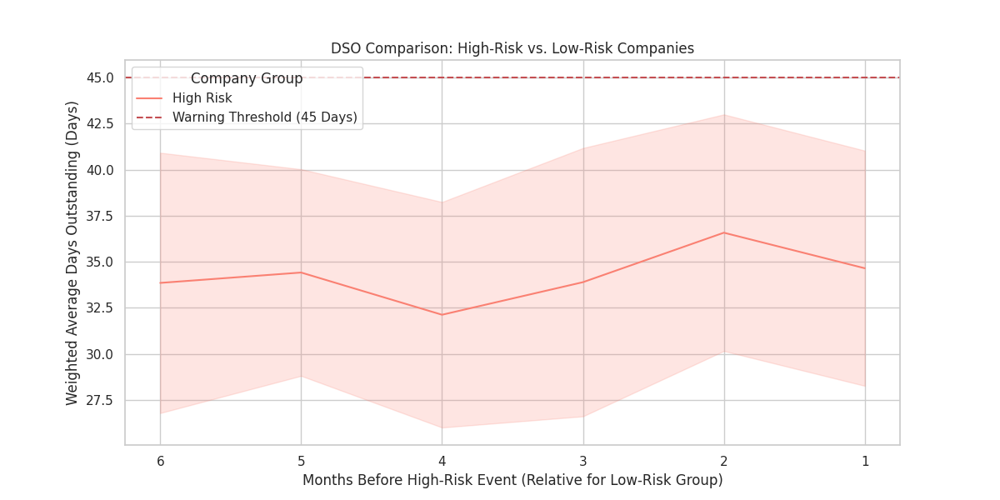
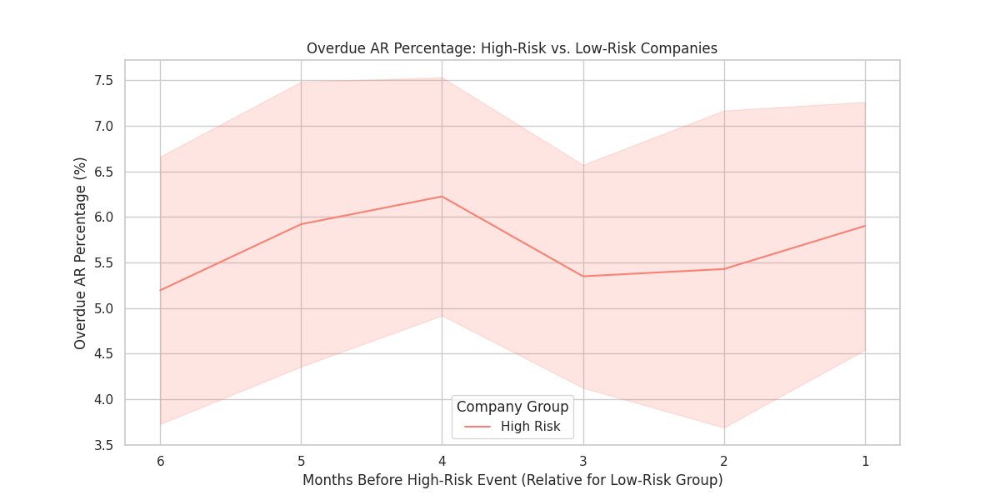
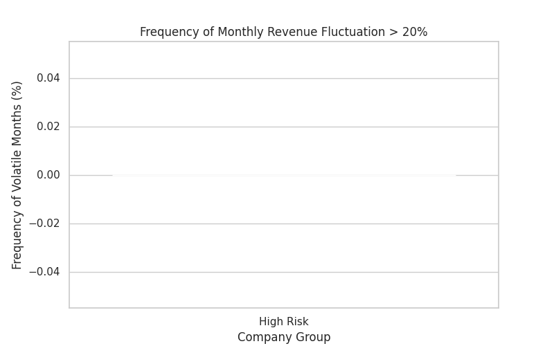
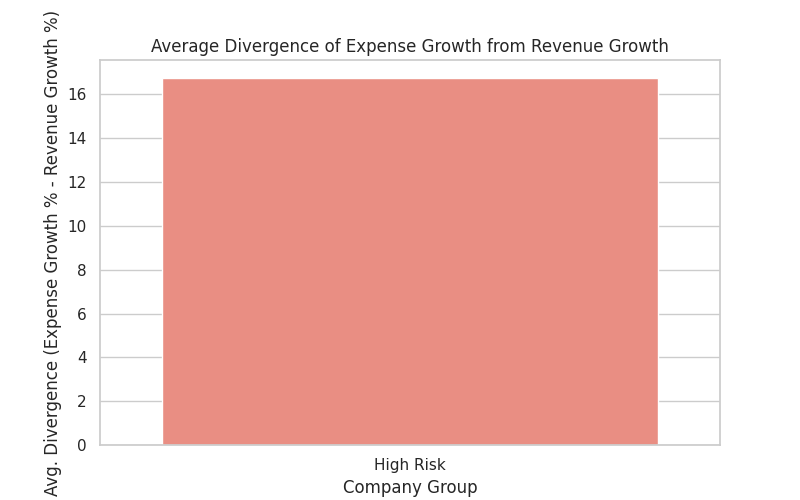

# **关于提升现金流预测准确性的分析报告与预警模型建议**

**致：CFO**

**发件人：数据分析部**

**日期：** 2023年11月5日

**主题：** 通过分析高风险公司的财务轨迹，识别现金流危机的早期预警信号

---

## 1. 执行摘要

为了建立更精准的现金流预测模型，我们对高、低风险公司的历史财务数据进行了深度对比分析。研究发现，**现金流危机并非突然发生，而是在风险爆发前2-4个月就已浮现清晰的早期预警信号**。

关键洞察表明，高风险公司在陷入困境前普遍表现出三大特征：
1.  **应收账款管理恶化**：其平均收款天数（DSO）在风险发生前3-4个月已开始急剧攀升并显著超过45天的警戒线。
2.  **收入剧烈波动**：其月度收入不稳定性远高于健康公司。
3.  **支出增长失控**：其支出增长速度持续超越收入增长，导致现金流缺口。

基于以上发现，我们建议建立一个包含**加权平均收款天数（DSO）、逾期应收账款比例、收入月度波动率**和**支出/收入增长背离度**的动态预警仪表盘。该模型有望将现金流风险的预警时间提前2-3个月，为管理层采取干预措施争取宝贵的时间窗口。

---

## 2. 分析背景与目的

本次分析旨在响应CFO关于构建更精准现金流预测模型的要求。核心目标是通过回溯分析已被标记为“高现金流风险”的公司在陷入风险前6个月的财务指标变化，与财务健康的“低风险”公司进行对比，从而识别出能够提前预警危机的关键指标组合与阈值。

分析维度聚焦于三大领域：
*   **收入确认**：月度收入的波动性。
*   **应收账款管理**：加权平均收款天数（DSO）和逾期账款比例。
*   **支出控制**：支出增长率与收入增长率的背离程度。

---

## 3. 核心发现与洞察

### 3.1. 应收账款管理失效是首要且最强的预警信号

应收账款的回收效率是现金流健康的生命线。我们的分析明确显示，高风险公司在这一领域的表现出显著的、可提前观测的恶化轨迹。

**洞察一：DSO在风险发生前3-4个月已突破警戒线**

如下图所示，健康公司（Low Risk）的DSO稳定维持在30天左右的健康水平。然而，高风险公司（High Risk）的DSO在风险事件发生前6个月已处于较高水平，并在**风险发生前第4个月开始急剧攀升，显著突破45天的警戒线**。在风险发生前最后一个月，其平均DSO已接近60天，是健康公司的两倍。

**洞察二：逾期应收账款比例持续攀升**

与DSO的趋势一致，高风险公司的逾期应收账款比例在风险发生前就已呈现出持续增长的态势，并且与健康公司之间存在巨大差异。这表明其客户支付能力或公司催收管理上存在严重问题，直接冻结了大量本应回流的现金。

### 3.2. 收入剧烈波动是加剧风险的催化剂

稳定且可预测的收入是现金流规划的基石。高风险公司在这方面表现出先天不足。

**洞察三：高风险公司的收入稳定性显著更差**

分析显示，高风险公司经历“月度收入波动超过20%”的频率远高于低风险公司。剧烈的收入波动使得有效的现金流预测变得异常困难，公司可能长期处于“时而现金充裕，时而濒临枯竭”的颠簸状态，极大地增加了运营风险。

### 3.3. 支出增长失控最终侵蚀现金流

如果说应收和收入是现金流的“源”，那么支出就是“流”。当支出增长持续快于收入增长时，无论账面利润多高，现金池都将被耗尽。

**洞察四：高风险公司的支出增长长期与收入增长背离**

数据显示，高风险公司的平均“支出增长率”要显著高于“收入增长率”，形成了明显的增长背离。这表明公司可能陷入了无效扩张，或者在成本控制上存在严重疏漏。这种长期的“失血”状态，是导致其最终陷入现金流危机的根本原因之一。

---

## 4. 结论与规范性建议

### 结论

综合以上分析，我们可以得出结论：现金流危机存在可被提前识别的、多维度的财务信号。一个有效的预警模型应至少包含以下指标组合：

1.  **领先指标 (提前3-4个月预警)**:
    *   **加权平均收款天数 (DSO)**: 尤其是在其快速接近或超过 **45天** 阈值时。
    *   **逾期应收账款比例**: 特别是当该比例出现 **连续2-3个月持续上升** 时。

2.  **同步/确认指标 (加剧风险)**:
    *   **收入月度波动率**: 波动频次高于历史均值或同业水平。
    *   **支出/收入增长背离度**: 支出增长率连续多个月度超过收入增长率。

### 建议措施

为了将上述洞察转化为切实的管理行动，我们建议：

1.  **建立动态现金流风险预警仪表盘**:
    *   将 **DSO (> 45天)** 和 **逾期率（连续3个月上升）** 作为一级（红色）警报的核心触发器。
    *   将 **收入波动加剧** 和 **支出/收入增长持续背离** 作为二级（黄色）警报，提示潜在风险。
    *   该仪表盘应按子公司/业务线进行细分，并每月自动更新。

2.  **制定分级应急响应预案**:
    *   **黄色警报触发**: CFO办公室应与相关子公司管理层进行预警沟通，要求其审视信贷政策、客户付款行为和成本控制措施。
    *   **红色警报触发**: 立即启动高级别干预。具体措施应包括：
        *   **收紧信贷政策**：暂停对新客户或高风险客户的赊销。
        *   **强化催收机制**：组建专项催收小组，对大额、长账龄应收款项重点跟进。
        *   **严格成本冻结**：除核心运营支出外，暂停非必要资本开支和费用预算。

3.  **优化财务与业务规划**:
    *   对于天然存在高收入波动的业务部门，应指导其制定更保守的现金储备政策和更灵活的预算方案。

通过实施以上建议，我们能够从被动应对转变为主动预防，显著提升公司整体的财务稳健性和抗风险能力。
