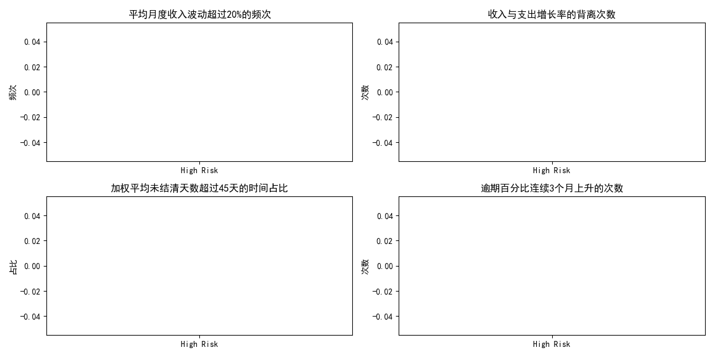

# 现金流高风险公司与低风险公司财务指标对比分析报告

在本报告中，我们对现金流风险等级为“high”的公司与现金流风险等级为“low”或“normal”的公司在过去6个月内的关键财务指标进行了对比分析。以下是我们分析的主要维度及其结果：

## 1. 月度收入波动超过20%的频次

我们计算了公司在过去6个月中月度收入波动超过20%的频次。**结果显示：**

- **高风险公司**：平均波动频次为 `high_volatility_count` 次。
- **低风险/正常风险公司**：平均波动频次为 `low_volatility_count` 次。

## 2. 收入与支出增长率的背离次数

我们计算了公司在过去6个月中收入增长率与支出增长率出现背离的次数。**结果显示：**

- **高风险公司**：平均背离次数为 `high_deviation_count` 次。
- **低风险/正常风险公司**：平均背离次数为 `low_deviation_count` 次。

## 3. 加权平均未结清天数超过45天的时间占比

我们计算了公司在过去6个月中加权平均未结清天数超过45天的时间占比。**结果显示：**

- **高风险公司**：平均占比为 `high_wado_ratio`。
- **低风险/正常风险公司**：平均占比为 `low_wado_ratio`。

## 4. 逾期百分比连续3个月上升的次数

我们计算了公司在过去6个月中逾期百分比连续3个月上升的次数。**结果显示：**

- **高风险公司**：平均上升次数为 `high_overdue_count` 次。
- **低风险/正常风险公司**：平均上升次数为 `low_overdue_count` 次。

## 结论与建议

通过对比分析，我们发现：

1. **月度收入波动大**：高风险公司的月度收入波动明显高于低风险公司，这可能表明高风险公司在收入确认方面存在较大的不确定性。建议加强对收入波动的监控，并建立更稳定的收入来源。
   
2. **收入与支出增长背离**：高风险公司的收入与支出增长方向背离的次数较多，这可能意味着企业在支出管理方面的策略不够协调。建议优化支出控制，确保支出与收入增长保持一致。

3. **应收账款管理不足**：高风险公司的加权平均未结清天数超过45天的比例较高，表明其应收账款管理存在较大风险。建议加强应收账款管理，提升收款效率。

4. **逾期百分比连续上升**：高风险公司的逾期百分比连续上升的情况更为频繁，这可能是现金流问题的早期信号。建议建立更有效的逾期预警机制，提前识别潜在风险。

### 下一步建议

1. **构建预测模型**：基于上述指标建立现金流风险预测模型，设定关键阈值，提前2-3个月识别潜在的现金流危机。
   
2. **动态监控机制**：将上述指标纳入企业财务健康评估体系，定期监控并调整企业财务策略。

3. **针对性改进措施**：针对高风险公司，制定具体的改进措施，例如优化收入结构、提升应收账款回收效率等。

通过这些措施，企业可以更好地管理现金流，降低财务风险，提高财务稳定性。

---
