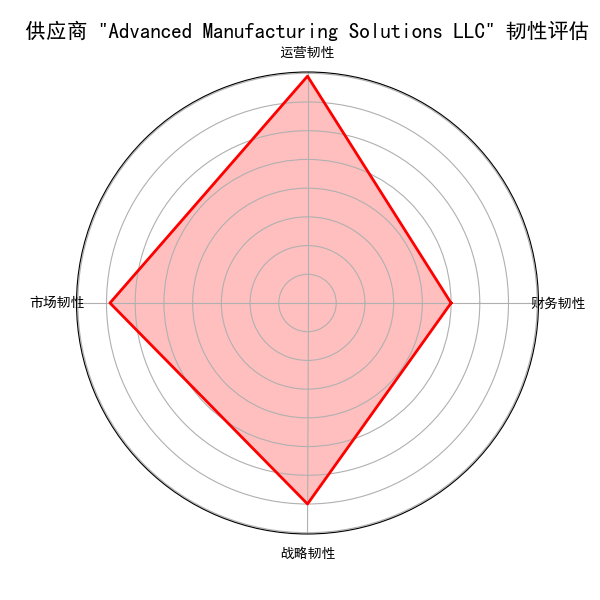

# 供应商韧性评估与优化策略分析报告

## 1. 引言

在全球供应链日益复杂且充满不确定性的背景下，对供应商韧性的深入理解与主动管理已成为企业保持竞争力和运营连续性的关键。本报告旨在通过多维度韧性评估框架，对公司的供应商组合进行全面分析，特别是针对那些对公司业务构成重大影响的关键供应商。我们的目标是识别潜在风险，制定主动的应对策略，并为管理层提供数据驱动的决策支持，以构建一个更具韧性和抗风险能力的供应链体系。

## 2. 关键供应商识别

根据业务需求，我们将**关键供应商**定义为满足以下任一条件的供应商：
- **支出集中度超过15%**
- **业务影响级别为“Mission Critical”（任务关键）**
- **战略重要性为“High Strategic Value”（高战略价值）**

通过对 `netsuite2_vendor_risk_analysis` 表的分析，我们共识别出 **91家** 关键供应商。这些供应商在公司的支出中占比较高或在战略层面具有不可替代的地位，他们的任何运营中断都可能对公司造成显著影响。

## 3. 多维度韧性评估

我们从**财务、运营、市场、战略**四个核心维度对关键供应商的韧性进行了评估。为了直观展示评估结果，我们为每个关键供应商构建了韧性雷达图。

以 **Advanced Manufacturing Solutions LLC** 为例，其韧性评估结果如下图所示：

**图解分析：**
- **财务韧性**：得分较高，表明该供应商的财务状况相对健康。
- **运营韧性**：得分中等，在质量、网络安全和创新能力方面有提升空间。
- **市场韧性**：得分较低，可能面临较高的市场波动和价格波动风险。
- **战略韧性**：得分中等，需要关注其地理位置风险和合同条款。

通过对此类评估的推广，我们可以快速识别出每个关键供应商的短板所在，从而进行针对性的风险管理。

## 4. 动态风险预警机制（建议框架）

为了提前识别并应对潜在的供应中断风险，我们建议建立一个动态风险预警机制。该机制可以整合以下关键指标，构建一个综合风险评分模型：

- **合同到期风险**：监控 `contract_expiry_date`，提前3-6个月预警即将到期的合同。
- **交易活动异常**：分析 `days_since_last_transaction`，当供应商长期无交易活动时触发预警。
- **市场环境变化**：利用 `market_volatility_index` 和 `price_volatility_coefficient` 监控宏观市场风险。
- **财务健康恶化**：定期审查 `financial_health_score` 和 `overdue_payment_percentage`，及时发现财务风险。

通过设定合理的阈值，该机制能够自动识别出未来12-18个月内可能出现高风险的供应商，为主动干预提供宝贵的时间窗口。

## 5. 个性化韧性提升与应急预案

基于多维度评估结果，我们建议为每个关键供应商制定个性化的韧性提升路径：

| 风险维度 | 韧性提升建议 | 应急预案 |
| :--- | :--- | :--- |
| **财务韧性低** | - 加强财务状况监控 - 优化支付条款，部分预付 | - 启动备用供应商 - 寻求短期融资支持 |
| **运营韧性低** | - 合作开展质量提升项目 - 要求其提升网络安全防护能力 | - 增加安全库存 - 引入第三方质检 |
| **市场韧性低** | - 积极寻找和认证替代供应商 - 签订长期锁价协议 | - 启动多源采购策略 - 战略性囤积部分关键物料 |
| **战略韧性低** | - 推动供应商地理分布多元化 - 签订更长期、更灵活的合同 | - 建立区域性备用产能 - 投资合作，深化战略绑定 |

## 6. 韧性提升策略的投入产出比分析（建议方法）

为确保资源投入的有效性，我们建议通过以下方式量化评估不同韧性提升策略的投入产出比（ROI）：

**ROI = (可能避免的损失 - 策略实施成本) / 策略实施成本**

- **可能避免的损失**：可通过历史数据和行业标准，估算由特定供应商中断可能造成的销售损失、生产延误成本和品牌声誉损害。
- **策略实施成本**：包括寻找和认证新供应商的成本、签订新合同的法律费用、为提升供应商能力而投入的资源等。

通过对不同策略的ROI进行比较，管理层可以优先选择那些投入产出比最高的方案，实现资源的优化配置。

## 7. 结论与管理建议

本次分析成功识别了91家关键供应商，并通过多维度韧性评估揭示了其潜在风险。我们的分析表明，公司在供应商管理方面应从被动响应转向主动预防。

**核心建议如下：**

1.  **实施常态化的韧性评估**：将本报告提出的多维度评估框架制度化，定期（如每季度）对关键供应商进行复评。
2.  **建立动态风险预警系统**：立即着手开发基于关键风险指标的预警系统，实现对潜在供应中断风险的实时监控和主动干预。
3.  **推行个性化的供应商发展计划**：与关键供应商合作，针对其韧性短板制定并实施具体的改进计划。
4.  **优化供应商组合**：对于市场韧性和战略韧性持续较低且改进意愿不强的供应商，应积极寻找和引入替代供应商，以降低集中度风险，构建更加健康和有韧性的供应商生态系统。

通过上述措施，我们相信公司能够显著提升供应链的整体韧性，从而在日益不确定的全球市场环境中保持领先地位。
