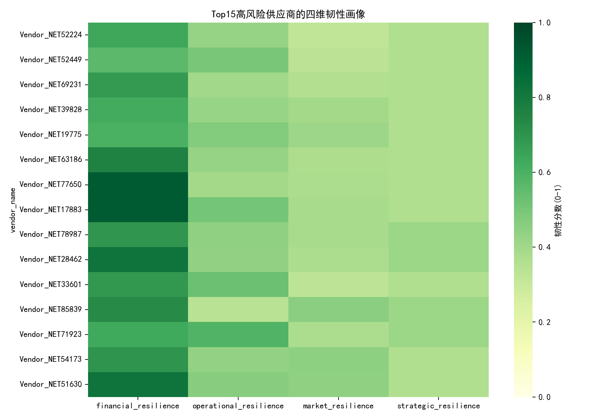
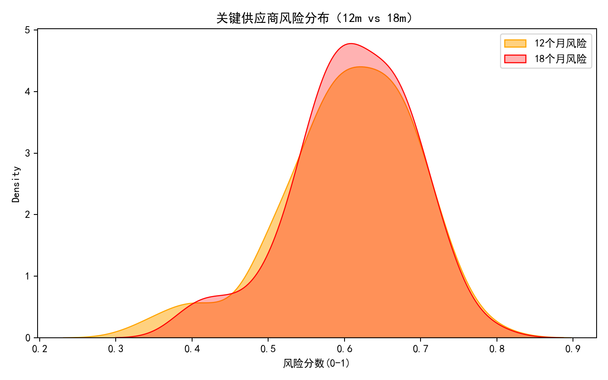
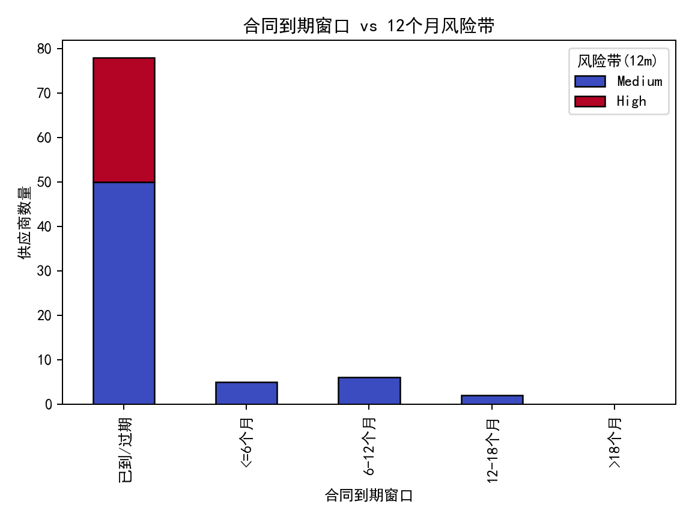
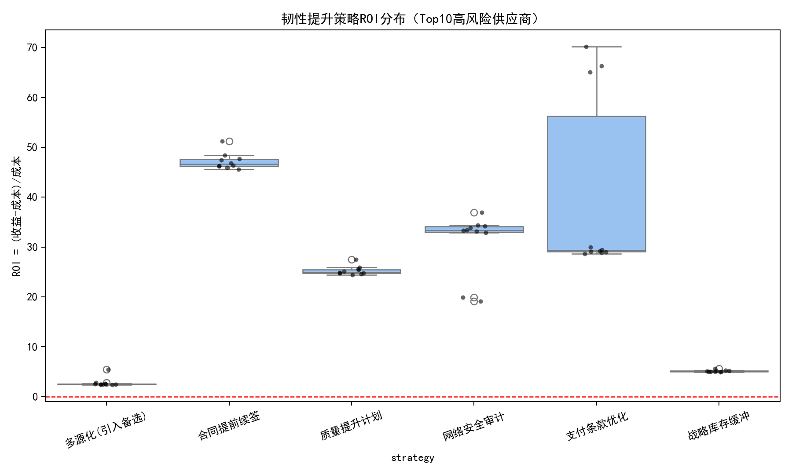

# 全球供应链不确定性下的多维度供应商韧性评估与预警方案（基于SQLite数据）

> 报告目的：为“支出集中度超过15%或被归类为Mission Critical/High Strategic Value”的关键供应商群体构建财务、运营、市场、战略四维度韧性评估框架，并设计12–18个月动态风险预警机制，提出个性化韧性提升路径与应急预案，量化不同策略的投入产出比，支持管理层进行供应商组合优化。

## 1. 数据与方法
- 数据来源：/workspace/dacomp-075.sqlite（表：netsuite2_vendor_risk_analysis）。
- 总样本：93家供应商；关键筛选条件（支出集中度>15%或战略重要性为Mission Critical/High Strategic Value）后获得91家（约98%）。
- 不进行数据清洗：直接使用已工程化字段，构建指标与评分。
- 可视化已使用Python生成并保存在当前目录，引用如下图片名。

为保证中文显示，绘图代码包含如下行：
```python
plt.rcParams['font.sans-serif'] = ['SimHei']
plt.rcParams['axes.unicode_minus'] = False
```

## 2. 多维度韧性评估框架
核心维度与指标（0-1归一化，越高代表韧性越好）：
- 财务韧性（Financial）：支付表现（平均付款延迟、逾期付款百分比、逾期发票比率）与财务健康评分综合。
- 运营韧性（Operational）：质量评分、网络安全评分、创新能力评分、合规评级综合。
- 市场韧性（Market）：市场波动指数、价格波动系数、季节性因素、替代供应商数量、切换成本综合。
- 战略韧性（Strategic）：依赖程度、关系稳定性、环境可持续性评级、合同到期剩余天数、支出集中度综合。

综合韧性指数（Resilience Index）= 四维韧性得分的等权平均。样本的平均综合韧性指数为约0.527，显示整体处于中等水平。

可视化：Top15高风险供应商的四维韧性画像（绿色越高越好）



解读要点：
- 运营维度（质量/网络安全/创新）在若干高风险供应商中出现短板；
- 市场维度中，替代供应商稀缺与高价格/市场波动共同压低韧性；
- 战略维度的合同到期近、支出集中度高是典型风险驱动因子。

## 3. 动态风险预警机制（12–18个月）
我们构建了启发式加权风险得分，用于识别未来12与18个月内的中断风险：
- 风险因子与权重（越高代表中断可能性越大）：
  - 合同到期临近：0.22
  - 市场波动：0.15；价格波动：0.10；季节性需求：0.06
  - 替代供应商不足（用1-替代可得性衡量）：0.12
  - 支出集中度高：0.10
  - 支付延迟长：0.10
  - 质量短板：0.08；网络安全短板：0.07
- 风险分层规则：风险分数[0,0.33)为低，[0.33,0.66)为中，≥0.66为高。

结果分布（关键供应商91家）：
- 12个月风险：Medium 63（69.2%），High 28（30.8%），Low 0；
- 18个月风险：Medium 63（69.2%），High 28（30.8%），Low 0；
- Top5高风险（18m）供应商及风险分数：Vendor_NET52224(0.791)、Vendor_NET52449(0.748)、Vendor_NET69231(0.737)、Vendor_NET39828(0.734)、Vendor_NET19775(0.725)。

风险分布图：



合同到期窗口与风险带的交叉分布：



解读要点：
- “≤12–18个月到期”的合同占据相当比例的高风险群体；
- 替代供应商数量低与高支出集中度叠加，会显著提升12m/18m风险；

集中度-替代可得性的风险气泡图：


图中颜色为12个月风险，气泡大小代表相对支出规模：在高集中度且替代稀缺的区域，高风险颜色明显聚集。

## 4. 个性化韧性提升路径与应急预案（Top供应商）
我们为Top10高风险供应商量化了多种策略的成本-收益与ROI，并生成了摘要（top10_supplier_plans.txt）。部分摘录：
- Vendor_NET52224：基准预计损失(18m)=268.20；最佳策略为“支付条款优化”，ROI≈70.18，成本≈0.57，收益≈40.23；备选策略：合同提前续签（ROI≈51.20）、网络安全审计（ROI≈36.96）。
- Vendor_NET52449：基准预计损失(18m)=287.96；最佳“支付条款优化”，ROI≈66.32；备选“合同提前续签”ROI≈48.37；“质量提升计划”ROI≈25.93。
- Vendor_NET69231：基准预计损失(18m)=279.35；最佳“合同提前续签”ROI≈47.66；“网络安全审计”ROI≈34.39；“支付条款优化”ROI≈29.96。
- Vendor_NET39828：基准预计损失(18m)=6.51；最佳“支付条款优化”ROI≈65.07；备选“合同提前续签”“网络安全审计”。
- Vendor_NET19775：基准预计损失(18m)=36.88；最佳“合同提前续签”ROI≈46.86；备选“网络安全审计”“支付条款优化”。

推荐的应急预案组件（按风险驱动因子个性化组合）：
- 合同维度：优先对“≤12个月到期”的高风险供应商执行提前续签或延长条款；引入服务水平协议（SLA）与罚则；设置价格上限与加急条款。
- 市场维度：
  - 多源化：对替代供应商数量≤1的供应商，启动第二来源开发或框架协议；
  - 战略库存缓冲：对市场/价格波动高和季节性强的品类建立安全库存或VMI。
- 财务维度：优化支付条款（如提前支付换折扣），以改善现金流与交付稳定性；对付款延迟高的供应商优先实施。
- 运营维度：质量协同改进计划（联合8D/PPAP）、网络安全审计与整改、创新共研（技术路线对齐）。
- 战略/ESG：提升环境评级要求，优先与“Good/Excellent”或评级A/B供应商加深合作；探索地理多元化以降低地缘风险。

## 5. 策略投入产出比（ROI）分析与组合优化
我们对Top10高风险供应商的六类策略进行了ROI模拟，汇总如下图：



观察与结论：
- 支付条款优化与合同提前续签在多数场景呈现高ROI（示例区间约29–70与约45–51），属于“低成本、快速见效”的优先策略；
- 网络安全审计与质量提升计划通常ROI中高，尤其当当前评分低于中位数时，风险降幅更显著；
- 战略库存缓冲的ROI分布较分散，适合高波动/高季节性品类，需精细化设定安全库存水平，否则可能因持有成本导致ROI偏低或为负；
- 多源化的ROI受“可用备选数量与切换成本”影响，替代稀缺、切换成本高时，ROI可能下降，但长期韧性显著提升。

组合优化建议（数据驱动）：
- 短期（0–6个月）：
  - 对所有“High风险且≤12个月合同到期”的供应商，优先执行合同提前续签；
  - 对“支付延迟高（>P60）”的供应商，执行支付条款优化；
  - 对“网络安全评分<中位数”的供应商，部署审计与整改；
- 中期（6–12个月）：
  - 对“替代≤1且集中度高（>30%）”的供应商，启动多源化；
  - 对“市场/价格波动≥P70和季节性≥P70”的品类，建立安全库存；
- 长期（12–18个月）：
  - 地理多元化（跨区域备选）；
  - ESG联合改进（将环境评级纳入年度评审与准入门槛）。

## 6. 动态预警运行机制与阈值
- 监测频率：按月滚动重新计算风险分数risk_12m/risk_18m。
- 触发器：
  - 风险分数≥0.66（High）即触发预警并进入应急预案；
  - 合同到期≤365天且风险≥0.33（Medium+）进入合同谈判排期；
  - 替代供应商数量≤1且集中度≥0.30，触发多源化与备选开发；
  - 支付延迟≥P60，触发支付条款优化；
  - 网络安全/质量评分<中位数，触发审计/协同改进。
- 看板与可视化：采用散点气泡图与到期-风险柱状图（本报告已示例）进行“红黄绿”管控。

## 7. 关键原因分析（诊断性洞察）
- 合同到期与替代稀缺是“可操作的致因”，落实提前续签与备选开发能快速降风险；
- 高市场与价格波动导致供需不确定性增大，战略库存能在峰值周期提供缓冲；
- 付款延迟与质量/网络安全短板是“运营层面致因”，通过条款优化与专项改进能提升交付稳定性与合规性；
- 支出集中度高是结构性风险，应通过组合层面优化（多源化、分散支出）逐步降低。

## 8. 局限与进一步工作
- 风险权重为启发式设置，可在后续引入历史中断事件与机器学习进行校准；
- ROI模拟采用简化假设（损失系数、成本比例），建议结合品类与合同真实数据细化；
- 建议对不同地理区域的地缘风险与ESG合规进行更精细的情景分析与压力测试。

## 9. 结论与执行清单
- 关键供应商（91家）中，约31%在未来12–18个月处于高风险；平均韧性指数约0.53，存在明显改善空间；
- 优先策略：合同提前续签、支付条款优化；针对运营短板执行网络安全审计与质量改进；对高波动品类实施战略库存；对高集中度与替代稀缺实施多源化。
- 执行清单（下周启动）：
  - 制定“≤12个月到期且High风险”供应商列表并排期谈判；
  - 识别“支付延迟>60分位”的供应商并优化条款；
  - 安排对“网络安全/质量评分低于中位数”的供应商进行审计；
  - 对“替代≤1且集中度>30%”的供应商发起第二来源开发；
  - 为“高波动/季节性强”的品类设定安全库存目标。

以上分析已生成图表与明细文件，可直接用于管理层汇报与项目落地。
