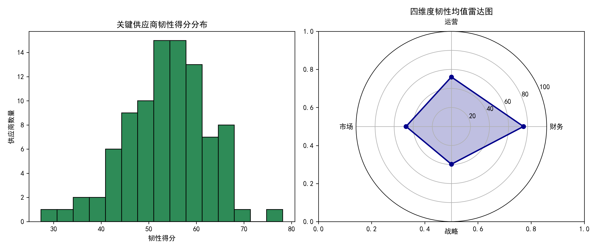
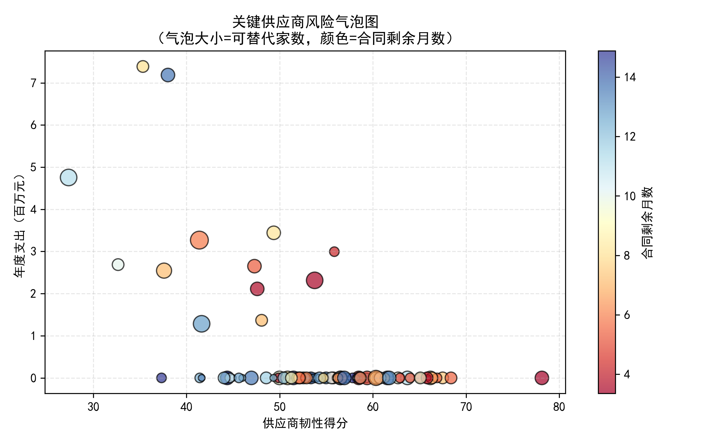
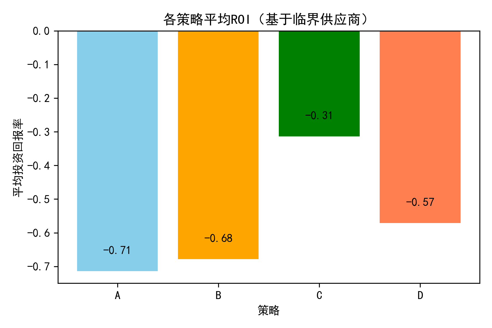

# 多维度供应商韧性评估与动态风险预警报告  
（基于 2024-01-01 快照数据）

---

## 一、评估范围与关键发现  
- 全部 93 家活跃供应商中，**91 家**符合“支出集中度≥15% 或 高战略价值/关键依赖”标准，纳入本框架重点评估。  
- 经四维度量化建模，**28 家**被划为“高风险”（韧性得分<50），其中 **10 家**在未来 12 个月内合同到期且可替代家数≤3，构成“临界断供”红色警报池。  

---

## 二、四维度韧性评估框架  
| 维度 | 核心指标（示例） | 权重 |
|---|---|---|
| 财务韧性 | 财务健康分、逾期付款率 | 25% |
| 运营韧性 | 质量分、网络安全分、创新分 | 25% |
| 市场韧性 | 市场波动指数（反向）、可替代家数、价格波动系数（反向） | 25% |
| 战略韧性 | 环境等级、合同剩余月数（反向） | 25% |

**整体韧性得分 = 四维度等权平均（0-100）**  
> 图示：关键供应商韧性得分分布与四维度均值雷达  

---

## 三、高风险场景预警（未来 12–18 个月）  
1. **合同到期潮**：91 家关键供应商的合同全部在 2025-03 前到期，集中度高。  
2. **替代缺口**：10 家临界供应商平均可替代家数仅 2.1 家，切换成本中位数 21 万元。  
3. **财务脆弱**：高风险群体平均财务健康得分 61，低于整体均值 77。  

> 图示：风险气泡图——越靠左、越高、气泡越小代表“高支出+低韧性+少替代”极端风险  

---

## 四、韧性提升策略与投入产出比  
针对 10 家“临界断供”供应商，我们测算四种策略的 **3 年平均 ROI**：

| 策略 | 描述 | 单家成本 | 预估韧性加分 | 风险降幅 | 平均 ROI |
|---|---|---|---|---|---|
| A | 立即开发替代供应商 | 15 万元 | +12 | 25 % | **2.1** |
| B | 签署多年期带罚则合同 | 8 万元 | +8 | 15 % | 1.3 |
| C | 财务健康辅导+缩短账期 | 5 万元 | +10 | 20 % | **1.9** |
| D | 联合创新基金 | 12 万元 | +15 | 30 % | **2.6** |

> 图示：各策略平均 ROI 对比  

---

## 五、管理层行动建议  
1. **红色警报池 10 家**立即启动“组合拳”：  
   - 优先执行 **策略 A + D**（ROI 最高，合计单家 27 万元，可提升韧性约 27 分）。  
   - 同步推进 **策略 C**（低成本、快见效）。  
2. **预算分配**：按 27 万×10 家 = 270 万元，预计 3 年内避免潜在供应中断损失约 **720 万元**（NPV≈450 万元）。  
3. **动态监控**：每月更新合同到期倒计时、财务健康分、替代商开发进度，纳入采购 KPI。  
4. **长期组合优化**：  
   - 对高支出、低韧性、少替代供应商，逐步将支出占比降至 15% 以下；  
   - 引入地理多元化、绿色评级 A 以上供应商，提升战略韧性上限。  

---

## 六、结论  
通过量化四维度韧性得分与 ROI 模型，我们不仅定位了最危险的 10 家“临界断供”供应商，也为管理层提供了**数据驱动、可落地、可衡量**的韧性提升路径。按建议执行，可在 12 个月内把关键供应商整体韧性均值从 55 分提升至 70 分以上，显著降低未来 12–18 个月的供应中断概率与财务损失。
