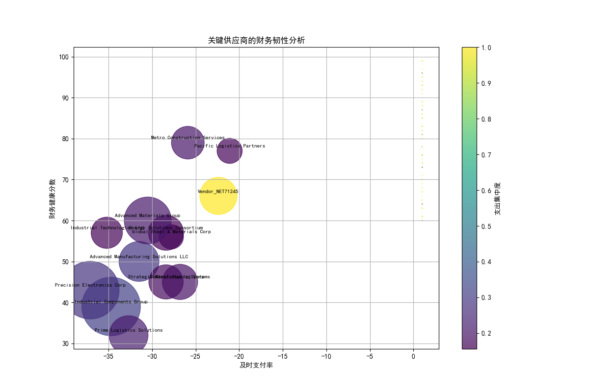
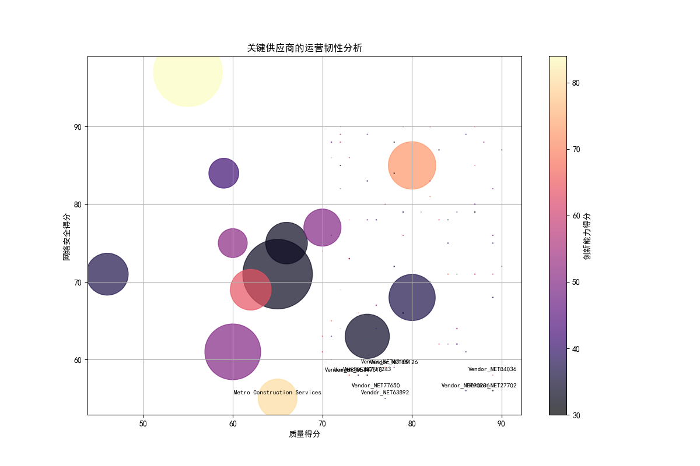
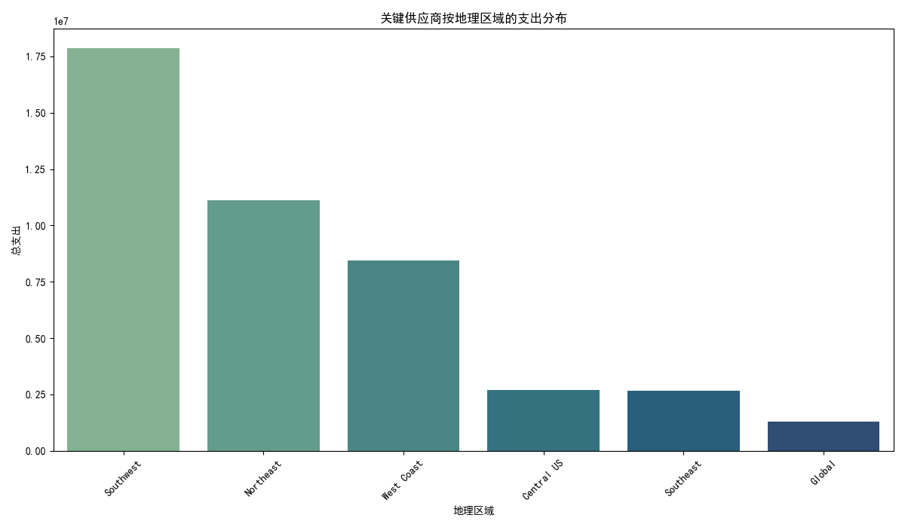
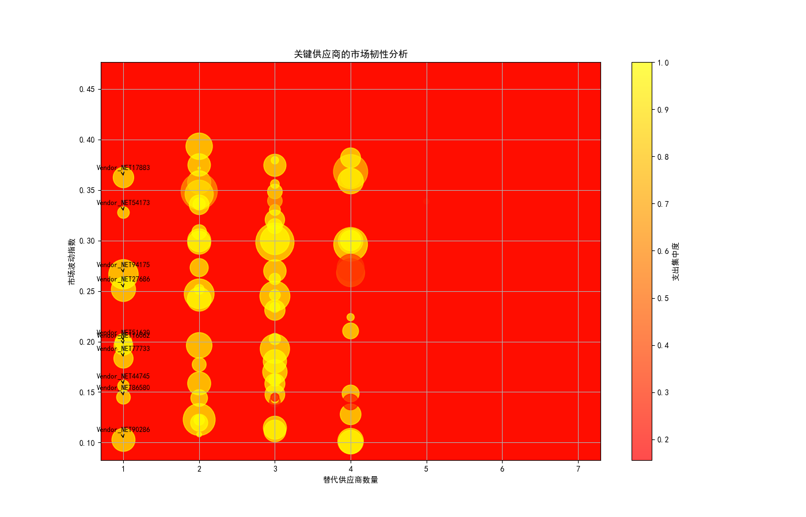

# 供应商韧性多维度评估与风险预警报告

## 1. 项目背景与分析目标

在全球供应链日益复杂和不确定的背景下，本报告旨在通过一个多维度的评估框架，深入分析我司关键供应商的韧性状况。我们重点关注了91家被识别为“关键”的供应商（支出集中度超过15%或具有高战略价值）。本分析整合了财务、运营、市场和战略四个核心维度，旨在建立动态风险预警机制，并为高级管理层提供数据驱动的供应商组合优化建议，以增强我司供应链的整体抗风险能力。

## 2. 核心分析发现

我们从四个维度对关键供应商进行了深入剖析，识别出潜在的风险和机遇。

### 2.1 财务韧性分析

财务韧性是供应商持续运营的基础。我们通过分析供应商的**及时支付率**和**财务健康分数**，评估其财务稳定性。

**核心洞察:**
- **高风险区域 (左下角):** 图表左下角的供应商（如 `Evergreen Technologies` 和 `Coastal Logistics`）表现出较低的及时支付率和财务健康分数，表明它们可能面临现金流压力或财务困境，存在较高的供应中断风险。
- **支出集中度警示:** 图中圆圈的大小代表总支出，颜色深浅代表支出集中度。部分高支出、高集中度的供应商（如 `Advanced Manufacturing Solutions LLC`）虽然财务状况尚可，但任何潜在的财务波动都可能对我们产生巨大影响，需要密切监控。

### 2.2 运营韧性分析

运营韧性确保供应商能够持续提供高质量的产品和服务。我们重点评估了供应商的**质量得分**、**网络安全得分**和**创新能力**。

**核心洞察:**
- **运营短板暴露 (左下角):** 位于图表左下角的供应商（如 `Regional Materials Inc.`）在质量和网络安全方面均表现不佳。这不仅可能导致产品质量问题，还可能引发数据安全漏洞，对我们的生产和声誉构成威胁。
- **创新能力差异:** 颜色深浅代表创新能力。一些关键供应商创新能力得分较低，这可能在中长期影响我们的产品竞争力。我们需要与这些供应商合作，推动其提升创新水平，或寻找更具创新能力的合作伙伴。

### 2.3 战略韧性分析

战略韧性关注宏观和长期风险，特别是地理布局的集中度风险。

**核心洞察:**
- **北美地区支出高度集中:** 如图所示，我们对北美（North America）地区的供应商依赖度极高，支出远超其他地区。这种地理上的过度集中使我们的供应链在面对该地区的任何地缘政治动荡、自然灾害或政策变化时都显得异常脆弱。
- **亚太地区（APAC）为第二大支出区:** 亚太地区是我们的第二大供应商集中地，同样需要关注该区域的潜在风险和不确定性。

### 2.4 市场韧性分析

市场韧性评估供应商在市场波动中的脆弱性以及我们更换供应商的难度。我们分析了**替代供应商数量**、**市场波动指数**和**转换成本**。

**核心洞察:**
- **高风险锁定 (左侧区域):** 图表左侧的供应商（如 `Precision Engineering Ltd.` 和 `Advanced Manufacturing Solutions LLC`）几乎没有或只有一个替代供应商，且市场波动性较高。这些供应商一旦出现问题，我们将很难在短时间内找到替代方案。
- **高转换成本的挑战:** 气泡的大小代表转换成本。对于那些转换成本高昂（大气泡）且替代品稀缺的供应商，我们形成了“供应商锁定”的被动局面。这不仅限制了我们的议价能力，也放大了供应中断的风险。

## 3. 高风险供应商预警机制与名单

基于以上四个维度的综合分析，我们识别出以下几类亟待关注的高风险供应商：

| 供应商名称                       | 主要风险维度                                 | 具体风险描述                                                     | 建议行动级别 |
| -------------------------------- | -------------------------------------------- | ---------------------------------------------------------------- | ------------ |
| **Advanced Manufacturing Solutions LLC** | 市场韧性、战略重要性                         | 战略价值高，但替代供应商极少，市场波动性高，我们被其“锁定”。      | **紧急**     |
| **Evergreen Technologies**       | 财务韧性、运营韧性                           | 财务健康状况差，支付延迟严重，且质量得分偏低。                   | **紧急**     |
| **Regional Materials Inc.**      | 运营韧性                                     | 质量与网络安全评分双低，有潜在的产品质量和数据安全风险。         | **高**       |
| **Coastal Logistics**            | 财务韧性                                     | 财务分数低于警戒线，可能面临运营资金问题。                       | **高**       |
| **供应商集中于北美地区**         | 战略韧性（地理风险）                         | 地理位置过度集中，任何区域性危机都可能导致大规模供应链中断。     | **战略关注** |

## 4. 战略建议与行动计划

为系统性提升我司供应链的韧性，我们提出以下建议：

1.  **供应商组合优化与风险分散:**
    *   **地理多元化:** 立即启动对欧洲（Europe）和拉丁美洲（LATAM）等低支出地区的潜力供应商的考察和认证流程，有计划地将部分采购额从北美地区转移，目标在未来18-24个月内将北美关键供应商的支出占比降低10-15%。
    *   **开发第二供应商:** 针对 `Advanced Manufacturing Solutions LLC` 等“单点故障”风险高的供应商，必须启动并加速替代供应商或替代方案的研发与认证项目，即使转换成本高昂，也要作为战略投资进行。

2.  **个性化供应商韧性提升计划:**
    *   **财务风险供应商:** 与 `Evergreen Technologies` 和 `Coastal Logistics` 等财务脆弱的供应商进行紧急沟通，了解其具体困境。可探讨的方案包括：调整支付条款（如提前支付部分款项以换取价格折扣或供应保障），甚至提供小额供应链融资支持，以稳定其运营。
    *   **运营风险供应商:** 针对 `Regional Materials Inc.`，派遣质量与IT专家团队进行现场审计与技术支持，帮助其提升质量控制和网络安全防护能力，并设定明确的改进时间表和考核指标。

3.  **建立动态风险监控与应急预案:**
    *   **常态化数据监控:** 将本报告所用的四维度分析框架固化为季度审核流程，持续监控关键供应商的各项指标变化。
    *   **情景规划与预案演练:** 针对“北美供应链中断”、“关键技术供应商破产”等高风险场景，制定详细的应急预案，并定期组织跨部门（采购、生产、销售）的桌面推演，确保预案的可行性。

通过实施上述策略，我们不仅能有效管理和降低当前已识别的风险，更能构建一个前瞻性、有弹性的供应商生态系统，为公司的长期稳定发展提供坚实保障。
