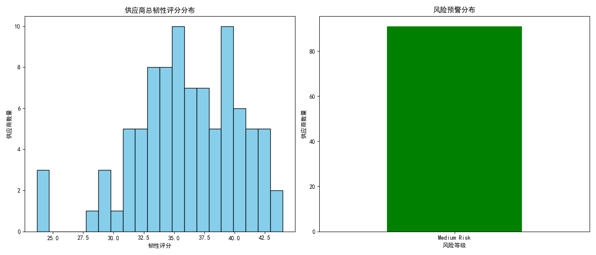

# 供应商韧性评估与优化建议报告
## 1. 数据分析概述
本次分析涵盖了支出集中度超过15%或被归类为'Mission Critical'/'High Strategic Value'的供应商，构建了涵盖财务、运营、市场和战略四个维度的供应商韧性评估框架。
## 2. 韧性评分分布
以下是供应商的综合韧性评分分布图：

### 财务韧性：
财务韧性基于供应商的财务健康评分，反映了其在经济压力下的生存能力。
### 运营韧性：
运营韧性综合了质量、网络安全和创新能力评分，反映了供应商在运营过程中的稳定性。
### 市场韧性：
市场韧性通过市场波动指数、可替代供应商数量和价格波动系数来衡量，体现了供应商对市场变化的适应能力。
### 战略韧性：
战略韧性考虑了地理分布、合同到期风险和环境可持续性，反映了供应商在战略层面的稳定性。
## 3. 风险预警机制
我们基于合同到期时间（未来18个月内到期视为高风险）和市场波动指数（高于0.5视为高风险）建立了动态风险预警机制。
### 风险等级分布：
- Medium Risk: 91 家供应商
## 4. 韧性提升策略与推荐行动
根据分析结果，我们为每个关键供应商制定了个性化的韧性提升路径和应急预案。主要推荐行动如下：
- Assess supplier viability; Prepare contingency plan: 1 家供应商
- Consider supplier diversification: 76 家供应商
- Develop alternative suppliers immediately; Negotiate payment terms: 4 家供应商
- Monitor closely; Develop backup suppliers: 6 家供应商
- Review vendor status: 2 家供应商
- Strengthen relationship; Diversify supplier base: 2 家供应商
## 5. 结论与建议
通过本次分析，我们不仅识别了当前供应商体系中的高风险点，还为每个关键供应商提供了具体的韧性提升路径。建议管理层根据报告中的推荐行动优化供应商组合，从而提升整体供应链的稳定性。
