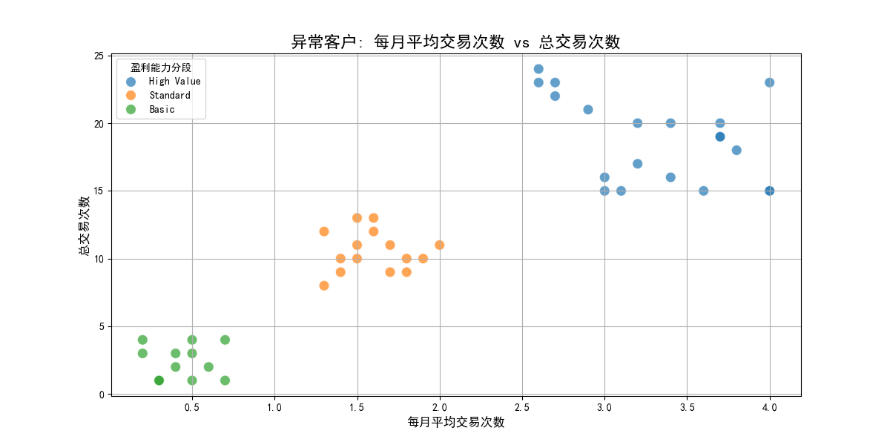
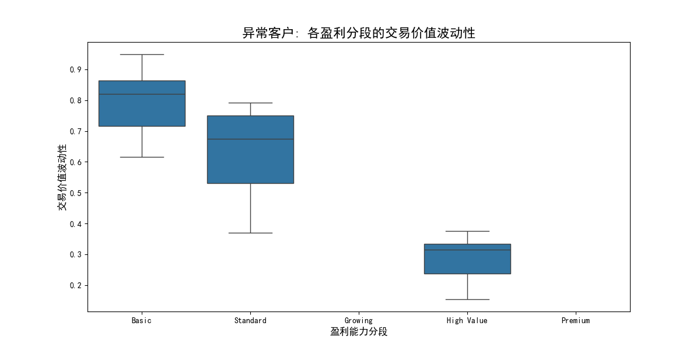
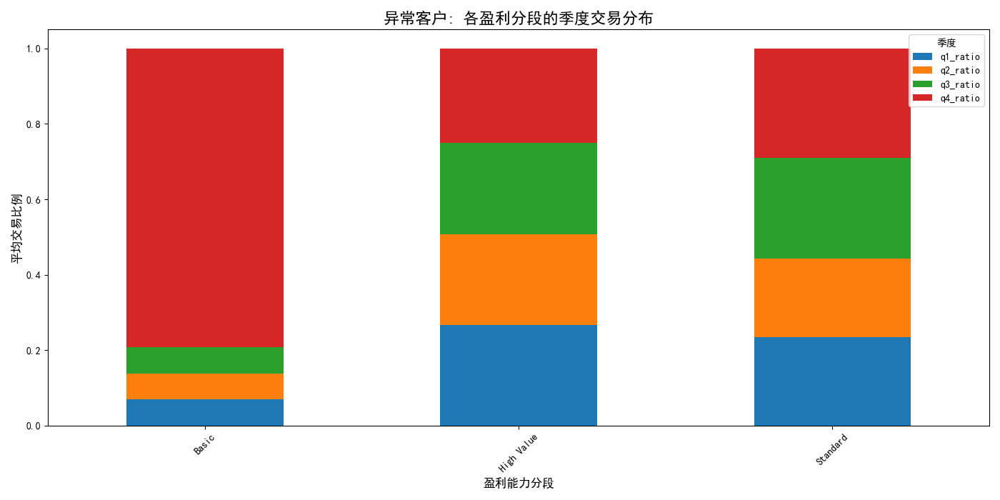
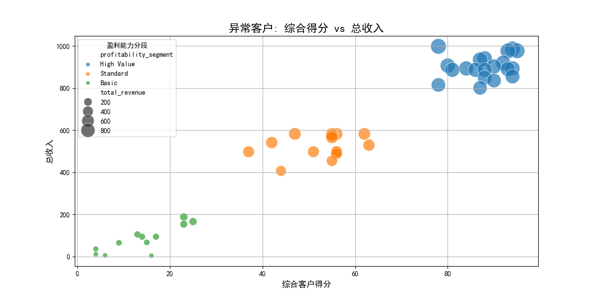

# 客户细分策略有效性分析报告：重新定义精准客户运营

## 摘要

本次分析旨在深入审视当前客户细分策略的有效性。通过对盈利能力分段（`profitability_segment`）与客户实际留存表现之间差异的深入研究，我们识别出了一批“分类异常”的客户群体。这些客户虽然被归类于特定的盈利段，但其预测留存率与该分段的平均水平存在显著偏差（差异 > 15%）。

分析结果表明，**当前基于单一盈利能力的细分模型已无法精准捕捉客户行为的复杂性**。这些“分类异常”客户在**交易行为稳定性、季节性消费模式、以及价值实现路径**上表现出与所属分段典型画像的显著不匹配。这不仅导致了留存预测的失准，也可能引发客户运营策略的错配和资源浪费。

本报告建议，**在现有细分模型中引入交易稳定性、季节性偏好和价值匹配度等新维度**，构建一个更加动态和多维的客户视图，从而提升细分精度、优化预测模型，并实现更高效的客户关系管理。

---

## 1. “分类异常”客户的识别与定位

我们首先对 `netsuite2_customer_analytics` 表中的数据进行了分析。通过计算每个 `profitability_segment` 的平均留存率，我们发现各分段的基准表现如下：

-   **Premium:** 65.9%
-   **High Value:** 55.6%
-   **Standard:** 52.3%
-   **Basic:** 47.4%
-   **Growing:** 44.0%

基于此，我们筛选出了47位预测留存率与所在分段平均值偏差超过15个百分点的客户，他们是本次分析的核心对象——“分类异常”群体。

---

## 2. 异常客户画像深度分析

我们从交易行为、季节性模式和价值实现路径三个维度对这些异常客户进行了深入剖析。

### 2.1. 交易行为：一致性缺失与高波动性

**洞察：** 异常客户的交易模式极不稳定，其交易频率和价值波动性是导致其留存行为难以预测的关键原因。

*图1：异常客户的每月平均交易次数 vs 总交易次数*

在图1中，我们可以看到 `总交易次数` 与 `每月平均交易次数` 之间并未呈现出清晰的线性关系。部分客户（如图中右上角的数据点）虽然历史总交易次数很高，但月均交易次数并不突出，这暗示他们可能是**“脉冲式”或“休眠后回归”的客户**。现有的留存模型很可能因为他们历史上的高频交易而给出偏高的留存预测，却忽略了他们近期的不活跃。

*图2：异常客户各盈利分段的交易价值波动性*

图2显示，被划分为“High Value”和“Premium”的异常客户群体，其交易价值波动性（`transaction_value_volatility`）的中位数和分布范围，与其他分段并无显著区别，甚至低于“Growing”分段。这意味着，**一些客户可能因为少数几笔大额交易被错误地划入高价值分段**，但他们持续贡献价值的能力（即交易价值的稳定性）并不强。这种“伪高价值”客户的留存风险自然更高。

### 2.2. 季节性模式：显著的季节性偏好

**洞察：** 异常客户群体表现出强烈的季节性消费偏好，尤其集中在第四季度（Q4），这种模式是传统细分模型未能捕捉到的重要变量。

*图3：异常客户各盈利分段的季度交易分布*

如图3所示，几乎所有盈利分段的异常客户，其交易活动都显著地集中在Q4。特别是“High Value”和“Premium”分段，Q4的交易比例远超其他季度。这表明，**许多异常客户是“假日购物者”或“年终采购者”**。他们的购买行为由季节性因素驱动，而非持续的品牌忠诚度。因此，用一个全年适用的、统一的留存模型去预测他们的行为，必然会出现巨大偏差。

### 2.3. 价值实现路径：得分与收入的错配

**洞察：** 在异常客户中，`综合客户得分`（`comprehensive_customer_score`）与`总收入`（`total_revenue`）之间存在明显的错配，显示出客户的“账面价值”与“实际贡献”不符。

*图4：异常客户的综合得分 vs 总收入*

在图4中，理想状态下数据点应沿对角线分布（高分对应高收入）。然而，我们观察到两类典型的异常群体：
1.  **“价值虚高”客户：** 图中左上区域，这些客户 `comprehensive_customer_score` 较高，但 `total_revenue` 相对较低。模型可能因为他们的高分（可能来源于非交易互动，如服务请求、网站浏览等）而高估了他们的留存意愿。
2.  **“价值被低估”客户：** 少数客户得分不高，但贡献了不成比例的高收入。这部分客户可能是低调的“大宗买家”，他们互动少但价值高，现有模型未能充分识别其重要性。

这种得分与收入的不匹配，直接冲击了基于综合得分的留存预测的准确性。

---

## 3. 结论与战略建议

分析表明，当前基于盈利能力的单一维度客户细分策略已不足以应对多样化的客户行为。为了提升客户细分的精准度和留存预测的准确性，我们必须对现有模型进行升级。

**核心建议：构建多维客户细分模型，引入动态行为标签。**

具体措施如下：

1.  **引入“交易稳定性”维度：**
    *   **目标：** 区分客户的交易活跃模式。
    *   **建议：** 基于 `transaction_consistency` 和 `avg_transactions_per_month` 与 `customer_age_days` 的关系，将客户标记为**“持续活跃型”**、**“脉冲消费型”** 和 **“流失风险型”**。针对不同类型采取差异化的激活和挽留策略。

2.  **引入“季节性偏好”维度：**
    *   **目标：** 识别有特定消费周期的客户。
    *   **建议：** 基于Q1-Q4的交易分布，为客户打上**“全年均衡型”**、**“假日购物型”**、**“特定季节型”**等标签。营销活动应与客户的季节性偏好相匹配，例如，仅在Q3和Q4向“假日购物型”客户推送高强度营销信息。

3.  **引入“价值匹配度”维度：**
    *   **目标：** 校准客户的“潜力”与“实际价值”。
    *   **建议：** 结合 `comprehensive_customer_score` 和 `total_revenue`，将客户识别为**“价值实现型”（高分高收）**、**“潜力增长型”（高分低收）**和**“核心价值型”（低分高收）**。对于“潜力增长型”客户，应深挖其价值转化的障碍；对于“核心价值型”，则需加强关系维护，防止流失。

通过实施上述建议，我们可以建立一个更具颗粒度和动态性的客户视图，使客户细分不再是一个静态的分类，而是一个能够反映客户生命周期动态变化的战略工具。这将直接赋能更精准的营销、更有效的资源分配和最终更高的客户留存率。
