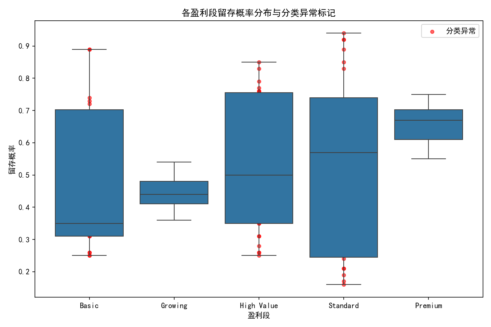
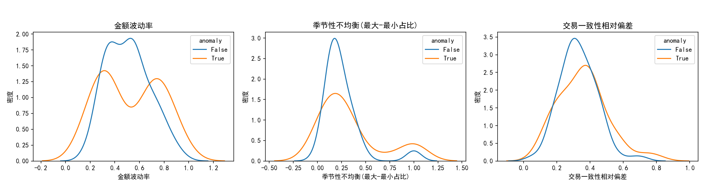
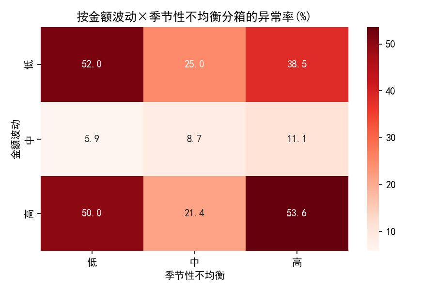
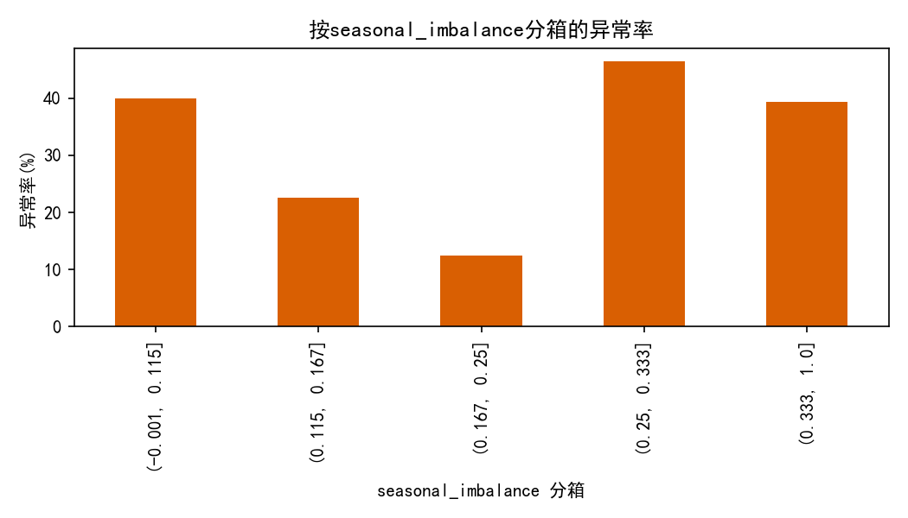
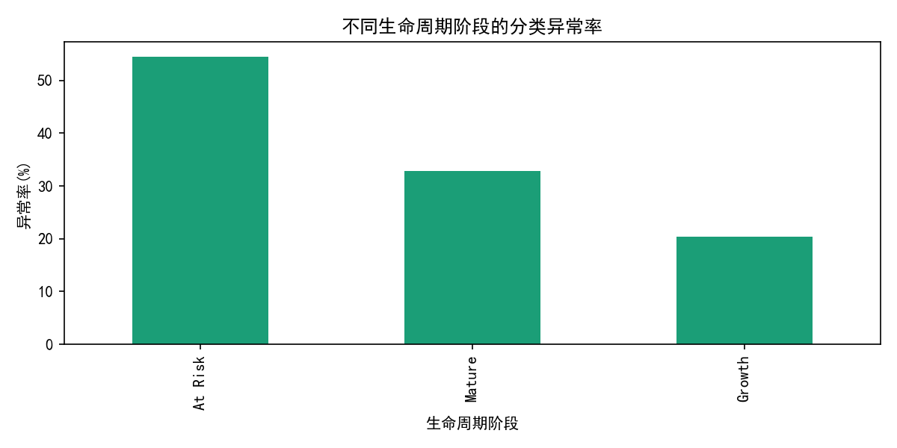

# 客户细分有效性复盘：盈利段与实际表现的匹配度诊断与优化建议

> 目标：检验当前盈利段分类（profitability_segment）与客户实际表现（尤其留存）是否匹配，聚焦“分类异常”客户：其个体留存概率与所属盈利段平均留存率偏差超过15个百分点（|retention_probability − 段均值| > 0.15）。从交易稳定性、季节性、价值路径三个维度进行诊断，并用规则聚类与“类决策树”信息增益方法为细分模型优化提供依据。

---

## 数据与方法
- 数据来源：/workspace/dacomp-076.sqlite 中的表 netsuite2_customer_analytics（149位客户）。
- 关键字段：profitability_segment、retention_probability、transaction_count、avg_transactions_per_month、transaction_value_volatility、q1-q4_transactions、comprehensive_customer_score、total_revenue、customer_age_days、lifecycle_stage 等。
- 异常判定：按所属盈利段计算段均留存率，若该客户留存概率与段均值偏差>0.15则标记为“分类异常”。
- 特征构造：
  - 交易一致性：将 transaction_count/客户月龄（customer_age_days/30）作为从累计交易反推月均交易 implied_avg；一致性差异 gap=|avg_transactions_per_month − implied_avg|；并计算相对偏差 consistency_gap_rel 以便跨量级比较。
  - 金额波动：volatility=transaction_value_volatility。
  - 季节性均衡：使用季度交易占比的HHI与熵，定义季节性不均衡 seasonal_imbalance=四季最大占比−最小占比，越大表示越集中在少数季度。
  - 价值路径匹配：对 total_revenue 与 comprehensive_customer_score 分别做z标准化（z_rev、z_score），两者差的绝对值 score_rev_mismatch 反映“评分-收入”错配程度。
- 诊断方法：
  - 规则聚类（非训练）：按季节性不均衡×波动率三分位将客户划为“稳定-均衡”“不稳定-强季节”“混合”。
  - 类决策树：不训练模型，枚举分位阈值，计算信息增益，找出对“分类异常”最有区分力的单阈值与二层组合阈值。

绘图代码片段（确保中文展示与负号显示正确）：
```python
import matplotlib.pyplot as plt
plt.rcParams['font.sans-serif'] = ['SimHei']
plt.rcParams['axes.unicode_minus'] = False
```

---

## 1. 总体画像与异常客户规模
- 客户总数：149；盈利段规模：Premium(52)、Growing(29)、High Value(27)、Standard(23)、Basic(18)。
- 各段留存均值：Basic 0.474，Growing 0.440，High Value 0.556，Premium 0.659，Standard 0.523。
- 异常客户：47位，占比31.5%。

图：各盈利段留存分布与异常标记（红点）



要点：尽管Premium段整体留存均值最高，但各段内部存在显著离散度，导致不少个体偏离段均超过15个百分点。

---

## 2. “分类异常”客户的三大特征对比

图：异常 vs 正常 在关键维度上的分布对比（金额波动、季节性不均衡、交易一致性相对偏差）



- 季节性不均衡 seasonal_imbalance：异常组的中位数0.263，高于正常组0.200，表明异常更易发生在季节性极不均衡的客户上。
- 交易一致性 consistency_gap_rel：异常组中位数0.361，高于正常组0.314，说明“累计交易×月龄”与“报告的月均交易”不一致更强，指示交易节奏不稳或近期行为变化明显。
- 金额波动 volatility：两组中位数近似（异常0.504 vs 正常0.498），单独作为驱动因素的证据不强。

---

## 3. 价值实现路径：评分-收入匹配性

图：标准化综合评分 vs 标准化总收入（含y=x参照线）


- 整体相关：z_score与z_rev的相关系数高达0.957，说明综合评分与收入总体一致。
- 异常客户并非“评分-收入错配”更严重：异常组的 score_rev_mismatch 中位数反而低于正常组（0.158 vs 0.209）。
- 结论：当前细分模型中的价值刻画与收入表现大体对齐，“分类异常”更多源自交易稳定性与季节性等行为因素，而非价值评估偏差。

---

## 4. 季节性与稳定性对异常率的交互影响

图：金额波动×季节性不均衡 分箱的异常率热力图



- 发现：当季节性不均衡较高时，异常率显著上升；金额波动的影响相对次要，但与季节性叠加后仍会抬升异常率。

规则聚类结果（非训练）：
- 不稳定-强季节（n=28）：异常率53.6%，收入占比6.9%，属于高风险但收入贡献相对较低的人群。
- 稳定-均衡（n=26）：异常率50.0%，提示即便行为稳定，仍存在偏离段均的留存特征，疑似与生命周期阶段或近期状态有关。
- 混合（n=95）：异常率20.0%，为较低风险主体，贡献约67.4%收入。

---

## 5. 类决策树（信息增益）规则洞察

单特征最优阈值（信息增益）对“异常”的区分力排序：
- 季节性不均衡 seasonal_imbalance @ 0.50：左右异常率28.1% vs 64.3%，增益最高（0.034）。右侧样本虽仅14人，但异常密度极高。
- 评分-收入错配 score_rev_mismatch @ 0.187：左右异常率40.0% vs 23.0%，增益0.024。
- 金额波动 volatility @ 0.277：左右异常率60.0% vs 28.4%，增益0.028（左侧样本15人）。
- 交易一致性相对偏差 consistency_gap_rel @ 0.481：左右异常率29.1% vs 53.3%，增益0.017。

二层规则（在高风险一侧再切分）：
- Level1：seasonal_imbalance > 0.50 → 异常率64.3%。
- Level2（聚焦右侧）：score_rev_mismatch ≤ 0.082（信息增益0.185）进一步解释高风险区间内的差异，表明“高度季节性的人群里，即便评分与收入匹配，也更可能出现与段均留存显著偏离”的现象。对模型的启示是：季节性应成为主维度，评分-收入则用于二次刻画（非主要原因，但有辅助区分力）。

图：按信息增益Top特征的分箱异常率



---

## 6. 生命周期维度的影响

图：不同生命周期阶段的分类异常率



- At Risk：异常率54.6%（最高）。
- Mature：32.9%。
- Growth：20.4%（最低）。

解读：生命周期阶段对“分类异常”具有强解释力，尤其“即将流失/风险中”的人群显著高于其他阶段。这与“稳定-均衡”群体仍有高异常率的现象相呼应，说明单看交易稳定可能掩盖了生命周期带来的留存变化。

---

## 7. 业务结论与策略建议

1) 是否匹配：现有盈利段对收入/价值刻画较到位（评分与收入高度相关），但对留存行为的刻画不足，导致约31.5%的客户在“段均留存”上显著偏离。

2) 异常客户画像：
- 更高的季节性不均衡（偏好1-2个季度）是主因；
- 交易节奏存在“累计×月龄”与“报告月均”的不一致，体现为近期交易行为变化或不稳定；
- 生命周期阶段（At Risk）显著提升异常概率。

3) 细分模型优化方向：
- 新增“季节性维度”：引入季节性不均衡指标（如 seasonal_imbalance 或季节熵）到细分规则中。建议对 seasonal_imbalance > 0.5 的客户独立成亚群（如“季节性驱动群”）。
- 纳入“生命周期阶段”：将 lifecycle_stage 作为一级或二级切分维度，重点区分 Growth/Mature/At Risk，针对 At Risk 设计差异化留存策略。
- 引入“交易稳定性”作为辅助因子：使用 consistency_gap_rel 或“环比/周内变异度”等指标识别交易节奏变化，作为异常预警信号。

4) 预测与运营落地：
- 预测性：若不纳入季节性/生命周期维度，未来在旺季前后仍将出现系统性偏差与较高异常率（特别是在细分量小但风险高的群体中）。
- 规范性：
  - 针对“季节性驱动群”（seasonal_imbalance > 0.5）：在旺季前推送补货/折扣包、在淡季提供替代品/跨品类捆绑；目标是“填谷”和“前置拉动”。
  - 对“At Risk”阶段客户：加速触发召回与福利权益（关怀券、专属客服），并校准其在盈利段中的留存预期，避免被高估导致资源错配。
  - 对“交易一致性偏差高”的客户：设定行为变动阈值，作为客户健康评分的负向加权，纳入NPS/工单反馈进行人工巡检。

5) 指标与实验建议：
- 指标：按新维度（季节性、生命周期、稳定性）计算分群留存均值与预测偏差MAPE，监控优化前后变化；
- 实验：对季节性驱动群开展“旺季前置优惠 vs 常规促销”的A/B，验证留存与ARPU改善幅度；对At Risk群测试“权益+服务包 vs 单一优惠”的差异化召回策略。

---

## 8. 局限与后续
- 样本量较小（例如季节性极端不均衡与低波动阈值侧仅有14-15人），结论需在更长时间窗/更大样本上复核；
- 本次分析未做数据清洗，可能存在极值或记录口径差异；
- 建议补充月度粒度行为序列，增强对“稳定性与变点”的识别，并联动CRM触点数据做因果归因。

---

## 附：本次生成的图片文件
- segment_retention_distribution.png
- anomaly_vs_normal_features.png
- score_vs_revenue_scatter.png
- anomaly_rate_heatmap.png
- top_feature_anomaly_rate.png
- anomaly_by_lifecycle.png

以上分析与图表为后续细分模型规则优化与运营策略制定提供了直接支撑，建议优先将“季节性不均衡、生命周期阶段、交易稳定性”纳入细分与留存预估的核心维度。
