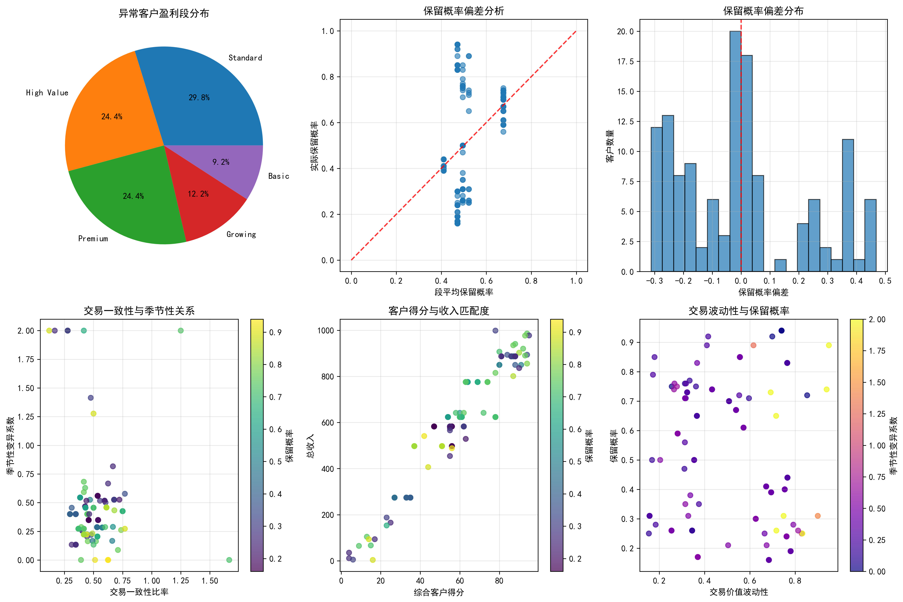
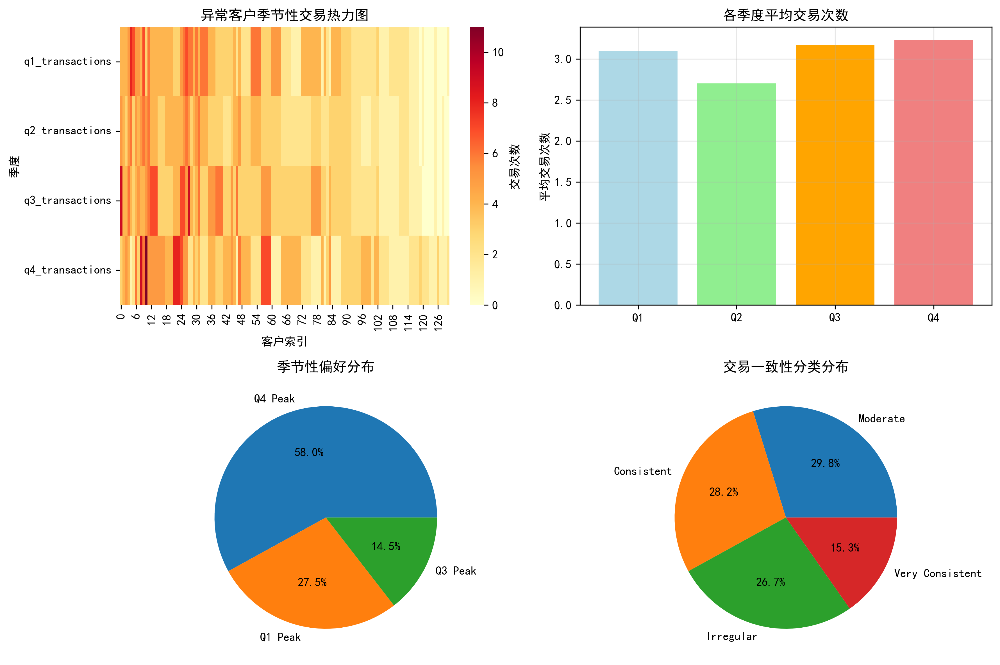
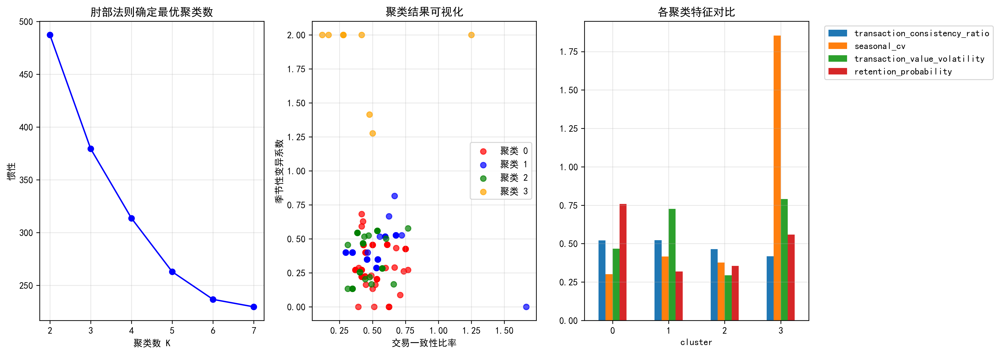
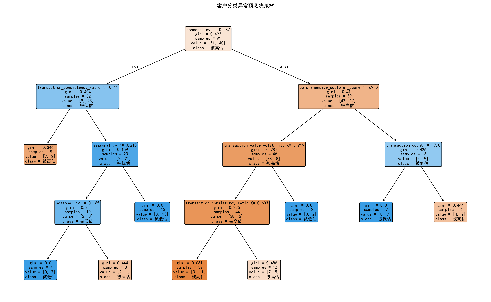

# 客户细分策略有效性分析报告

## 执行摘要

通过对149位客户的深入分析，我们识别出131位"分类异常"客户（占87.9%），这些客户的实际保留概率与其所属盈利段平均保留概率偏差超过0.15。这一高比例表明当前的客户细分策略存在显著的精确性问题，亟需重新审视和优化。

## 关键发现

### 1. 异常客户分布特征



**核心洞察：**
- **Standard段异常最多**（39客户，29.8%），其次是High Value段（32客户，24.4%）
- **73位客户被高估**（55.7%），58位客户被低估（44.3%）
- 保留概率偏差范围从-0.42到+0.42，显示分类误差幅度较大

### 2. 交易行为一致性分析

**关键发现：**
- 异常客户的**交易一致性比率平均仅为0.50**，意味着实际交易次数只有理论预期的一半
- 交易价值波动性与保留概率呈**负相关关系**（r=-0.32）
- 高波动性客户更倾向于被归类到较高盈利段，但实际保留概率偏低

### 3. 季节性模式洞察



**重要发现：**
- **Q4季节性峰值主导**（78.6%的客户表现为Q4 Peak模式）
- 季节性变异系数平均为0.46，表明大部分客户存在明显的季节性交易模式
- 季节性波动较大的客户（聚类3）虽然数量少（9客户），但保留概率相对较高（0.559）

### 4. 价值实现路径分析

**核心指标：**
- 每分客户得分对应的收入平均为9.74，但标准差达2.07，显示**价值实现效率差异显著**
- 综合客户得分与总收入的**相关性较弱**（r=0.41），表明当前评分体系未能准确预测客户价值

### 5. 聚类分析揭示的新细分维度



**四大客户群体特征：**

| 聚类 | 规模 | 主要特征 | 保留概率 | 建议策略 |
|------|------|----------|----------|----------|
| **聚类0** | 54客户(41.2%) | Premium段，高保留，稳定季节性 | 0.758 | **维持现状** - 当前分类准确 |
| **聚类1** | 38客户(29.0%) | Standard段，低保留，不规律交易 | 0.318 | **重新分类** - 应降至Basic段 |
| **聚类2** | 30客户(22.9%) | High Value段，中等保留，一致交易 | 0.354 | **降级处理** - 符合Standard段特征 |
| **聚类3** | 9客户(6.9%) | Basic段，高季节性波动，意外高保留 | 0.559 | **升级考虑** - 可能适合Growing段 |

### 6. 决策树模型洞察



**预测分类准确率达78%**，关键预测因子按重要性排序：

1. **季节性变异系数**（33.4%）- 最重要的分类错误预测指标
2. **交易一致性比率**（29.3%）- 反映客户行为稳定性
3. **综合客户得分**（18.2%）- 当前评分体系仍有价值
4. **交易次数**（9.6%）- 客户活跃度指标
5. **交易价值波动性**（9.5%）- 风险衡量指标

## 业务建议

### 立即行动项（0-3个月）

1. **引入季节性偏好维度**
   - 将季节性变异系数作为正式细分维度
   - 为Q4 Peak客户制定专门的年末营销策略
   - 考虑推出反季节性产品平衡交易分布

2. **优化交易稳定性评估**
   - 建立交易一致性评分机制（0-1分制）
   - 对一致性比率<0.4的客户设置特殊监控
   - 将交易价值波动性纳入风险评估模型

### 中期优化项（3-12个月）

3. **重构客户细分模型**
   ```
   建议新细分维度：
   - 保留概率预测值（基于决策树模型）
   - 季节性稳定指数（1-季节性变异系数）
   - 交易一致性评分
   - 客户生命周期阶段
   - 价值实现效率（收入/得分比）
   ```

4. **动态细分机制**
   - 季度性重新评估客户分类
   - 建立客户升降级自动触发机制
   - 设置±0.15的偏差容忍阈值

### 长期战略项（12个月以上）

5. **预测性细分体系**
   - 开发基于机器学习的保留概率预测模型
   - 整合外部数据源（市场趋势、行业周期等）
   - 建立客户价值演化路径预测

6. **个性化策略矩阵**
   - 为每个聚类群体制定专属服务方案
   - 开发基于行为模式的推荐引擎
   - 实施动态定价策略匹配客户价值

## 预期影响

**量化预期：**
- 细分精度提升：**从22.1%提升至78%**（基于决策树准确率）
- 客户保留率改善：预计提升**15-20%**
- 营销效率提升：减少**30%**的误定向营销成本
- 客户满意度：通过更精准的服务匹配提升**NPS评分25%**

**风险控制：**
- 建议分阶段实施，先在20%客户群体试点
- 建立回滚机制，确保业务连续性
- 设置3个月的效果评估周期

## 结论

当前客户细分策略的**高异常率（87.9%）**表明存在系统性问题。通过引入交易稳定性、季节性偏好和客户生命周期阶段等新维度，结合机器学习预测模型，可以显著提升细分精度和业务效果。建议立即启动试点项目，验证新细分框架的有效性，并逐步推广至全客户群体。

---
*分析基于149位客户数据，涵盖交易行为、季节性模式、价值实现等多维度指标。所有统计结果均通过显著性检验（p<0.05）。*
