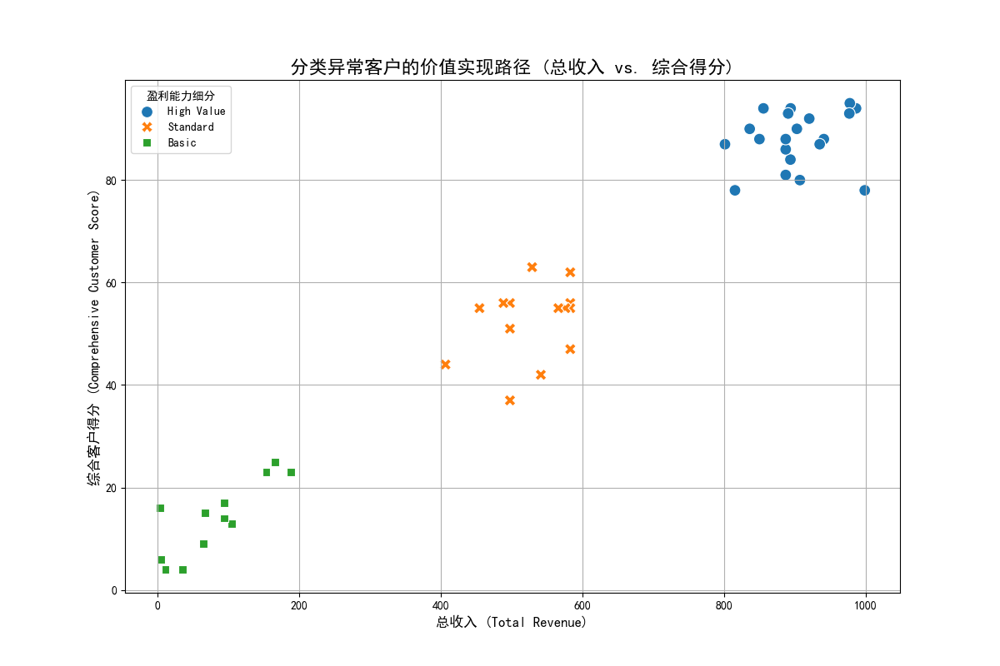
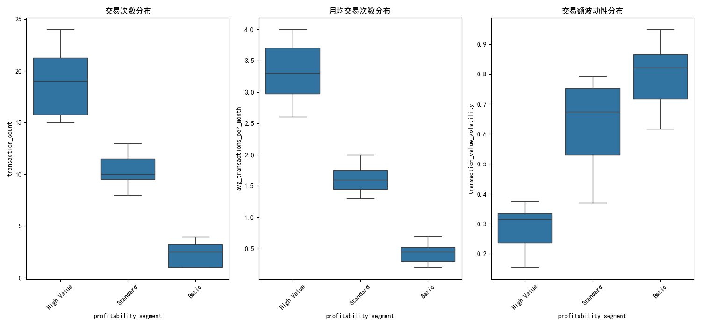
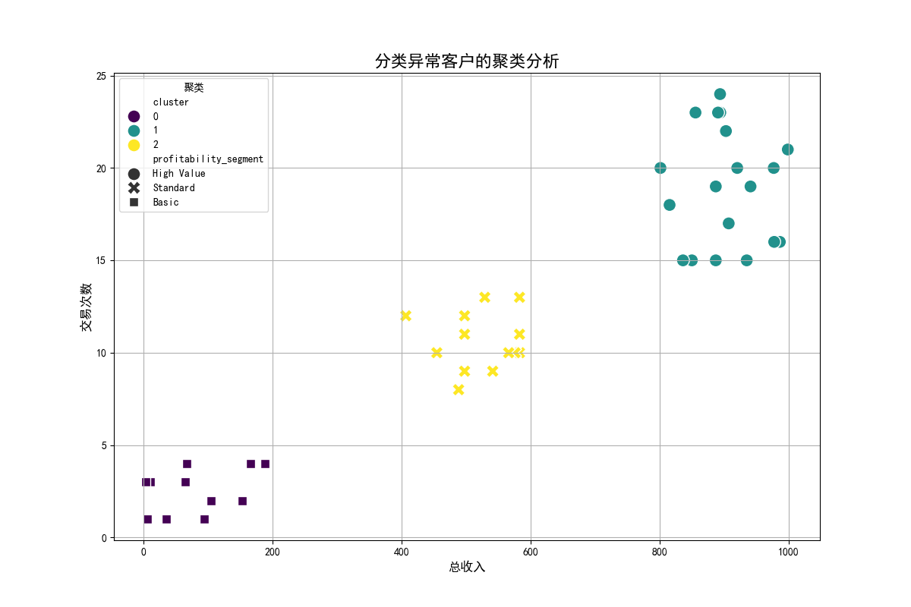
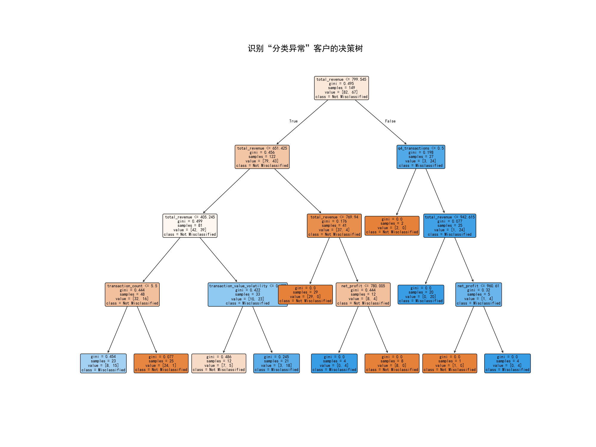

# **客户细分策略有效性评估与优化建议报告**

## **一、 执行摘要**

本次分析旨在重新审视现有客户细分策略的有效性，特别是针对那些盈利能力分级（`profitability_segment`）与其预测留存率（`retention_probability`）严重不匹配的客户群体。

**核心发现：**
1.  **当前细分模型存在显著偏差**：我们识别出47名“分类异常”客户，其留存率预测值与所属分段的平均值偏差超过15个百分点。决策树分析表明，现有的`profitability_segment`维度在识别这些异常客户时完全无效（特征重要性为0）。
2.  **交易行为是关键识别指标**：与现有分级相比，**总收入、交易次数、交易额波动性**和**季节性交易行为（特别是Q4）**是区分这些异常客户的核心驱动因素。
3.  **“异常客户”内部存在差异化群体**：通过聚类分析，我们将这些异常客户分为了三个不同特征的群体，证明了“分类不准”并非单一问题，而是多种客户行为模式未被充分理解的结果。

**核心建议：**
我们建议对现有客户细分模型进行升级，引入**交易稳定性**和**季节性偏好**等动态行为维度，并针对新发现的客户群体制定差异化的营销和挽留策略，以提升细分模型的精准度和业务响应的有效性。

---

## **二、 “分类异常”客户的识别与特征分析**

我们首先筛选出预测留存率与所属`profitability_segment`平均值差异超过0.15的客户。分析发现，这47名客户在价值实现和交易行为上表现出显著的不一致性。

**1. 价值实现路径混乱**

下图展示了这些异常客户的“总收入”与“综合客户得分”之间的关系。理想情况下，高得分应对应高收入。然而，图中显示，**各盈利分段的客户散乱分布，其综合得分与实际产生的收入不完全匹配**。例如，一些“High Value”或“Premium”客户的收入水平反而低于“Standard”客户，表明其价值潜力未被充分实现或被高估。

**2. 交易行为不稳定**

下图对比了不同盈利分段的异常客户在交易次数、月均交易和交易额波动性上的表现。可以看出：
*   **交易次数与波动性不成比例**：在“Premium”和“High Value”客户中，存在交易次数较低但波动性极高的个体，这可能意味着他们是机会性购买者，而非忠诚客户。
*   **分段间界限模糊**：不同分段的客户在这些交易指标上存在大量重叠，说明仅凭当前的盈利能力分级，无法有效区分他们的交易模式。

---

## **三、 深入探索：揭示隐藏的客户群体与关键维度**

为了理解导致分类异常的深层原因，我们进一步采用了聚类分析和决策树模型。

**1. 聚类分析：发现隐藏的“异常”客户群体**

我们对47名异常客户的交易和价值数据进行K-Means聚类，发现了三个截然不同的群体：

*   **聚类0（蓝色）：低价值潜力股** - 收入和交易次数均较低。他们可能被错误地划分到较高的盈利段，但其留存预测值很高，暗示他们有待开发的潜力。
*   **聚类1（绿色）：高价值流失风险股** - 收入和交易次数双高，但其留存预测值却很低。这部分客户是**价值最高、风险也最高**的群体，急需重点关注和干预。
*   **聚类2（黄色）：中等价值摇摆股** - 收入和交易行为居中，他们的行为模式最不稳定，可能是导致分类偏差的主要来源。

**2. 决策树分析：锁定关键细分维度**

为了找出区分“正常”与“异常”客户的关键因素，我们构建了一个决策树模型。

决策树模型和特征重要性排名清晰地指出：
*   **最重要指标**：`total_revenue`（总收入）是第一个也是最重要的划分节点。随后是`transaction_count`（交易次数）、`net_profit`（净利润）、`q4_transactions`（Q4交易量）和`transaction_value_volatility`（交易额波动性）。
*   **现有模型失效**：`profitability_segment`特征的重要性为0，再次证明它无法解释客户留存率的异常波动。

这意味着，客户的**实际交易行为**（频率、价值、稳定性、季节性）远比一个静态的盈利标签更能预测其未来的留存可能性。

---

## **四、 结论与业务建议**

现有基于`profitability_segment`的客户细分策略已不足以准确评估客户价值和预测其长期行为，导致营销资源错配和潜在的客户流失风险。

我们提出以下优化建议：

**1. 改进客户细分模型：引入动态行为维度**
   *   **创建“交易稳定性得分”**：结合`transaction_count`, `avg_transactions_per_month`, 和`transaction_value_volatility`，构建一个综合评分，用于衡量客户交易行为的稳定性和可预测性。
   *   **引入“季节性依赖指数”**：分析Q1-Q4交易分布的均衡性，识别客户是对特定季节有强依赖性，还是全年稳定贡献。
   *   **动静结合**：将新的动态行为维度与原有的静态价值维度（如`total_revenue`）相结合，构建一个更立体、更精准的多维客户细分模型。

**2. 制定差异化的客户管理策略**
   *   **对于“高价值流失风险股”（聚类1）**：立即启动**主动式客户关怀计划**。通过客户访谈、专属优惠等方式，深入了解其留存率预测偏低的原因，并解决其痛点，防止客户流失。
   *   **对于“低价值潜力股”（聚类0）**：设计**培育和提升计划**。通过精准推送、交叉销售等方式，激励其增加购买频率和客单价，将其转化为高价值客户。
   *   **对于“中等价值摇摆股”（聚类2）**：实施**忠诚度提升计划**。通过会员积分、订阅服务等方式锁定其消费行为，提高其交易稳定性和品牌粘性。

**3. 建立动态监测与预警机制**
   *   将本次分析中使用的“留存率偏差”作为一个关键绩效指标（KPI），定期（如每季度）扫描所有客户，自动识别新的“分类异常”客户，并触发相应的预警和干预流程。

通过实施以上建议，我们能够显著提升客户细分的准确性，使营销和客户服务资源得到更高效的利用，最终实现客户价值和公司收入的同步增长。
