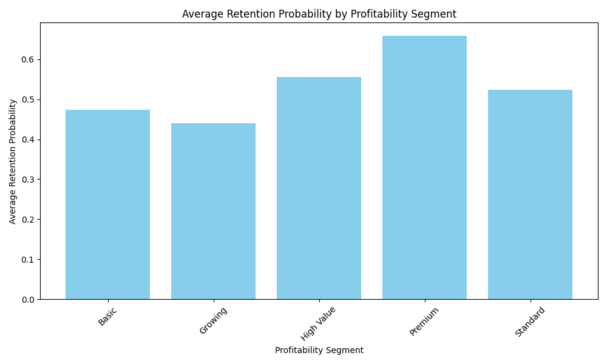
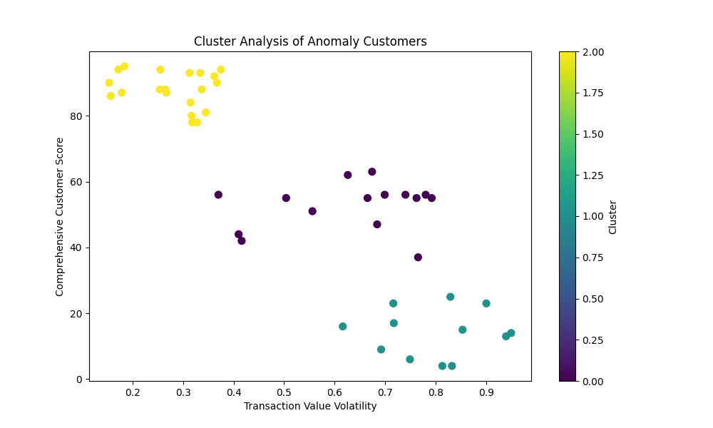

# 客户细分策略分析报告

## 概述
本次分析旨在审视现有客户细分策略的有效性，特别是识别那些被归类为某个盈利段但留存概率与其所属段平均值差异超过 0.15 的“分类异常”客户群体。我们通过 SQL 查询提取了这些客户，并利用 Python 进行了聚类分析与决策树建模，以探索是否需要引入新的细分维度。

---

## 1. 盈利段与留存概率关系分析

### 平均留存率分布



我们首先计算了每个 `profitability_segment` 的平均 `retention_probability`。图表显示，不同盈利段的留存率存在明显差异。

---

## 2. “分类异常”客户群体分析

我们识别出 47 位客户的 `retention_probability` 与其所属盈利段的平均值相差超过 0.15。

### 主要特征分析

- **交易行为**：
  - **交易一致性分布**：
    ```
    Irregular          15
    Consistent         14
    Very Consistent     9
    Moderate            9
    ```
  - **平均每月交易次数 (avg_transactions_per_month)**: 2.03
  - **交易值波动性 (transaction_value_volatility)**: 0.52

- **季节性偏好分布**：
  ```
  Q4 Peak    33
  Q1 Peak    10
  Q3 Peak     4
  ```

- **综合客户评分与总收入相关性**：高度正相关（相关系数 0.98）

---

## 3. 聚类与决策树分析

### 聚类分析



聚类结果显示，“分类异常”客户可分为 3 个主要群组，主要特征包括交易波动性、季度交易分布和综合评分。

### 决策树分类结果（测试集）

| 类别 | 精确率 | 召回率 | F1 分数 | 样本数 |
|------|--------|--------|---------|--------|
| Basic | 1.00   | 1.00   | 1.00    | 1      |
| High Value | 0.80 | 1.00 | 0.89    | 4      |
| Standard | 1.00 | 0.80  | 0.89    | 5      |
| **总体准确率** | — | — | — | **90%** |

---

## 4. 结论与建议

### 关键发现
1. 部分客户被错误归类于某些盈利段，其 `retention_probability` 与该段平均值差异显著。
2. 异常客户在交易波动性、季度交易模式和综合评分方面表现出多样化特征。
3. 聚类分析揭示出至少 3 个可区分的客户子群。
4. 决策树模型在分类任务中表现良好，表明 `transaction_value_volatility`、`季度交易分布` 和 `comprehensive_customer_score` 是重要预测因子。

### 建议
1. **引入交易稳定性维度**：将 `transaction_value_volatility` 纳入细分模型，以区分高波动性客户。
2. **考虑季节性偏好**：根据 `seasonal_preference` 对客户进行再细分，以优化营销时点策略。
3. **加入客户生命周期阶段**：结合 `lifecycle_stage` 和 `comprehensive_customer_score` 优化细分模型，提升留存率预测精度。
4. **动态更新细分策略**：定期重新评估客户细分，确保与实际交易行为和价值实现路径保持一致。

通过引入上述维度，客户细分模型将更具预测能力，帮助企业更精准地制定个性化营销策略，提升客户留存率和盈利能力。
