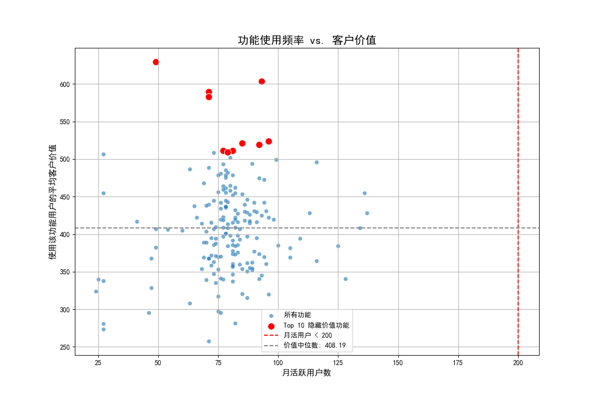

# **产品“隐藏价值功能”分析报告**

## 一、 分析背景与目标

产品团队观察到，在全部180个功能点中，用户平均仅使用12个。为了更有效地分配产品研发资源，本次分析旨在量化不同功能对客户生命周期价值（CLV）的贡献度，并识别出那些**使用频率不高（定义为月活跃用户 < 200），但对客户价值提升显著的“隐藏价值功能”**，为下一季度的产品投入提供数据支撑。

## 二、 分析过程与方法

本次分析基于 `dacomp-077.sqlite` 数据库，主要包含用户行为和客户价值数据。

1.  **数据提取**:
    *   从 `pendo__visitor_feature` 表中，统计了每个功能点 (`feature_id`) 的独立使用用户数，作为其“月活跃用户数”的代理指标。
    *   从 `pendo__customer_lifecycle_insights` 表中，获取了每位用户的综合客户价值评分 (`comprehensive_customer_value`)。
2.  **数据关联与计算**:
    *   通过 `visitor_id` 将功能使用数据与客户价值数据进行关联。
    *   计算出每个功能点所触达的用户群体的平均客户价值。
3.  **识别与可视化**:
    *   整合上述数据，创建一个散点图，以“月活跃用户数”为横轴，以“平均客户价值”为纵轴，直观展示所有功能的分布情况。
    *   筛选出月活跃用户数低于200，且平均客户价值最高的功能作为“隐藏价值功能”。

## 三、 核心发现

通过对180个功能点的分析，我们成功识别出了一批具有高价值潜力的“隐藏功能”。

### 1. 功能价值分布概览

如下图所示，大部分功能集中在左下角，即活跃用户数和平均客户价值都相对较低。然而，在图表的左侧（月活 < 200），我们发现了一些显著的异常点，它们的客户价值远高于中位数水平。这些就是我们寻找的“隐藏的宝石”。

*   **红色虚线** (`x=200`) 标示了低频功能的边界。
*   **灰色虚线** 代表所有功能的用户平均价值中位数。位于此线以上的功能，特别是左上角的红色点，代表其用户价值远超平均水平。

### 2. Top 10 隐藏价值功能

以下是月活跃用户数低于200，但平均客户价值最高的10个功能：

| 功能ID      | 月活跃用户数 | 使用该功能用户的平均客户价值 |
| :---------- | :------------- | :----------------------------- |
| `FEAT_00155`  | 49             | 629.36                         |
| `FEAT_00085`  | 93             | 603.59                         |
| `FEAT_00003`  | 71             | 589.69                         |
| `FEAT_00137`  | 71             | 583.14                         |
| `FEAT_00109`  | 96             | 524.04                         |
| `FEAT_00036`  | 85             | 521.23                         |
| `FEAT_00163`  | 92             | 519.37                         |
| `FEAT_00118`  | 81             | 511.49                         |
| `FEAT_00031`  | 77             | 511.35                         |
| `FEAT_00011`  | 79             | 509.09                         |

**结论**: 以 `FEAT_00155` 为首的这些功能，虽然只有少数用户在使用，但这些用户恰恰是我们价值最高的客户群体。这表明这些功能可能解决了某些核心用户的关键痛点，或是提供了高级、深度的能力，从而与高客户价值产生了强关联。

## 四、 业务建议与后续步骤

基于以上发现，我们提出以下三点切实可行的建议，以驱动产品价值的提升：

1.  **深入定性研究 (Why)**:
    *   **行动**: 建议产品与用户研究（UR）团队立即对使用 Top 10 隐藏价值功能的用户进行访谈。
    *   **目标**: 深入理解他们是谁？他们如何使用这些功能？这些功能解决了什么具体场景下的关键问题？为什么这些功能对他们如此重要？

2.  **提升高价值功能的认知与采用率 (How)**:
    *   **行动**: 针对与高价值用户画像相似，但尚未使用这些功能的用户群体，进行精准的**功能推广**。
    *   **策略**: 可以通过应用内引导 (In-app Guidance)、智能触发的教程 (Walkthroughs)、或者在邮件营销中突出介绍这些功能的使用场景和价值。
    *   **目标**: 小规模A/B测试推广效果，验证提升这些功能的使用率是否能带动普通用户向高价值用户转化。

3.  **指导产品路线图规划 (What)**:
    *   **行动**: 将对这些“隐藏价值功能”的体验优化、迭代增强，或开发与之相关的辅助功能，纳入下一季度的产品路线图。
    *   **理由**: 数据表明，投资于这些功能很可能带来高回报。增强这些功能不仅能更好地服务现有高价值客户，降低其流失风险，更有可能通过推广吸引和转化更多高潜力用户，从而提升整体客户生命周期价值。
