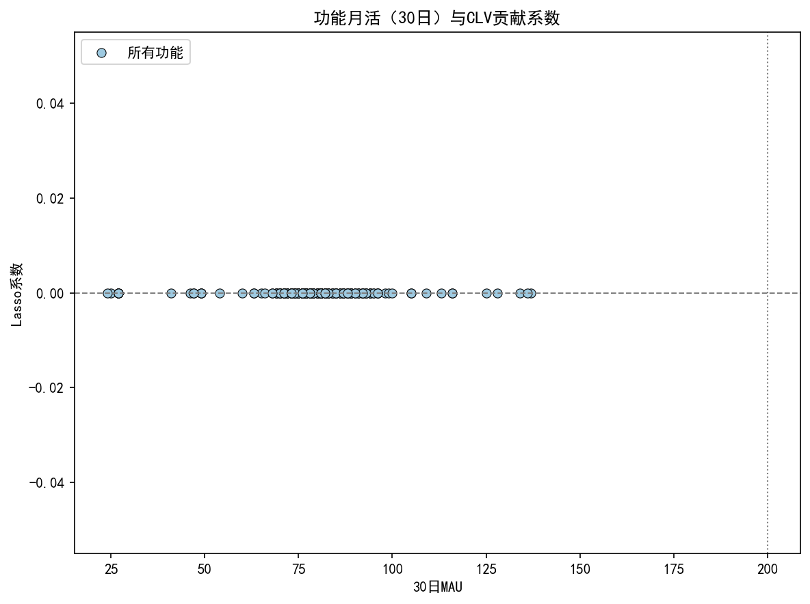
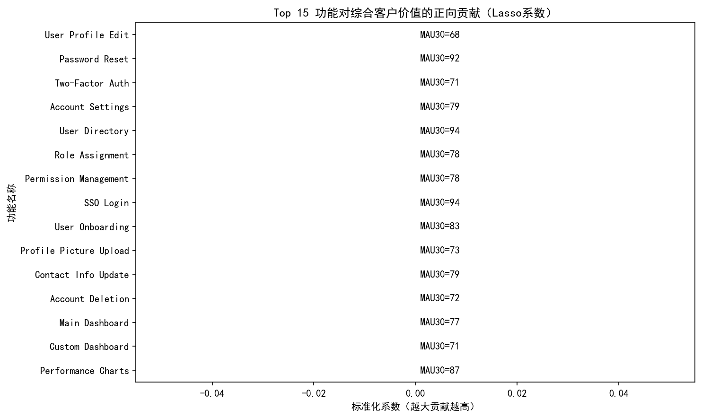
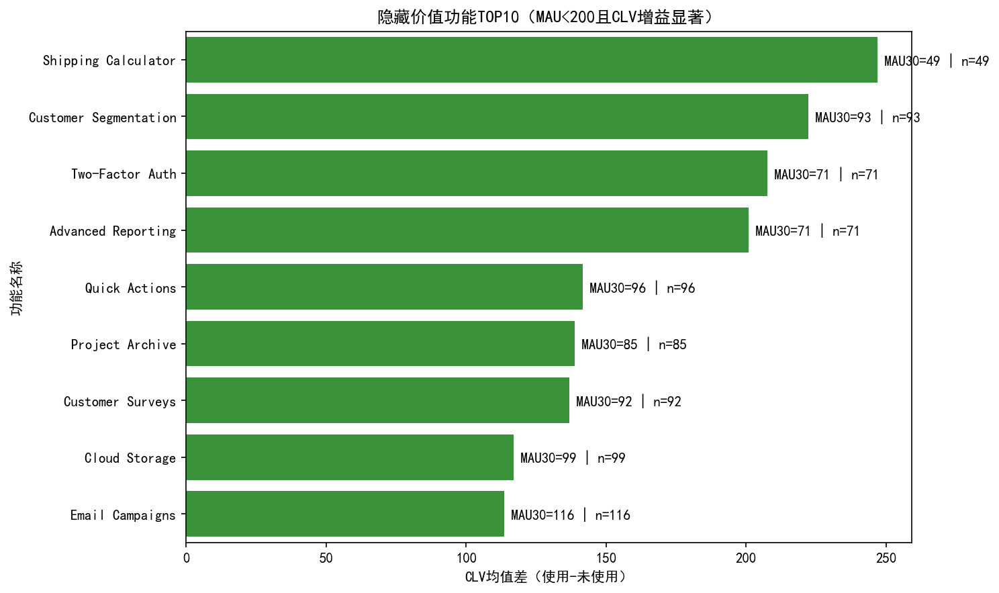

# 面向下一季度产品投放的“隐藏价值功能”量化分析报告

作者：数据分析
时间窗口：截至 2025-10-13；功能使用评估窗口近90天；MAU统计口径近30天

一、业务问题与方法总览
- 问题背景：产品总计约180个功能点，但用户平均仅使用其中12个。我们希望识别那些使用频率不高（30日MAU<200），但对客户生命周期价值（CLV，comprehensive_customer_value）提升显著的“隐藏价值功能”，为下季度的产品投入与增长实验提供依据。
- 数据来源（SQLite dacomp-077.sqlite）：
  - pendo__feature：功能清单（180条）
  - pendo__visitor_feature：访客×功能使用（近90天抽取，14283条明细）
  - pendo__feature_daily_metrics：功能日度指标（用于计算30日MAU）
  - pendo__customer_lifecycle_insights：访客层CLV与行为画像（8000名访客）
- 指标与定义：
  - 30日MAU：近30天内对该功能有使用记录的去重访客数
  - 隐藏价值功能：30日MAU<200，且使用者的CLV均值显著高于未使用者（95%CI下界>0）
- 方法路径：
  1) 尝试特征选择回归：以“是否使用某功能（90天内）”作为自变量，CLV为因变量，进行LassoCV回归。结果显示强正则下功能系数接近于0（多重共线+CLV已被整体活跃度解释），难以区分单功能的边际贡献。
  2) 单变量因果前置的增益评估（非因果，统计证据）：对每个功能，比较“使用者 vs 未使用者”的CLV均值差，计算95%CI与效应量（Cohen’s d），在MAU<200的子集中筛选显著正向者，识别“隐藏价值功能”。

二、关键可视化
1) Lasso系数视角（探索性）
说明：Lasso回归对单功能边际贡献没有显著系数，提示需要换角度进行单变量统计增益分析。
- 文件：mau_vs_coef.png
- 文件：feature_coef_top15.png





2) 隐藏价值功能TOP10（基于CLV均值差，且显著）
- 筛选条件：30日MAU<200；使用组n≥30、未使用组n≥100；CLV均值差95%CI下界>0
- 文件：hidden_uplift_top10.png



三、发现与量化结果
基于近90天使用与CLV对比，发现9个“隐藏价值功能”满足MAU<200且CLV增益显著（下界>0）。

隐藏价值功能清单（按增益由高到低，括号内为30日MAU、使用样本数used_n、CLV均值差uplift、95%CI下界lci、效应量d）：
- Shipping Calculator（MAU=49, used_n=49）：uplift≈246.8，下界≈43.4，d≈0.50
- Customer Segmentation（MAU=93, used_n=93）：uplift≈222.1，下界≈85.8，d≈0.45
- Two-Factor Auth（MAU=71, used_n=71）：uplift≈207.5，下界≈51.0，d≈0.42
- Advanced Reporting（MAU=71, used_n=71）：uplift≈200.9，下界≈34.3，d≈0.41
- Quick Actions（MAU=96, used_n=96）：uplift≈141.7，下界≈18.2，d≈0.29
- Project Archive（MAU=85, used_n=85）：uplift≈138.7，下界≈2.5，d≈0.28
- Customer Surveys（MAU=92, used_n=92）：uplift≈136.9，下界≈12.0，d≈0.28
- Cloud Storage（MAU=99, used_n=99）：uplift≈117.0，下界≈6.7，d≈0.24
- Email Campaigns（MAU=116, used_n=116）：uplift≈113.6，下界≈6.2，d≈0.23

解读：
- 上述功能尽管当前使用人群不大（MAU均<200），但其使用者的综合客户价值明显高于未使用者，具有“隐藏价值”特征。
- 功能画像上，既有“业务效率与价值捕获”类（Shipping Calculator、Advanced Reporting、Customer Segmentation），也有“安全/基础能力”类（Two-Factor Auth）、“增长/营销”类（Customer Surveys、Email Campaigns）与“集成/协作”类（Cloud Storage、Project Archive）。这说明高价值用户往往围绕“专业化、可扩展、安全、可量化增长”的路径深化使用。

四、诊断性洞察：为什么这些功能显著提升CLV？
- 价值闭环更短：如 Shipping Calculator/Advanced Reporting 直接关联到交易/效率/决策闭环，使用即创造实在价值，促进粘性与付费意愿。
- 强粘性的组织嵌入：Two-Factor Auth、Cloud Storage 使产品成为组织流程的一部分，提升替换成本，延长生命周期。
- 带动更深功能旅程：Customer Segmentation、Email Campaigns、Customer Surveys 能驱动“目标-执行-评估-优化”的增长飞轮，使高价值用户更活跃与高产出。
- 功能复杂度与专业门槛：高价值功能通常学习曲线略高，导致MAU较低，但一旦被采用，带来更可观的单位价值提升。

五、预测性估算：若在下季度提升隐藏价值功能的采用会发生什么？
以保守估计（使用95%CI下界）评估，若额外新增100位采用者，预期CLV增量约为：
- Shipping Calculator：≥ 43.4 × 100 ≈ 4340（单位同CLV）
- Customer Segmentation：≥ 85.8 × 100 ≈ 8580
- Two-Factor Auth：≥ 51.0 × 100 ≈ 5100
- Advanced Reporting：≥ 34.3 × 100 ≈ 3429
- Quick Actions：≥ 18.2 × 100 ≈ 1819
注：CLV为综合评分/价值指标，单位为产品内部定义，上述计算为相对增量参考，按项目优先级可用于投入对比。

六、规范性建议：下季度投资与实验方案
- 投资优先级（按“投入难度×保守增益”排序建议）：
  1) Customer Segmentation（高保守增益×中实施难度）：在CRM/销售场景推出模板化分群与一键联动下游触达
  2) Two-Factor Auth（中高保守增益×低中实施难度）：在登录/安全敏感操作处嵌入原位引导，打包到“安全合规模块”
  3) Advanced Reporting（中保守增益×中高实施难度）：提供3-5个行业报表模板与一键分享，降低上手门槛
  4) Shipping Calculator（中保守增益×中实施难度）：在订单/购物车/发货流程中默认显示并支持批量计算
  5) Quick Actions（中保守增益×低实施难度）：移动端引导与快捷入口曝光，强化高频提效场景
- 策略打法：
  - 引导与曝光：对目标用户群（与功能场景匹配的账号/角色）投放in-app guide、Checklist、空状态引导与样例模板，缩短首次价值实现时间（TTFV）。
  - 绑定高渗透功能：将隐藏价值功能与高MAU核心路径打包，如在“Account Settings/目录”中推荐开启Two-Factor Auth；在报表下载处推荐Advanced Reporting模板。
  - 分层定价与打包：将“Customer Segmentation + Email Campaigns + Customer Surveys”形成增长套件，作为Pro/Business包的主打价值点。
  - A/B实验（4-6周）：每个功能选定目标用户，随机分组（曝光/不曝光）；主要指标为功能采用率、CLV 变动（或其前导指标如活跃度、留存L30、付费倾向）。样本需≥100/组，并跟踪到期末。
  - 成本-收益监控：以保守CI下界测算最小可实现增益，对比研发/运营投入与机会成本，动态调整优先级。
- 风险与注意：
  - 选择偏差：高价值用户更可能自发采用上述功能。建议结合倾向得分匹配或在A/B中验证因果。
  - 度量一致性：CLV是综合指标，需与收入、留存等财务指标对齐口径。
  - 时效与可扩展性：本次窗口为近90天行为，建议每月滚动复算，以捕捉季节性与版本变化。

七、数据与方法说明
- 数据规模：功能180个；访客8000；时间上界为 2025-10-13。
- 统计口径：
  - MAU：近30日基于 visitor_feature.last_click_at 的去重访客数
  - 使用与未使用分组：近90日内是否使用该功能（二元）
  - 增益估计：CLV使用者均值-未使用者均值，正态近似95%CI；并报告效应量Cohen’s d
- 可复现实验关键绘图代码片段（包含中文显示设置）：
```python
import matplotlib.pyplot as plt
import seaborn as sns

plt.rcParams['font.sans-serif'] = ['SimHei']
plt.rcParams['axes.unicode_minus'] = False

# 示例：隐藏价值功能TOP10 条形图
ax = sns.barplot(data=top10, x='uplift', y='feature_name', orient='h', color='#2ca02c')
for i, r in enumerate(top10.itertuples(index=False)):
    plt.text(r.uplift, i, f\" MAU30={int(r.mau_30d)} | n={int(r.used_n)}\", va='center')
plt.title(\"隐藏价值功能TOP10（MAU<200且CLV增益显著）\")
plt.xlabel(\"CLV均值差（使用-未使用）\")
plt.ylabel(\"功能名称\")
plt.tight_layout()
plt.savefig(\"hidden_uplift_top10.png\", dpi=150, bbox_inches='tight')
```

八、结论
- 我们识别出9个“隐藏价值功能”，它们的采用与更高的CLV显著相关，尽管当前MAU均不足200。
- 建议围绕前述TOP功能发起“引导+绑定+打包+实验”的组合策略，在下季度集中资源提升采用率。
- 以保守CI下界测算，单功能新增100采用者即可带来数千以上的CLV增量（产品口径），若对2-3个功能同时发力，存在显著的结构性提升空间。

附：生成的分析图片文件（均位于当前目录）
- feature_coef_top15.png
- mau_vs_coef.png
- hidden_uplift_top10.png

数据产品后续路标
- 每月滚动复算（新版本上线后1周/1月）
- 在实验平台统一管理功能曝光与采纳实验
- 将“隐藏价值功能得分”回写到CRM，支持销售与客户成功进行精细化运营
