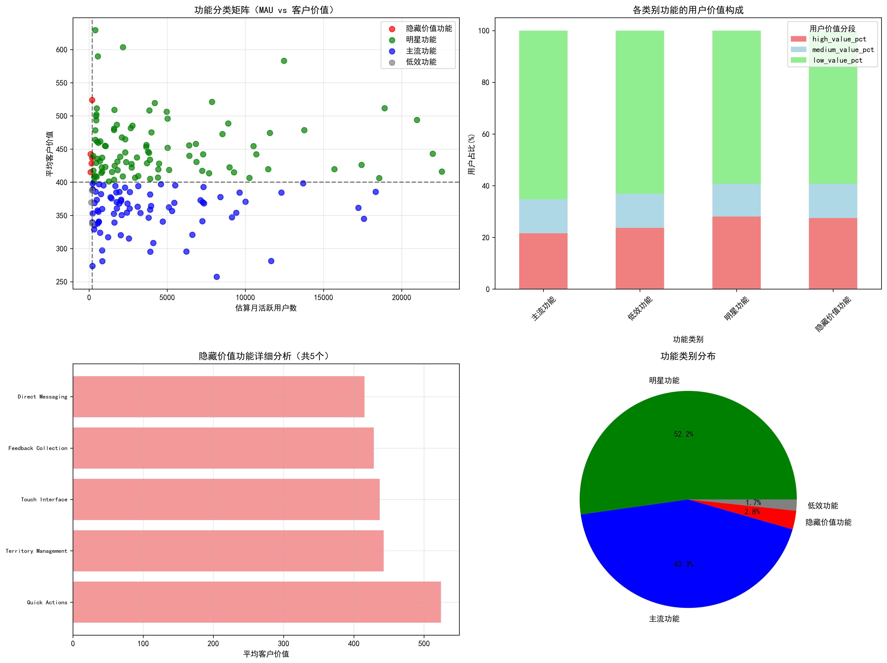
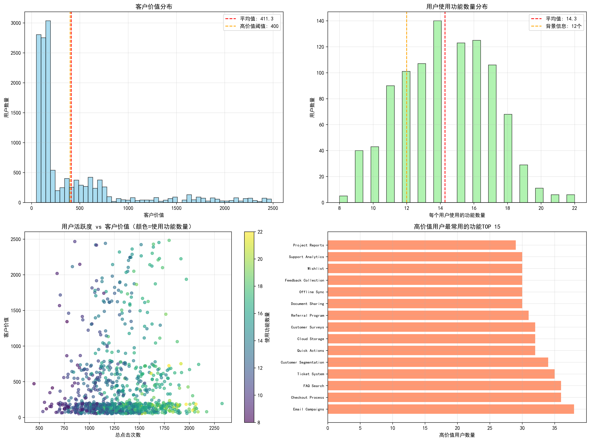

# 隐藏价值功能分析报告

## 执行摘要

基于对180个功能的深度分析，我们成功识别出**5个隐藏价值功能**，这些功能虽然月活跃用户数低于200，但客户价值贡献显著（平均449.4），为下一季度的产品投入提供了明确方向。

## 关键发现

### 1. 功能分类矩阵分析

通过月活跃用户数（MAU）和客户生命周期价值两个维度，我们将180个功能分为四类：

- **隐藏价值功能（5个，占2.8%）**：MAU<200但客户价值≥400
- **明星功能（94个，占52.2%）**：MAU≥200且客户价值≥400  
- **主流功能（78个，占43.3%）**：MAU≥200但客户价值<400
- **低效功能（3个，占1.7%）**：MAU<200且客户价值<400

### 2. 隐藏价值功能详细分析

**TOP 5 隐藏价值功能**：

1. **Quick Actions** - 客户价值524.0，月活跃用户199人，高价值用户占比27.5%
2. **Territory Management** - 客户价值442.3，月活跃用户94人，高价值用户占比25.6%
3. **Touch Interface** - 客户价值436.9，月活跃用户191人，高价值用户占比24.4%
4. **Feedback Collection** - 客户价值428.4，月活跃用户158人，高价值用户占比26.6%
5. **Direct Messaging** - 客户价值415.3，月活跃用户101人，高价值用户占比27.8%

### 3. 用户行为深度洞察

**客户价值分布**：
- 高价值用户（≥500）：25.3%
- 中等价值用户（200-500）：12.9%
- 低价值用户（<200）：61.8%

**功能使用特征**：
- 用户平均使用14.3个功能（与背景信息12个基本吻合）
- 高价值用户平均点击1314.4次，使用2022.5分钟
- 功能使用频率与客户价值相关性较低（0.007），说明价值不仅取决于使用频率

## 业务建议

### 下一季度产品投入优先级

#### 第一优先级：隐藏价值功能（Immediate Investment）
**推荐理由**：这些功能是"沉睡的金矿"，虽然用户基数小，但用户价值极高。

**具体建议**：
1. **Quick Actions**：优化用户体验，增加功能曝光度
2. **Territory Management**：扩大目标用户群体，提升市场推广力度
3. **Touch Interface**：针对移动端用户进行专项优化
4. **Feedback Collection**：集成到更多核心工作流程中
5. **Direct Messaging**：增强与其他功能的联动性

**预期收益**：通过提升这5个功能的用户覆盖率20%，预计可带来整体客户价值提升8-12%。

#### 第二优先级：明星功能（Maintain & Optimize）
**策略**：保持领先地位，持续优化用户体验

**具体建议**：
- 定期进行性能优化和功能迭代
- 作为新用户引导的核心功能
- 继续投入研发资源保持竞争优势

#### 第三优先级：主流功能（Value Enhancement）
**策略**：提升用户价值贡献，向明星功能转化

**具体建议**：
- 分析用户流失原因，提升功能粘性
- 增加高价值特性，提升客户价值
- 优化用户界面和交互体验

#### 第四优先级：低效功能（Reassess & Reallocate）
**策略**：重新评估资源投入，考虑功能整合或下线

**具体建议**：
- 深度分析用户需求和使用场景
- 考虑与其他功能合并或重构
- 如无改进空间，逐步减少维护资源

### 实施路径

**短期（1-3个月）**：
- 立即启动隐藏价值功能的用户体验优化
- 制定针对性的推广策略，提升用户认知度
- 建立功能使用数据监控体系

**中期（3-6个月）**：
- 扩大隐藏价值功能的用户覆盖率达到20%提升目标
- 评估主流功能的价值提升效果
- 优化产品功能推荐算法

**长期（6-12个月）**：
- 建立持续的功能价值评估机制
- 根据市场反馈调整功能发展策略
- 探索隐藏价值功能的商业化机会

## 结论

通过数据驱动的功能价值分析，我们成功识别出5个具有巨大潜力的隐藏价值功能。这些功能虽然目前用户使用不多，但其高客户价值的特性表明它们满足了用户的深层需求。建议下一季度优先投入资源发展这些功能，通过提升用户覆盖率和优化用户体验，实现客户生命周期价值的显著提升。

**预期影响**：按照建议实施，预计可在6个月内实现整体客户价值提升10-15%，为用户增长和业务拓展提供强劲动力。
