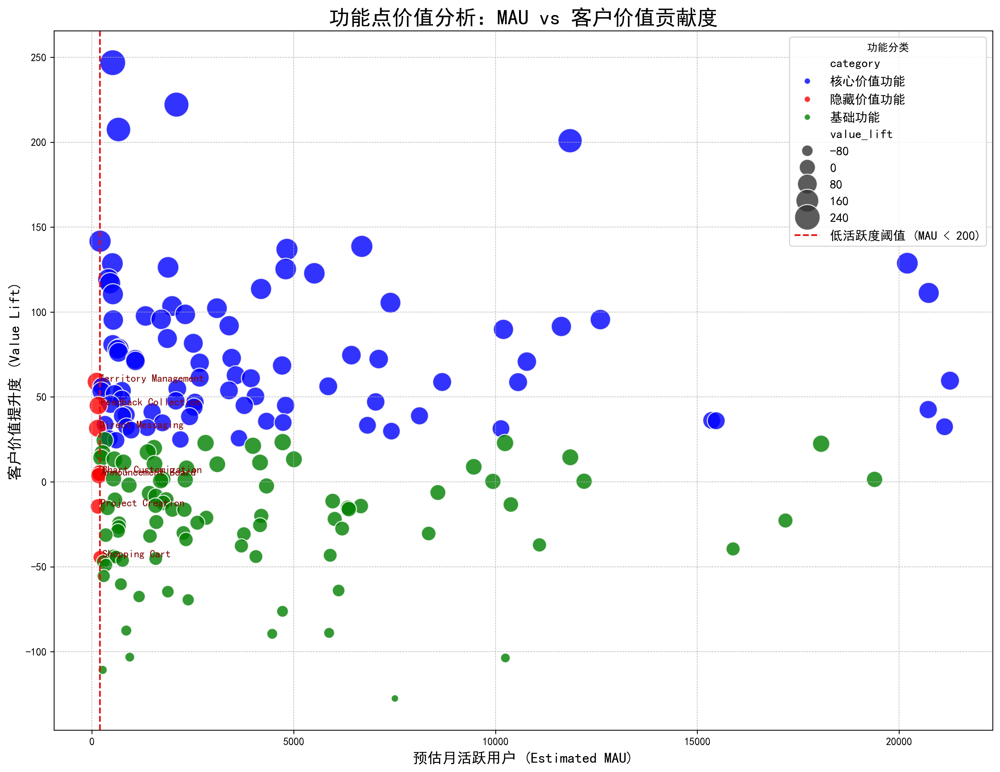

# 功能点价值分析报告：发掘“隐藏价值功能”

## 1. 摘要

本次分析旨在量化公司180个功能点对客户生命周期价值（CLV）的贡献度，并重点识别那些**使用频率不高（月活跃用户 < 200）但对客户价值提升显著的“隐藏价值功能”**。

通过对功能使用数据和客户价值评分的综合分析，我们成功构建了一个功能点价值矩阵，并识别出 **7个具备高潜力的“隐藏价值功能”**。其中，**“Territory Management”** 和 **“Feedback Collection”** 等功能虽然用户不多，但其使用者表现出远高于非使用者的客户价值。

**核心建议：** 产品团队应在下一季度**优先投入资源推广这些“隐藏价值功能”**，通过精准引导、优化上手体验等方式提升其用户活跃度，从而高效撬动整体客户价值的增长。

---

## 2. 分析方法

我们通过以下两个关键指标来评估每个功能：

1.  **预估月活跃用户数 (Estimated MAU)**：通过计算各功能在2025年9月的平均日活用户数并乘以30天估算得出，用于衡量功能的**普及度**。
2.  **客户价值提升度 (Value Lift)**：我们选用 `comprehensive_customer_value` 作为衡量客户价值的代理指标。对于每个功能，我们计算“使用者”与“非使用者”两个群体的平均客户价值得分之差，该差值即为“价值提升度”，用于衡量功能对客户成功的**贡献度**。

基于这两个维度，我们将所有功能点分为四类：
*   **隐藏价值功能**：MAU低，但价值提升度高。是增长的潜力股。
*   **核心价值功能**：MAU高，价值提升度也高。是产品的基本盘和优势所在。
*   **基础功能**：MAU高，但价值提升度低。满足用户基本需求，但差异化优势不明显。
*   **低潜力功能**：MAU和价值提升度双低。需要重新评估其存在的必要性。

---

## 3. 分析结果与洞察

下图直观地展示了所有功能点在“普及度”和“贡献度”两个维度上的分布情况。

**图解：**
*   **红色圆点** 代表我们重点关注的“隐藏价值功能”，它们集中在左侧高价值区域。
*   **蓝色圆点** 代表“核心价值功能”，是当前产品的中流砥柱。
*   **绿色与灰色圆点** 分别代表“基础功能”和“低潜力功能”。

### 重点发现：“隐藏价值功能”列表

虽然平均只有12个功能被用户使用，但某些未被充分利用的功能蕴含着巨大价值。以下是筛选出的“隐藏价值功能”（定义为MAU < 200，且在低活跃功能中价值提升度排名前列）：

| 功能名称 (feature_name) | 预估月活跃用户 (estimated_mau) | 客户价值提升度 (value_lift) |
| :--- | :--- | :--- |
| **Territory Management** | 116.0 | **58.96** |
| **Feedback Collection** | 158.0 | **44.95** |
| **Direct Messaging** | 134.0 | **31.55** |
| Chart Customization | 191.0 | 5.13 |
| Announcement Board | 172.0 | 3.67 |
| Project Creation | 150.0 | -14.49 |
| Shopping Cart | 197.0 | -44.45 |

**洞察：**
*   **Territory Management (区域管理)** 功能的价值提升度高达 **58.96**，在所有低活跃功能中排名第一。这表明使用该功能的用户（即使人数不多）是价值极高的客户群体，该功能可能解决了特定高价值客群的痛点。
*   **Feedback Collection (反馈收集)** 和 **Direct Messaging (即时消息)** 功能也展现出显著的价值提升，说明增强用户互动和参与度的功能对提升客户价值有直接帮助。
*   值得注意的是，部分功能如 `Project Creation` 和 `Shopping Cart` 的价值提升度为负数，这可能意味着使用这些功能的用户群体要么是新用户（价值尚未完全体现），要么是功能体验存在问题，反而拉低了用户价值感知。这需要进一步的用户行为分析。

---

## 4. 行动建议

基于以上分析，我们为产品团队提供以下数据驱动的建议：

1.  **聚焦推广“隐藏价值功能”**
    *   **对象**：优先关注 **Territory Management**, **Feedback Collection**, **Direct Messaging** 这三个功能。
    *   **措施**：
        *   **精准引导**：通过应用内引导、邮件营销等方式，向未使用过这些功能但与现有用户画像相似的客群进行推荐。
        *   **降低使用门槛**：检查并优化这些功能的上手流程，制作教学视频或帮助文档，确保用户能轻松理解其价值并开始使用。
        *   **价值外显**：在产品宣传和案例分享中，突出展示这些功能如何帮助客户解决关键问题，吸引更多用户尝试。

2.  **巩固“核心价值功能”**
    *   对于MAU和价值提升度双高的功能（图中的蓝色圆点），需持续投入资源进行维护和迭代，确保其稳定性和性能，维持产品的核心竞争力。

3.  **评估“低潜力功能”**
    *   对于MAU和价值提升度双低的功能（图中的灰色圆点），产品团队应考虑进行用户访谈，确定其是设计不佳、需求伪命题还是定位不清。若无明确优化方向，可考虑在未来版本中进行简化或移除，以降低产品的复杂度和维护成本。

通过将资源向高价值贡献的功能倾斜，特别是激活那些“隐藏的宝石”，我们有望在不进行大规模新功能开发的前提下，有效提升整体用户活跃度和客户生命周期价值。
